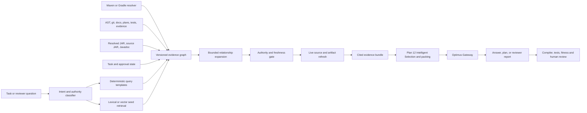

# GraphRAG Research for Coding Agents and Optimus Cost Agent

Status: Independent decision-support research; no adoption decision
Date: 2026-07-15
Revision: 2 (2026-07-15) - added use-case provenance, in-process/embedded storage option, and
build/maintenance cost model
Potential roadmap destination: Plan 12 or later
Scope: GraphRAG concepts, tooling, coding-agent and reviewer use cases, and a candidate Optimus evaluation architecture

## Decision Boundary

This document gathers context for a later architecture decision. It does not:

- select GraphRAG for Optimus;
- start, schedule, or amend Plan 12;
- amend the HLD, LLD, Test Strategy, roadmap, or
  `docs/context-window-optimization-strategy.md`;
- authorize an implementation plan or implementation work; or
- select Neo4j, FalkorDB, Microsoft GraphRAG, or any other dependency.

If GraphRAG survives evaluation, its accepted design would first need to be reconciled with the
authoritative architecture documents and then planned under Plan 12 or a later roadmap entry.

## Executive Summary

GraphRAG combines graph-structured knowledge retrieval with language-model generation. Instead of
retrieving only text chunks that are semantically similar to a question, it can seed retrieval from
entities or symbols and then traverse explicit relationships to collect connected evidence.

For coding agents, the most valuable form is not an LLM-invented knowledge graph over raw source.
It is a **deterministic, version-aware evidence graph** constructed from authoritative tools and
artifacts, with GraphRAG used above it for natural-language retrieval, explanation, and context
assembly.

The representative use cases have different fits:

1. Spring Boot dependency resolution is primarily a Maven/Gradle and BOM problem. A graph helps
   explain resolution, conflicts, provenance, and upgrade impact, but GraphRAG must never select a
   version by inference.
2. Correct version-specific syntax and imports are a strong hybrid use case. A graph can connect the
   resolved artifact version to packages, classes, methods, source usages, Javadoc, and migration
   notes. Compilation and tests remain the final truth.
3. Project memory is a strong GraphRAG use case. A graph can connect requirements, plans, docs,
   directories, source symbols, tests, decisions, and evidence.
4. A graph network of tasks is primarily a workflow/DAG use case. GraphRAG is useful for querying,
   summarizing, impact analysis, and reviewer assistance, but deterministic task state remains the
   source of truth.

For the full set of use cases, a dedicated property-graph database is likely to have lower lifetime
implementation complexity than building a general graph engine from Redis HASH structures. An
in-process graph library over collector-produced snapshots (for example NetworkX or rustworkx) is
the low-operations middle option and the cheapest vehicle for the evaluation phase itself. Neo4j
is the leading evaluation candidate because of its mature Cypher, constraints, visualization,
vector/full-text support, and official Python GraphRAG package. FalkorDB is the leading alternative
because of its Redis-like operating model, GraphRAG SDK, and Code-Graph tooling. Neither is selected
by this research note.

The current Optimus architecture places topology and structural-memory maps in Redis HASH
structures. Moving the authoritative graph to a dedicated database would be an architecture change,
not a transparent implementation detail. That change should occur only after a bounded evaluation
demonstrates enough correctness, reviewer value, and fully-loaded cost benefit to justify the extra
runtime dependency.

## 1. What GraphRAG Is

Retrieval-Augmented Generation, or RAG, retrieves external evidence and places it in the model's
input so that the answer can use knowledge outside the model's training data. Conventional RAG
usually retrieves independent text chunks using keyword, full-text, or vector similarity.

GraphRAG adds a graph representation and graph-aware retrieval. The graph may contain:

- entities or program symbols as nodes;
- typed relationships as edges;
- source chunks, summaries, embeddings, and provenance as properties or linked nodes; and
- communities or hierarchical summaries for corpus-wide questions.

A typical GraphRAG query performs some combination of:

```text
understand query
-> identify seed nodes
-> retrieve exact/lexical/vector candidates
-> expand along allowed graph relationships
-> rank and prune the resulting subgraph
-> fetch source evidence
-> assemble cited model context
-> generate or review an answer
```

The original Microsoft GraphRAG work focused on query-focused summarization over large private text
corpora. It builds an entity graph, detects communities, pregenerates community summaries, and uses
local or global retrieval. Its published evaluation showed gains over naive RAG for the
comprehensiveness and diversity of global sensemaking answers. That is useful evidence for
corpus-wide analysis, but it is not direct evidence that the same pipeline resolves build
dependencies or eliminates coding hallucinations.

References:

- [From Local to Global: A Graph RAG Approach to Query-Focused Summarization](https://arxiv.org/abs/2404.16130)
- [Microsoft GraphRAG indexing overview](https://microsoft.github.io/graphrag/index/overview/)
- [Microsoft GraphRAG query modes](https://microsoft.github.io/graphrag/query/overview/)

### 1.1 Graph database, knowledge graph, and GraphRAG are different layers

These terms should not be treated as synonyms:

| Layer | Responsibility |
| --- | --- |
| Graph database | Persists nodes/edges and executes traversal or pattern queries |
| Knowledge/evidence graph | Defines what nodes, relationships, authority, time, and provenance mean |
| Graph retrieval | Selects a relevant subgraph or graph-linked evidence for a query |
| GraphRAG | Uses graph retrieval to assemble grounded model context and generate an answer |

A dedicated graph database can support GraphRAG, but it does not by itself build a trustworthy
knowledge graph. Likewise, Microsoft GraphRAG is a pipeline and methodology, not a graph database;
its standard outputs are Parquet tables plus a configured vector store.

### 1.2 GraphRAG is a family of patterns

At least four patterns are relevant:

- **Knowledge-graph RAG:** retrieve facts and paths from an existing curated graph.
- **LLM-extracted GraphRAG:** use a model to extract entities/relationships from unstructured text,
  then retrieve from the resulting graph.
- **Deterministic code GraphRAG:** build program relationships from parsers, compilers, dependency
  resolvers, and repository metadata, then use those relationships for retrieval.
- **Temporal context graphs:** track facts, episodes, and validity windows for agent memory or
  evolving enterprise state.

Optimus should evaluate the deterministic code/evidence pattern first. LLM-extracted edges may be
useful as low-authority discovery hints, but they must not become the source of truth for versions,
imports, task status, approvals, or mutation decisions.

## 2. Databases and Tools

The following landscape is selective rather than exhaustive. Capabilities were checked against
first-party documentation on 2026-07-15. Vendor accuracy and performance claims have not been
independently reproduced for Optimus.

| Product/project | Category | Relevant capability | Main caution for Optimus |
| --- | --- | --- | --- |
| Microsoft GraphRAG | Open-source indexing/query framework | Entity extraction, community detection, local/global/DRIFT search, custom graphs | Natural-language and batch oriented; indexing can be expensive; standard provider setup is not gateway-only |
| Neo4j + `neo4j-graphrag` | Property-graph database plus official Python GraphRAG package | Cypher, constraints, vector/full-text/hybrid retrieval, Vector-Cypher expansion, KG builder, visualization | Adds a JVM/database service and a real Neo4j integration tier; custom Optimus Gateway adapters required |
| FalkorDB + GraphRAG-SDK | Property-graph database plus GraphRAG framework | OpenCypher, vector/full-text indexes, GraphRAG SDK, Code-Graph repository indexer | Separate Redis-derived server/module, not the existing TimeSeries Redis; licensing and maturity review required |
| AWS GraphRAG Toolkit + Neptune | Toolkit plus managed graph database | Hierarchical lexical graph and bring-your-own-KG question answering | Cloud-first operational and credential surface conflicts with Phase 1 local-first scope |
| LightRAG | Open-source graph-oriented RAG framework | Graph-based indexing/retrieval, multiple storage backends, server/UI | Broad framework and fast-moving surface; extraction and storage choices still require Optimus governance |
| Graphiti / Zep | Temporal context-graph framework / managed platform | Incremental updates, validity windows, provenance episodes, hybrid retrieval | Better fit for evolving agent memory than dependency truth; model-extracted facts need authority controls |
| Memgraph | Property-graph database with GraphRAG patterns | Cypher and database-side graph retrieval pipelines | Additional service; smaller direct Optimus fit than the two primary candidates |
| NetworkX / rustworkx | In-process graph libraries | Build, traverse, and analyze graphs in memory from collector output; snapshot files instead of a server | No query language, constraints, or built-in vector/full-text retrieval; every ad hoc query and durability concern becomes application code |
| Azure Cosmos AI Graph | Azure solution pattern | Document, vector, and relationship-aware retrieval | Cloud-managed direction is outside local-first Phase 1 unless the architecture changes |

Primary references:

- [Microsoft GraphRAG repository](https://github.com/microsoft/graphrag)
- [Neo4j GraphRAG for Python](https://neo4j.com/docs/neo4j-graphrag-python/current/)
- [Neo4j GraphRAG retrievers](https://neo4j.com/docs/neo4j-graphrag-python/current/user_guide_rag.html)
- [FalkorDB documentation](https://docs.falkordb.com/)
- [FalkorDB GraphRAG-SDK](https://github.com/FalkorDB/GraphRAG-SDK)
- [FalkorDB Code-Graph](https://docs.falkordb.com/genai-tools/code-graph.html)
- [AWS GraphRAG Toolkit](https://github.com/awslabs/graphrag-toolkit)
- [LightRAG](https://github.com/HKUDS/LightRAG)
- [Graphiti](https://github.com/getzep/graphiti)
- [Memgraph GraphRAG](https://memgraph.com/graphrag)
- [Azure Cosmos AI Graph](https://learn.microsoft.com/azure/cosmos-db/gen-ai/cosmos-ai-graph)
- [NetworkX](https://networkx.org/)
- [rustworkx](https://github.com/Qiskit/rustworkx)

### 2.1 Tools not recommended as the primary Optimus graph backend

- **Microsoft GraphRAG:** useful as a research reference and possibly for global analysis over
  long-form docs, but not the natural source of truth for rapidly changing code and dependency
  graphs.
- **RedisGraph:** Redis documents it as deprecated, and Redis states that it reached end of life on
  2025-01-31. New architecture should not depend on it.
- **Kuzu:** its repository was archived by its owner on 2025-10-10. It should not be selected for a
  new long-lived Optimus dependency without a credible maintained successor. Its archival also
  removes the leading *embedded* graph-database option, which is why the in-process-library option
  in section 9.2 matters: no mature embedded middle ground currently exists.
- **DuckPGQ and similar embedded SQL-graph extensions:** DuckDB's property-graph querying comes
  from a community/research extension, not the core engine. It would need its own maturity,
  stability, and maintenance review before becoming a load-bearing dependency.
- **Managed cloud graph services:** potentially appropriate later, but inconsistent with the Phase 1
  local-first and gateway-only operating contract.

References:

- [Redis Graph deprecated feature documentation](https://redis.io/docs/latest/operate/oss_and_stack/stack-with-enterprise/deprecated-features/graph/)
- [RedisGraph end-of-life notice](https://redis.io/docs/latest/operate/rs/release-notes/rs-7-4-2-releases/rs-7-4-6-279/)
- [Archived Kuzu repository](https://github.com/kuzudb/kuzu)
- [DuckPGQ extension](https://github.com/cwida/duckpgq-extension)

## 3. Representative Use Cases

The four use cases below are operator-selected, not hypothetical. Use cases 3.1 and 3.2 in
particular come from the operator's direct experience in the companion Spring Boot project
`wealthmgmtandtracker`, where wrong dependency versions, version-mismatched APIs, and incorrect
imports were the most common recurring coding-agent failures. A GraphRAG adoption decision should
therefore be judged primarily against those observed failure modes, not against generic RAG
benchmarks.

### 3.1 Spring Boot dependency resolution

**Fit:** graph database - high; GraphRAG - supporting/explanatory.

Each Spring Boot release publishes a curated dependency set through the
`spring-boot-dependencies` BOM. Maven Resolver collects the transitive dependency graph, resolves
conflicts, creates the effective dependency tree, and resolves artifacts. Gradle provides equivalent
dependency-management and diagnostic capabilities.

Those build tools, not an LLM or GraphRAG pipeline, must answer:

- which artifact version is selected;
- why it is selected;
- which BOM, parent, constraint, or direct declaration controls it;
- which dependency paths introduced competing versions; and
- which artifacts actually form the classpath.

A versioned evidence graph can then persist or project the resolver result:

```text
(ProjectSnapshot)-[:USES_BOOT]->(SpringBootRelease)
(SpringBootRelease)-[:IMPORTS_BOM]->(BomVersion)
(BomVersion)-[:MANAGES]->(ArtifactVersion)
(DependencyDeclaration)-[:REQUESTS]->(ArtifactVersion)
(ArtifactVersion)-[:DEPENDS_ON]->(ArtifactVersion)
(ConflictDecision)-[:SELECTS]->(ArtifactVersion)
(ConflictDecision)-[:REJECTS]->(ArtifactVersion)
(ArtifactVersion)-[:RESOLVED_FROM]->(Repository)
```

GraphRAG adds value when the user asks:

- Why did this project select Jackson version X?
- What changes transitively if Spring Boot moves from release A to B?
- Which source files use APIs supplied by a dependency whose version will change?
- Which tests and tasks are connected to those affected source symbols?

The answer should contain the resolver snapshot, artifact coordinates, dependency path, BOM source,
and current project hash. If those are absent or stale, the agent should refresh or abstain.

References:

- [Spring Boot build-system dependency management](https://docs.spring.io/spring-boot/reference/using/build-systems.html)
- [Spring Boot dependency versions](https://docs.spring.io/spring-boot/appendix/dependency-versions/index.html)
- [Maven Resolver dependency graph](https://maven.apache.org/resolver/dependency-graph.html)
- [How Maven Resolver works](https://maven.apache.org/resolver/how-resolver-works.html)
- [Maven Resolver API](https://maven.apache.org/resolver/maven-resolver-api/apidocs/)

### 3.2 Version-correct syntax, APIs, and imports

**Fit:** hybrid deterministic retrieval plus GraphRAG - high.

An apparently plausible method or import is often wrong because it belongs to another major version,
was renamed, is available only through a different module, or is contradicted by the resolved
classpath. Similarity search alone can retrieve a semantically relevant but version-incompatible
example.

A strong evidence graph connects:

```text
ArtifactVersion
-> Package
-> ClassOrInterface
-> MethodOrFieldSignature
-> IntroducedDeprecatedRemoved metadata
-> Exact Javadoc/source-JAR locator
-> Repository source usages
-> Compiler/test evidence
```

Authoritative inputs should include:

- the actual Maven/Gradle resolved graph;
- resolved JAR checksums and manifests;
- bytecode or signature inspection from the resolved JAR;
- source JAR and version-specific Javadoc when available;
- the project's language level and plugin configuration; and
- compiler, static-analysis, and test results.

GraphRAG may retrieve and explain the correct evidence chain, but a generated change is not proven
correct until the real project compiler and relevant tests pass. If documentation and the resolved
JAR disagree, the resolved artifact and executable verification take precedence.

### 3.3 Project memory across docs, folders, and source

**Fit:** GraphRAG - high.

Project memory can be modeled without persisting raw source in a vector index. Useful nodes include:

- requirement, design decision, roadmap entry, plan, task, deferred follow-up;
- document, section, directory, file, module, class, function, method;
- test, fixture, configuration key, runtime component, evidence artifact;
- commit or workspace snapshot; and
- approval or review finding, represented by exact pointer and status rather than lossy summary.

Useful relationships include:

- `CONTAINS`, `DEFINES`, `IMPORTS`, `CALLS`, `INHERITS`;
- `DOCUMENTS`, `IMPLEMENTS`, `TESTS`, `CONFIGURES`;
- `DEPENDS_ON`, `BLOCKS`, `SUPERSEDES`, `CONTRADICTS`;
- `VERIFIES`, `PRODUCES_EVIDENCE`, `CLOSES_FOLLOW_UP`; and
- `DERIVED_FROM`, `VALID_FOR_SNAPSHOT`.

This enables questions such as:

- Which source modules implement this LLD requirement?
- Which plan tasks and evidence artifacts justify this roadmap status?
- Which tests cover the permission boundary affected by this diff?
- Which docs become stale if this public interface changes?

Edges derived from ASTs, git, plan syntax, and test metadata should have higher authority than
LLM-extracted semantic relationships. Every result should link back to current files or immutable
evidence.

### 3.4 A graph network of tasks

**Fit:** task/workflow graph - high; GraphRAG - supporting.

The graph can represent:

```text
(Requirement)-[:SATISFIED_BY]->(Task)
(Task)-[:DEPENDS_ON]->(Task)
(Task)-[:BLOCKS]->(Task)
(Task)-[:TOUCHES]->(FileOrSymbol)
(Task)-[:VERIFIED_BY]->(TestOrEvidence)
(Task)-[:DEFERS_TO]->(RoadmapEntry)
```

This supports critical-path views, dependency completeness, impact analysis, and reviewer queries.
However, task status must be imported from the authoritative plan/issue/workflow state. A generated
summary must never mark a task complete. In Optimus, the plan checkbox and its required passing
verification remain the progress contract.

## 4. How GraphRAG Can Reduce Coding-Agent Hallucinations

GraphRAG can reduce specific failure opportunities; it cannot guarantee non-hallucination.

### 4.1 Mechanisms that help

- **Repository-specific grounding:** retrieve symbols and relationships that actually exist in the
  current repository rather than relying on model memory.
- **Version scoping:** bind API evidence to the resolved artifact version and project snapshot.
- **Dependency closure:** when a symbol is selected, include required definitions, callers,
  implementations, configs, fixtures, and tests rather than an isolated similar chunk.
- **Multi-hop retrieval:** follow `source -> API symbol -> artifact version -> BOM -> migration doc`
  or `task -> source -> test -> evidence` relationships.
- **Ambiguity visibility:** return competing symbols, versions, or dependency paths instead of
  silently choosing the closest vector match.
- **Provenance:** attach path, line/symbol locator, artifact coordinate, checksum, commit/hash, and
  retrieval time to every claim.
- **Abstention:** fail closed when required evidence is missing, stale, conflicting, or below an
  authority threshold.
- **Executable verification:** connect proposed claims to compiler, tests, static analysis, and
  release-gate evidence.

Code-specific research supports the hypothesis that graph structure can improve repository-level
context. RepoGraph reported improvements when a repository-level code graph was plugged into
software-engineering systems, while GraphCoder reported gains for code completion using control-flow
and dependence-aware context graphs. These results support evaluation; they do not prove the same
gain for Optimus or every coding task.

References:

- [RepoGraph](https://arxiv.org/abs/2410.14684)
- [RepoGraph ICLR 2025 paper](https://proceedings.iclr.cc/paper_files/paper/2025/file/4a4a3c197deac042461c677219efd36c-Paper-Conference.pdf)
- [GraphCoder](https://arxiv.org/abs/2406.07003)

### 4.2 Failure modes GraphRAG introduces

- LLM extraction can create false nodes, false edges, or misleading summaries.
- A stale graph can be more dangerous than obviously missing context, because it still looks
  authoritative.
- Incorrect entity resolution can merge distinct versions, symbols, or tasks.
- Graph expansion can retrieve a large but irrelevant neighborhood and crowd out direct evidence.
- Community summaries can hide disagreement or lose exact version qualifiers.
- Text-to-Cypher generation can produce overly broad, expensive, or semantically incorrect queries.
- A poisoned doc or tool output can introduce graph relationships that appear authoritative.
- Dual stores can drift if graph data and source artifacts have different update transactions.

Microsoft's Responsible AI FAQ explicitly requires domain-expert analysis and provenance tracing,
and notes that effective indexing depends on domain-specific concepts. GraphRAG must therefore be
treated as an evidence-selection aid, not a correctness oracle.

Reference: [Microsoft GraphRAG Responsible AI FAQ](https://github.com/microsoft/graphrag/blob/main/RAI_TRANSPARENCY.md)

## 5. Other Benefits, Including Reviewer Use Cases

### 5.1 Change-impact and blast-radius review

A reviewer can start from changed files or symbols and traverse to callers, implementations,
dependency versions, tests, configs, docs, requirements, and tasks. The result is a review scope with
explicit reasons rather than a list of semantically similar chunks.

### 5.2 Architecture-conformance review

The graph can make expected boundaries queryable:

- forbidden package or layer dependencies;
- calls that bypass the Optimus Gateway;
- code paths that bypass `MutationGuard`;
- unowned deferred work;
- requirements without implementing tasks; and
- production symbols without relevant tests or evidence.

Graph queries can locate candidates, but existing deterministic fitness gates remain authoritative.

### 5.3 Plan and evidence traceability

A reviewer can ask whether every requirement maps to a task and whether each completed task maps to
a named passing verification and evidence artifact. This complements the repository's existing
checkbox and evidence-tier rules.

### 5.4 Cross-document consistency

Graph relationships can reveal when a roadmap entry, design contract, plan, runbook, and source
implementation disagree or refer to different versions. Temporal/snapshot properties help
distinguish an actual contradiction from an older superseded statement.

### 5.5 Faster orientation and handoff

New agents and reviewers can retrieve a bounded subgraph for a component instead of rereading the
whole repository. A useful handoff bundle might include the governing requirements, active tasks,
affected symbols, tests, recent evidence, and unresolved follow-ups.

### 5.6 Explainability and auditability

The retrieved subgraph can explain why a piece of context was included. That is easier to inspect
than opaque vector similarity alone and aligns with Optimus's evidence-led design.

## 6. Applicability to Optimus Cost Agent

### 6.1 Why it may help

GraphRAG is directionally aligned with existing Optimus design goals:

- the Architecture v2.15 already describes AST-based functional slices, structural memory maps,
  deterministic feedforward controls, and a local-first runtime;
- the architecture prohibits unparsed source code in persistent vector indexes and permits
  structural signatures, summaries, and relative paths;
- the current context-window strategy already calls for freshness-gated intelligent selection,
  dependency closure, provenance, cost attribution, context regret, and fail-closed behavior; and
- roadmap Plan 12 already owns intelligent selection, dependency closure, and retrieval/packing
  evaluation after prerequisite evidence and cost signals are stable.

Graph retrieval could therefore be one candidate mechanism inside Plan 12's Intelligent Selection
control plane. It should not replace that control plane. Plan 12 still owns trust, freshness,
authority, marginal utility, budget-constrained packing, cost attribution, and runtime guardrails.

### 6.2 Why it should not be included yet

- Plan 12 is tracked but not scheduled.
- The current architecture's structural-memory storage boundary is Redis HASH, not a dedicated graph
  database.
- No Optimus evaluation yet proves that graph retrieval beats the current baseline on task success,
  unsupported claims, context regret, latency, or fully-loaded cost.
- A new database adds packaging, startup, health, persistence, credential, recovery, and
  real-dependency test obligations.
- The graph schema and authority model matter more than the vendor choice and are not yet accepted.

## 7. Candidate Evaluation Architecture

The candidate below is a research architecture, not an approved Optimus design.



### 7.1 Component boundaries

#### Authoritative collectors

Collectors produce versioned facts without model inference where a deterministic source exists:

- Maven/Gradle dependency-resolution collector;
- JAR/signature/Javadoc collector;
- repository AST/import/call/inheritance collector;
- git snapshot and diff collector;
- docs/roadmap/plan/task parser;
- test and evidence-artifact linker; and
- approval and runtime-state pointer collector.

#### Evidence graph

The graph stores structural metadata and provenance, not unrestricted raw source. Each node/edge
should carry applicable fields such as:

- stable type and ID;
- workspace-relative path or artifact coordinate;
- symbol or section locator;
- version, commit, content hash, or artifact checksum;
- valid-from/valid-to or snapshot ID;
- authority class and extraction method;
- source pointer;
- confidence only where the relationship is not deterministic; and
- last validation/retrieval time.

#### Retrieval orchestrator

The orchestrator chooses among:

- exact path/symbol/artifact lookup;
- reviewed deterministic graph-query templates;
- lexical or vector seed search followed by bounded traversal;
- task/requirement/evidence traceability queries; and
- optional natural-language global analysis over long-form docs.

High-authority questions must not use unrestricted Text-to-Cypher as their only query path.

#### Evidence materializer

Graph nodes are pointers. Before prompt assembly, the materializer reopens the current source file,
resolved artifact, plan, doc, or evidence record and verifies its hash/version. Stale required
evidence is refreshed or the request fails closed.

#### Plan 12 integration seam

Graph retrieval returns candidates and dependency relationships to Intelligent Selection. Plan 12
then applies authority, freshness, utility, token budget, diversity, dependency closure, packing,
and context-regret policy. Graph retrieval does not directly write the final prompt.

#### Gateway boundary

Any model-based extraction, embeddings, reranking, summarization, or final answer must call the
Optimus Gateway and preserve gateway-reported usage/cost. No Neo4j, FalkorDB, Microsoft GraphRAG,
Graphiti, or other library may introduce a local provider credential.

## 8. Graph Authority Model

A graph can make a weak claim look structurally convincing. Authority must therefore be explicit.

| Authority | Examples | Permitted use |
| --- | --- | --- |
| A - executable/current | Maven/Gradle resolved graph, current AST, compiler result, exact plan checkbox, immutable evidence hash | May support deterministic decisions after freshness validation |
| B - authoritative external | Spring Boot BOM, resolved JAR/source/Javadoc with checksum, official versioned docs | May support version/API claims when matched to project snapshot |
| C - curated project relation | Reviewed mapping between design requirement, plan, source module, and test | May support context/review after pointer validation |
| D - inferred discovery hint | LLM-extracted relation, community summary, semantic similarity | Candidate discovery only; cannot independently justify correctness or mutation |

Conflicts resolve toward fresh, higher-authority evidence. A lower-authority edge may not override an
executable resolver result, current source, approval state, or plan contract.

## 9. Storage Options and Complexity

### 9.1 Redis HASH compatibility pilot

The current HLD/LLD direction can support a bounded projection using Redis HASH structures and
predefined adjacency indexes. This is reasonable only if the pilot limits itself to a small schema
and a fixed set of one- or two-hop queries.

Advantages:

- reuses the existing Redis dependency and local infrastructure;
- avoids a new operator service during evaluation; and
- matches the current structural-memory storage wording.

Disadvantages:

- Optimus must implement traversal, pattern queries, constraints, deduplication, migrations,
  version history, query diagnostics, and visualization;
- hybrid vector/full-text plus graph retrieval is not provided by the existing TimeSeries-capable
  Redis contract;
- ad hoc impact and reviewer queries become custom application code; and
- the pilot risks growing into an in-house graph database.

If used, it should expose a narrow backend-neutral `GraphStore`/`EvidenceGraph` contract and contain
an explicit stop condition against implementing a general query engine.

### 9.2 In-process graph library (NetworkX or rustworkx)

A third option sits between the Redis projection and a dedicated server: build the evidence graph
in process with a graph library, persist it as versioned snapshot files keyed by workspace/commit
hash, and rebuild or patch it from collector output.

Advantages:

- no new operator service, port, credential, or health surface; the best fit for the Phase 1
  local-first contract;
- collectors already produce the graph data, so construction is direct and fully unit-testable;
- traversal, path, and impact algorithms are library-provided rather than hand-written
  (rustworkx adds a fast Rust core for larger graphs);
- snapshot-per-commit persistence gives natural temporal semantics: rebuild per snapshot instead of
  mutating shared state; and
- it is the cheapest harness for the evaluation itself, because schema and query design can be
  iterated quickly before any database commitment.

Disadvantages:

- no declarative query language; every reviewer or ad hoc impact query is application code;
- no constraints, deduplication, or migration facilities; consistency is entirely Optimus's job;
- no built-in full-text or vector retrieval; hybrid retrieval must be orchestrated with the
  existing Redis and gateway machinery;
- single-process and memory-bound; very large graphs or concurrent writers need a different
  answer; and
- the same scope risk as the Redis pilot: it can silently grow into an in-house graph database.

An embedded graph database would be the natural middle ground between this option and a server,
but the leading embedded candidate (Kuzu) is archived and SQL-embedded alternatives such as
DuckPGQ are community/research projects (section 2.1), so no mature embedded option currently
exists.

### 9.3 Neo4j candidate

Advantages:

- mature property graph and Cypher query language;
- schema constraints and indexes;
- vector, full-text, hybrid, and graph-expansion retrieval;
- official Python driver and official `neo4j-graphrag` package;
- strong visualization and query-debugging ecosystem; and
- a good fit for version, dependency, impact, and traceability queries.

Disadvantages:

- new JVM/database process or container;
- lifecycle, health, backup/recovery, packaging, and resource limits;
- an additional real-dependency integration tier;
- license/edition review; and
- provider adapters in `neo4j-graphrag` cannot be used with direct vendor credentials and must be
  replaced or wrapped by Optimus Gateway adapters.

### 9.4 FalkorDB candidate

Advantages:

- property graph and OpenCypher;
- graph, full-text, and vector capabilities;
- Python GraphRAG SDK;
- Code-Graph provides a directly relevant repository-indexing reference; and
- Redis-like protocol and operating concepts.

Disadvantages:

- still a separate graph server/module, not ordinary HASH use in the current Redis instance;
- current documentation requires Redis 8 or the provided FalkorDB image;
- its relationship to the existing RedisTimeSeries dependency must be tested rather than assumed;
- separate persistence, security, health, and evidence-tier obligations; and
- license, SDK maturity, and provider integration require review.

### 9.5 Relative implementation complexity

| Work area | Redis HASH implementation | In-process library snapshot | Dedicated graph database |
| --- | --- | --- | --- |
| Domain ontology and collectors | High; required either way | High; required either way | High; required either way |
| Basic one-hop lookup | Low | Low | Low |
| Multi-hop/path traversal | High custom work | Library algorithms; low to medium | Native query capability |
| Version/conflict/impact queries | High custom work | Medium; queries live in application code | Medium schema/query work |
| Constraints and deduplication | Custom | Custom | Native facilities |
| Full-text/vector plus traversal | Extra modules and orchestration | Orchestrated via existing Redis/gateway | Usually integrated |
| Temporal/snapshot behavior | Custom | Natural snapshot-per-commit rebuild | Schema work; some database support |
| Visualization and query inspection | Must be built | Export (GraphML/DOT) to external tools | Existing tools |
| Runtime operations | Reuses Redis | None beyond snapshot files | Adds a service |
| Testing | Custom traversal algorithm tests | Pure in-process unit tests | Query tests plus real database tier |
| Long-term complexity for all four use cases | High to very high | High; ad hoc query code accumulates | Medium to high |

The dedicated database does not remove the hardest correctness work: collectors, schema, authority,
freshness, provenance, gateway integration, prompt selection, and executable verification. It does
remove much of the undifferentiated storage, traversal, indexing, and visualization work.

For a small repo-map pilot, the in-process snapshot or Redis projection has the lowest total
complexity, and the in-process option is the cheapest vehicle for running the evaluation itself.
For versioned dependency graphs, API graphs, project memory, task networks, and ad hoc reviewer
queries together, a dedicated graph database is likely to have lower lifetime complexity.

### 9.6 Build and maintenance cost model

Backend choice mostly changes operations cost. Most graph cost is backend-independent and
recurring, and a later evaluation should price these components separately:

| Cost component | Driver | Notes |
| --- | --- | --- |
| One-time construction | Corpus size and extraction method | Deterministic collectors cost compute and wall time but zero gateway tokens; LLM extraction, summarization, and embeddings cost gateway tokens roughly proportional to corpus size |
| Incremental update | Commits, branch switches, dependency changes | The dominant recurring cost for coding agents; full rebuild per snapshot is simple but expensive, incremental invalidation is cheap but correctness-critical |
| Community/global summaries | Microsoft GraphRAG-style indexing | Must be re-summarized as the corpus changes; expensive for fast-moving repositories, more defensible for slow-moving long-form docs |
| Storage and provenance | Nodes, edges, per-edge provenance, version history | Version history multiplies volume; a retention policy is required |
| Staleness window | Update latency versus the freshness gate | A cheap pipeline that lags the workspace forces frequent fail-closed refreshes, transferring the cost to query time |

Because every model-mediated step (extraction, embedding, reranking, summarization) is
gateway-billed, the deterministic-collector-first design in section 7 is also the cost-minimizing
design: the graph's recurring token cost approaches zero when its edges come from resolvers, ASTs,
git, and plan syntax rather than model inference.

## 10. Provisional Evaluation Recommendation

If GraphRAG reaches a Plan 12 evaluation, compare these variants rather than adopting a product
immediately:

1. **Null baseline:** current task-aware context and Plan 12's simplest non-graph selection.
2. **Deterministic repo map:** symbols/paths plus lexical ranking, without a graph database.
3. **Redis bounded projection:** fixed graph relationships and query templates only.
4. **In-process library graph:** collector snapshots traversed with NetworkX/rustworkx, no new
   service (section 9.2); also the natural harness for prototyping the other variants' schema.
5. **Neo4j evidence graph:** deterministic collectors plus reviewed Cypher/hybrid retrieval.
6. **FalkorDB evidence graph:** equivalent schema/queries where feasible.
7. **Optional document-global method:** Microsoft GraphRAG-style community/global retrieval only for
   questions that genuinely require corpus-wide synthesis.

The same backend-neutral evidence bundle and query cases should be used across variants. This avoids
mistaking a richer prompt, a stronger model, or a different corpus for a graph-backend improvement.

### 10.1 Suggested evaluation tasks

- Explain the exact selected version and dependency path for a Spring Boot-managed library.
- Diagnose a direct override that conflicts with the Boot BOM.
- Find the correct import and method signature for the project's resolved library version.
- Identify all source/test/doc/task impact of a library upgrade.
- Map a roadmap requirement through plan task, source implementation, tests, and evidence.
- Detect an unowned or unverifiable task dependency.
- Review a multi-file diff for affected callers, configs, tests, docs, and architectural boundaries.
- Reject a stale graph fixture and refresh exact evidence.
- Resist a poisoned doc that asserts a false dependency or approval relationship.

### 10.2 Suggested measurements

Reuse Plan 12 concepts and add graph-specific measures:

- task/patch correctness;
- dependency-resolution agreement with Maven/Gradle;
- version-correct API/import rate;
- hallucinated symbol/artifact/version rate;
- unsupported reviewer-claim rate;
- dependency-closure recall and precision;
- stale-context rejection/refresh rate;
- context regret;
- coverage at line/token budget;
- evidence citation validity;
- graph extraction precision by authority class;
- query latency and index/update latency;
- one-time graph construction cost (gateway tokens and wall time) and incremental update cost per
  commit or branch switch;
- fully-loaded cost per successful task;
- graph storage and operator-startup overhead; and
- reviewer acceptance and time-to-verified-finding.

No fixed promotion threshold is proposed here. Thresholds belong to Plan 12 calibration after the
baseline and evidence harness exist.

## 11. Security, Governance, and Operational Requirements

Any later design should preserve these non-negotiable constraints:

- **Gateway-only models:** only `OPTIMUS_GATEWAY_URL` and `OPTIMUS_API_KEY` are available locally.
- **No raw source in persistent vector indexes:** store structural summaries, signatures, relative
  paths, locators, hashes, and permitted embeddings only.
- **Untrusted retrieved data:** docs, source, tool output, graph summaries, and inferred edges remain
  data, never instructions or policy.
- **Freshness before use:** validate workspace hash/commit/mtime and artifact checksum/version before
  materializing evidence.
- **No graph-to-mutation bypass:** retrieval cannot change approval state, authorize a tool, or
  bypass `MutationGuard`.
- **No graph-to-task-status bypass:** authoritative plan/task state controls completion.
- **Cost attribution:** every embedding, extraction, reranking, summarization, and generation call
  records Gateway usage fields.
- **Secret safety:** do not store credentials, source secrets, raw environment values, or unsafe
  tool output in graph properties or logs.
- **Bounded queries:** enforce depth, fan-out, result, token, time, and cost caps.
- **Evidence tiers:** a live Neo4j/FalkorDB claim requires the real named database; a fake is unit-tier
  evidence only.
- **Failure behavior:** stale, incomplete, ambiguous, conflicting, or unavailable required graph
  evidence causes refresh, degradation, correction request, or clean abort.

## 12. Open Questions for a Later Decision

- Is the graph per workspace, per repository/commit, per user, or shared across projects?
- Is cross-project Maven ecosystem knowledge worth the added data volume and update pipeline?
- Which relationships must be deterministic, and which inferred edges are useful enough to retain as
  discovery hints?
- Should task and project memory be one graph with typed subgraphs or separate bounded graphs?
- How are deleted/renamed files, rebases, and branch switches represented without stale edges?
- Does Plan/Chat mode read only a prebuilt graph, or may an explicitly authorized internal indexer
  update derived state?
- Is Neo4j/FalkorDB operator startup acceptable for the local-first product experience?
- Can a bounded Redis projection or in-process snapshot deliver most of the benefit without
  becoming a custom graph engine?
- What graph size and query patterns cause the dedicated database to win materially, and where
  does the in-process snapshot stop being viable?
- What per-commit incremental update cost and staleness window are acceptable, and is incremental
  invalidation provably correct across rebases and branch switches (or is rebuild-per-snapshot the
  only safe policy)?
- Which accepted eval threshold would justify an HLD/LLD storage-boundary amendment?

## 13. Conclusion

The four representative use cases are well suited to a graph-backed evidence architecture, but only
the retrieval and explanation parts are GraphRAG. Dependency resolution, API/version truth, task
state, approvals, and verification must remain deterministic.

The most promising evaluation design is a versioned evidence graph built from Maven/Gradle, resolved
artifacts, AST/git metadata, docs/plans/tasks, tests, and evidence. GraphRAG would query that graph,
materialize fresh cited evidence, and pass candidates into Plan 12's Intelligent Selection pipeline.

For all four use cases together, Neo4j is the strongest initial dedicated-database candidate and
FalkorDB is the strongest alternative. A bounded Redis projection remains a valid compatibility
pilot, and an in-process library snapshot (NetworkX/rustworkx) is the cheapest way to run the
evaluation without committing to a new service, but building a general graph engine on either is
unlikely to be the simplest long-term solution.

No adoption decision should be made until the candidate architecture beats the non-graph baseline
on correctness, unsupported claims, stale-evidence handling, reviewer value, latency, operator
burden, and fully-loaded cost.

## Sources

### GraphRAG research and Microsoft implementation

- [From Local to Global: A Graph RAG Approach to Query-Focused Summarization](https://arxiv.org/abs/2404.16130)
- [Microsoft GraphRAG documentation](https://microsoft.github.io/graphrag/)
- [Microsoft GraphRAG repository](https://github.com/microsoft/graphrag)
- [Microsoft GraphRAG Responsible AI FAQ](https://github.com/microsoft/graphrag/blob/main/RAI_TRANSPARENCY.md)

### Code and repository graphs

- [RepoGraph](https://arxiv.org/abs/2410.14684)
- [RepoGraph ICLR 2025 publication](https://proceedings.iclr.cc/paper_files/paper/2025/file/4a4a3c197deac042461c677219efd36c-Paper-Conference.pdf)
- [GraphCoder](https://arxiv.org/abs/2406.07003)

### Java and Spring dependency authority

- [Spring Boot dependency management](https://docs.spring.io/spring-boot/reference/using/build-systems.html)
- [Spring Boot managed dependency versions](https://docs.spring.io/spring-boot/appendix/dependency-versions/index.html)
- [Maven Resolver dependency graph](https://maven.apache.org/resolver/dependency-graph.html)
- [How Maven Resolver works](https://maven.apache.org/resolver/how-resolver-works.html)
- [Maven Resolver API](https://maven.apache.org/resolver/maven-resolver-api/apidocs/)

### Candidate databases and frameworks

- [Neo4j GraphRAG for Python](https://neo4j.com/docs/neo4j-graphrag-python/current/)
- [FalkorDB](https://docs.falkordb.com/)
- [FalkorDB GraphRAG-SDK](https://github.com/FalkorDB/GraphRAG-SDK)
- [FalkorDB Code-Graph](https://docs.falkordb.com/genai-tools/code-graph.html)
- [AWS GraphRAG Toolkit](https://github.com/awslabs/graphrag-toolkit)
- [LightRAG](https://github.com/HKUDS/LightRAG)
- [Graphiti](https://github.com/getzep/graphiti)
- [Memgraph GraphRAG](https://memgraph.com/graphrag)
- [Azure Cosmos AI Graph](https://learn.microsoft.com/azure/cosmos-db/gen-ai/cosmos-ai-graph)

### In-process and embedded options

- [NetworkX](https://networkx.org/)
- [rustworkx](https://github.com/Qiskit/rustworkx)
- [DuckPGQ extension](https://github.com/cwida/duckpgq-extension)

### Lifecycle cautions

- [Redis Graph deprecated feature documentation](https://redis.io/docs/latest/operate/oss_and_stack/stack-with-enterprise/deprecated-features/graph/)
- [RedisGraph end-of-life notice](https://redis.io/docs/latest/operate/rs/release-notes/rs-7-4-2-releases/rs-7-4-6-279/)
- [Archived Kuzu repository](https://github.com/kuzudb/kuzu)
