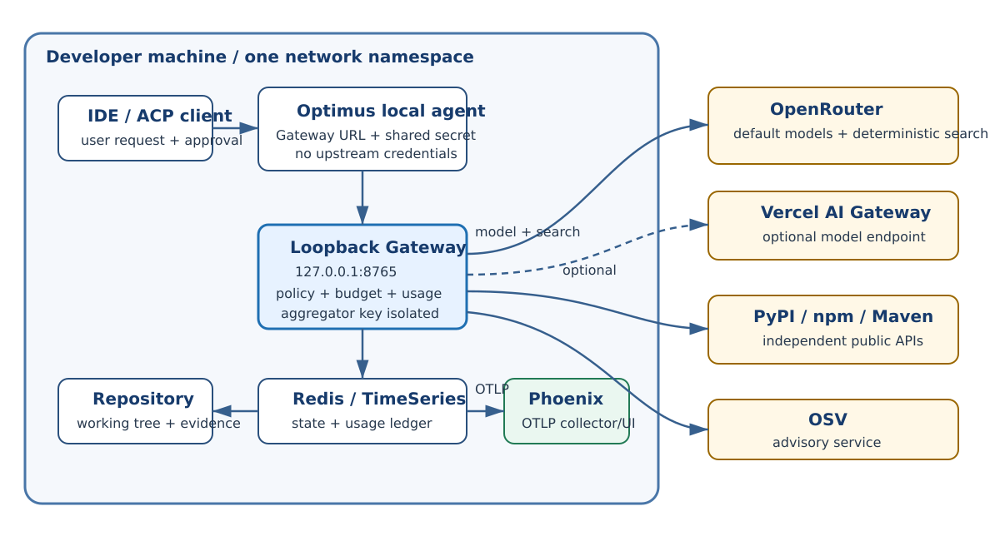
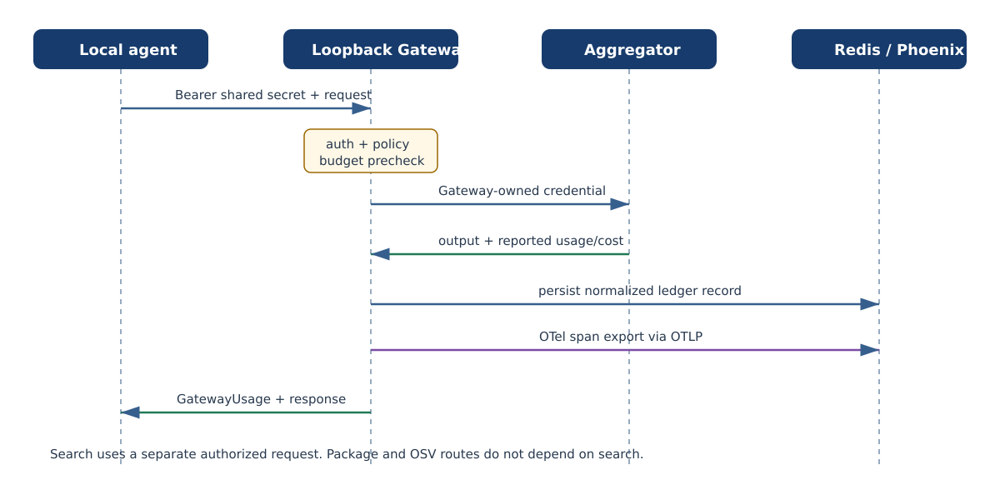

::: {.sheet .cover data-doc="Optimus-Cost-Agent - Architecture v2.16" data-page="1" data-total="13"}

Optimus-Cost-Agent

# Enterprise Architectural Blueprint

Adaptive Agent Reasoning Swarms and Evolutionary Governance Contracts

Version 2.16

Architected by: Vibhanshu Agarwal

:::
::: {.sheet data-doc="Optimus-Cost-Agent - Architecture v2.16" data-page="3" data-total="13"}
# 5A. Upstream Aggregator Cost Normalization and Single-Key Model

`OPTIMUS_API_KEY` is the only agent-facing credential. It is a local shared secret used to
authenticate the agent process to the loopback Optimus Gateway; it is not an upstream vendor key
or an Optimus tenant wallet. The Gateway process holds one developer-owned aggregator credential
in its own local configuration or OS credential storage. OpenRouter is the default aggregator.
Vercel AI Gateway is an allowed second OpenAI-compatible endpoint when its Python integration is
modest.

The developer funds the aggregator account directly. The aggregator supplies access to many
models, routes across upstream providers, reports normalized usage and USD cost, and debits one
developer-owned balance. The local Gateway preserves the one-key, one-budget, one-ledger thesis by
isolating that credential from the LLM-driven agent, enforcing policy and budget controls, and
recording provider-reported usage.

::: {.callout}
There is no Optimus-hosted account, prepaid balance, subscription, tenant, org, project wallet,
OAuth/device flow, or public Optimus Gateway.
:::

## Normalized cost path

| Stage | Credential and responsibility |
|---|---|
| Local agent | `OPTIMUS_GATEWAY_URL` and `OPTIMUS_API_KEY` only |
| Loopback Gateway | Shared-secret auth, policy, budget, attribution, aggregator credential isolation |
| Aggregator | Models, routing, provider-reported billing units and `cost_usd` |
| Local ledger | Run/session/request/Gateway/provider request attribution |

Web search currently shares the OpenRouter credential and balance through a dedicated,
deterministic plugin request. Package registry and OSV calls are free public APIs and are not
funding paths. OpenTelemetry trace export has no invented per-request charge.

The one-key property for search is explicitly conditional: OpenRouter has deprecated its
deterministic plugin, and no deterministic aggregator successor is presently documented. Plugin
withdrawal may require a verified-or-fail server-tool design or a standalone search provider with
a second key and balance.
:::

::: {.sheet data-doc="Optimus-Cost-Agent - Architecture v2.16" data-page="4" data-total="13"}
# 6. Deterministic Data-Flow Architecture (Phase 1 MVP)

The closed-loop Harness Engineering sequence remains authoritative. Step [6] is corrected:

1. User request enters through the IDE's ACP client.
2. The local ACP server validates framing, mode, workspace, and request identity.
3. Local structural memory is loaded from Redis without placing unparsed source in a persistent
   vector index.
4. Feedforward controls assemble bounded structural context and explicit constraints.
5. The routing policy selects a model alias and rigor path.
6. **The agent calls the loopback Optimus Gateway. The Gateway applies local policy and budget
   controls, resolves the alias, and calls the approved upstream aggregator - OpenRouter by
   default, or Vercel AI Gateway if retained. It returns model output plus provider-reported usage
   and USD cost. The agent never selects or contacts a direct provider adapter.**
7. Feedback sensors run triggered fitness gates. Failure routes to bounded reflection or a targeted
   retry; success advances toward controlled mutation.
8. Redis HASH and RedisTimeSeries persistence records state and attributed usage with a 30-day
   numeric telemetry retention window.
9. The IDE receives final status, evidence, and cost information.

## Invariants

- Model generation, deterministic search, and completion evaluation are distinct Gateway calls.
- Search is never attached to the primary generation request.
- `gateway_request_id`, provider request identity, billing units, cache state, model/version, and
  `cost_usd` are copied from validated Gateway usage.
- Missing or malformed reported cost fails closed.
- Package and OSV evidence routes remain available when paid search is absent.
- The Gateway credential cannot enter agent environment, logs, state, response payloads, or child
  processes.
:::

::: {.sheet data-doc="Optimus-Cost-Agent - Architecture v2.16" data-page="7" data-total="13"}
# 10.A System Context Diagram

The IDE, local agent, loopback Gateway, Redis, repository, and optional Phoenix collector are
inside one developer environment. The agent and Gateway are separate processes with separate
environments. The agent authenticates with a local shared secret and cannot read the Gateway's
aggregator credential.

{.diagram}

The Gateway alone may contact the approved upstream aggregator, package registries, OSV, and the
configured OTLP collector. An agent in WSL2 cannot reach a Windows-host Gateway through loopback;
Phase 1 requires both processes in the same network namespace.

Figure 10.A - Local-first system context. No MCP endpoint is shown or implied.

:::

::: {.sheet data-doc="Optimus-Cost-Agent - Architecture v2.16" data-page="9" data-total="13"}
# 10.C Phase 1 release gate

Phase 1 is not a hosted Gateway release. It is a local process boundary with separately scoped
credentials and egress.

| Gate | Required evidence |
|---|---|
| Agent credential scope | Agent process resolves only `OPTIMUS_GATEWAY_URL` and `OPTIMUS_API_KEY` |
| Gateway credential scope | Gateway process resolves one approved aggregator credential |
| Network boundary | Gateway URL is strict loopback; agent and Gateway share one network namespace |
| Model transport | OpenAI-compatible aggregator path; no direct single-provider adapter |
| Search | Dedicated deterministic request, annotations present, domains enforced, cost reported |
| Free tools | PyPI/npm/Maven and OSV routes exposed without a paid-search credential |
| Cost | Provider-reported `cost_usd` and billing units persisted with full request attribution |
| Observability | OTel spans export through OTLP to a real Phoenix evidence tier |
| Legacy removal | No Tavily/LangSmith/direct-provider key remains after migration acceptance |

::: {.warning}
The deterministic OpenRouter plugin is deprecated. A live release probe must fail the gate if the
plugin is removed or behavior changes. A server-tool successor is accepted only after a separate
verified-or-fail spike proves one search, usage accounting, annotations, domain enforcement, and
fail-closed behavior.
:::

`P11-FU-3` remains open, and `P11-FEAT-GATEWAY-MCP` remains blocked. This correction adds no MCP
route or contract.
:::

::: {.sheet data-doc="Optimus-Cost-Agent - Architecture v2.16" data-page="10" data-total="13"}
# 11. Optimus Gateway - Phase 1 Local Process Boundary

The Optimus Gateway is a deterministic loopback process run by the developer alongside the local
agent. It is not a hosted Optimus service, tenant control plane, subscription product, or central
wallet.

## Gateway responsibilities

- Bind to strict loopback and authenticate the agent with a local shared secret.
- Isolate the developer's aggregator credential in Gateway-owned local configuration or OS
  credential storage.
- Route approved model aliases through the surviving OpenAI-compatible transport.
- Enforce model/tool policy, domain rules, call caps, provenance, and the current run's USD budget.
- Return provider-reported usage and cost in a validated GatewayUsage envelope.
- Broker deterministic search, bounded extract, package lookup, and OSV advisory independently.
- Accept structured trace ingress, map it to OpenTelemetry, and export OTLP.
- Persist usage attribution across run, session, request, Gateway request, and provider request IDs.

## Process-scoped configuration

| Agent process environment | Gateway process local configuration |
|---|---|
| `OPTIMUS_GATEWAY_URL=http://127.0.0.1:8765` | `OPTIMUS_LOCAL_GATEWAY_PROVIDER=openrouter` |
| `OPTIMUS_API_KEY=<local shared secret>` | `OPTIMUS_LOCAL_GATEWAY_PROVIDER_API_KEY=<developer key>` |
| No provider, search, or OTel credentials | `OPTIMUS_LOCAL_GATEWAY_SHARED_SECRET=<same secret>` |
| Loopback URL only | allowed domains, Redis URL, optional OTLP endpoint |
| No hosted-origin override | no tenant profile, Vault, or non-loopback mode |

Run the agent and Gateway in the same network namespace. A Windows-host Gateway is not loopback
from an agent running inside WSL2.
:::

::: {.sheet data-doc="Optimus-Cost-Agent - Architecture v2.16" data-page="11" data-total="13"}
# 11.1 Gateway request / response sequence

{.diagram}

The agent sends one authenticated request to the loopback Gateway. The Gateway applies policy and
budget controls, calls the configured aggregator with its Gateway-owned credential, parses
provider-reported usage and cost, and returns the normalized GatewayUsage envelope. The
aggregator credential never enters the agent process or response.

Search follows a separate authorized request and annotation path. Package and OSV routes do not
depend on search availability. Trace delivery is an independent Gateway-to-OTLP operation and
does not create a fabricated per-request observability charge.
:::

::: {.sheet data-doc="Optimus-Cost-Agent - Architecture v2.16" data-page="12" data-total="13"}
# 11A. OpenTelemetry Trace Observability

Phase 1 uses OpenTelemetry spans and OTLP as the vendor-neutral trace contract across planning,
Gateway calls, tool invocation, validation, retries, and final response generation. The local
agent sends authenticated structured trace ingress to the Gateway; the Gateway validates and
redacts fields, maps them to OTel spans/events, and exports OTLP. Arize Phoenix is the documented
local default. Any OTLP-compatible backend may replace it without changing Optimus
instrumentation; Langfuse may be considered for team-scale deployments.

Trace export records operational telemetry, not an invented billable provider request. No
allocated or amortized observability `cost_usd` is added to the usage ledger. Infrastructure cost
is an operator concern outside per-request accounting.

Required attributes retain run, session, request, Gateway/provider request, execution mode,
generation scope, model/provider, cache, `cost_usd`, billing units, policy/tool, validation, retry,
and failure attribution. Secrets are redacted before export.

## 12. Testing and quality gates

| Concern | Tooling | Role in gates |
|---|---|---|
| Code coverage | `coverage.py`, `pytest-cov` | Release gate: at least 80%, safety-critical modules do not regress |
| Agent quality eval | DeepEval, Ragas | Task quality, correctness, groundedness |
| Adversarial/red-team | PyRIT | Prompt injection, tool-control, and trust-boundary validation |
| Trace observability | OpenTelemetry + OTLP; Phoenix default | Debugging and regression analysis, not a coverage metric |

OTel/OTLP trace validation is tracked separately from production-code coverage. LangSmith is not
part of the architecture or dependency set.
:::
