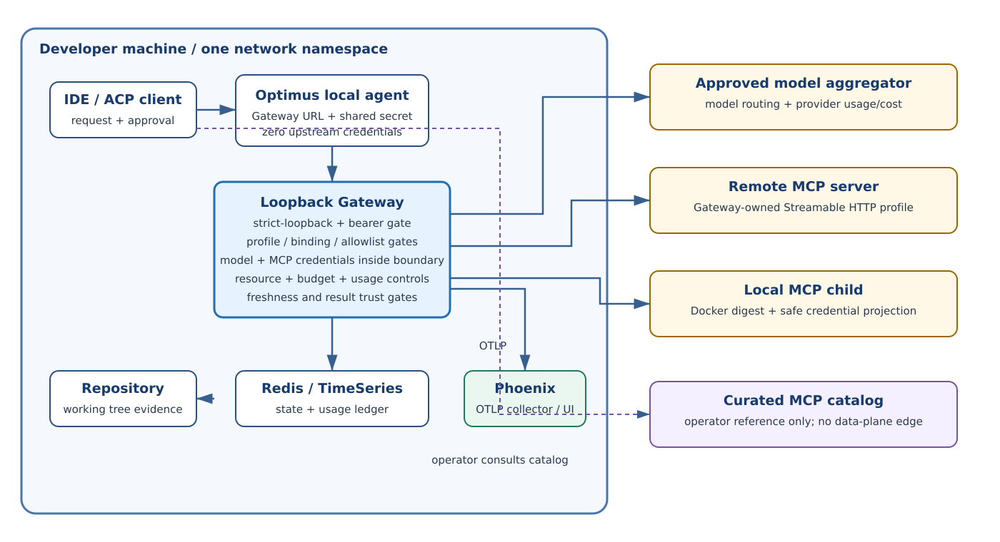
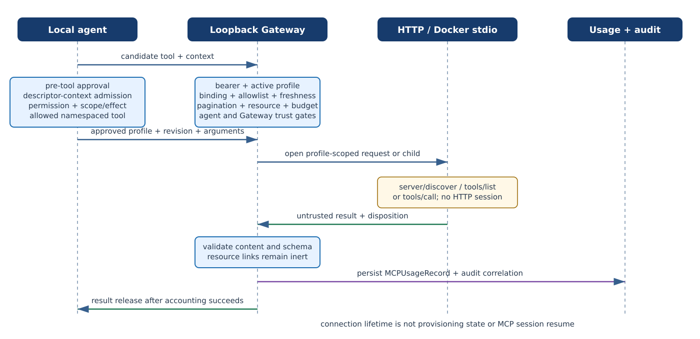

::: {.sheet .cover data-doc="Optimus-Cost-Agent - Architecture v2.17" data-page="1" data-total="13"}

Optimus-Cost-Agent

# Enterprise Architectural Blueprint

Adaptive Agent Reasoning Swarms and Evolutionary Governance Contracts

Version 2.17

Architected by: Vibhanshu Agarwal

:::

::: {.sheet data-doc="Optimus-Cost-Agent - Architecture v2.17" data-page="3" data-total="13"}
# 5A. Upstream Aggregator Cost Normalization and Single-Key Model

`OPTIMUS_API_KEY` remains the only agent-facing credential. It authenticates the agent to the
strict-loopback Gateway and is not an upstream vendor key. The Gateway may hold one model
aggregator credential plus multiple operator-provisioned, profile-scoped MCP credentials. The
architectural invariant is zero upstream credentials in the agent process; Gateway credential
count is capability- and profile-dependent.

The developer funds the aggregator account directly. Existing model and typed-tool usage retains
the settled `GatewayUsage` contract. MCP calls use separate attribution-aware
`MCPUsageRecord` records so provider-reported spend, operator-asserted zero marginal cost, and
unavailable cost are never conflated.

::: {.callout}
Approved MCP descriptors are recurring model-input cost. A pre-model admission gate exposes only
the operator-selected approved subset, enforces descriptor-count and UTF-8-byte ceilings, and
records admitted identities, count, and bytes. Provider-reported model input usage remains the
billing authority; Optimus does not estimate per-descriptor tokens. Semantic tool search,
automatic per-turn selection, and code mode are deferred to `P11-FU-15`.
:::

Sampling is closed in v1 because a server could initiate model spend with server-supplied prompt
content. A future opening requires pre-model budget reservation, linked provider usage and
`MCPUsageRecord`, and human review before both model dispatch and response return.

| Stage | Credential and responsibility |
|---|---|
| Local agent | `OPTIMUS_GATEWAY_URL` and `OPTIMUS_API_KEY` only; zero upstream credentials |
| Loopback Gateway | Shared-secret auth, profile custody, policy, budget, attribution, and secret isolation |
| Aggregator | Models, routing, provider-reported billing units and `cost_usd` |
| MCP profiles | Operator-provisioned transport, allowlist, binding, and credential references |
:::

::: {.sheet .tight data-doc="Optimus-Cost-Agent - Architecture v2.17" data-page="4" data-total="13"}
# 6. Deterministic Data-Flow Architecture (Phase 1 MVP)

The closed-loop Harness Engineering sequence remains the primary model path:

1. User request enters through the IDE/ACP client and the Optimus ACP server.
2. The agent reads structural memory, applies context optimization, and sends minimal model input
   to the stateful router.
3. The loopback Gateway delivers the approved model request to the configured aggregator and
   returns provider-reported usage and USD cost. The agent never selects or contacts a direct
   provider adapter.
4. Fitness functions validate the result before storage and release.

After the pre-tool decision and before result consumption, an approved namespaced MCP tool follows
a separate guarded branch. The agent validates the Plan 6.5 trust record and sends only the
profile ID, upstream tool name, arguments, non-secret manifest hash, and profile revision to the
Gateway. The Gateway independently validates the active profile, exact binding pair, upstream
allowlist, resource limits, and budget policy before contacting the configured stdio or
Streamable HTTP server. Tool arguments are the only agent-originated payload sent upstream; system
prompts, conversation history, policy text, and approval records never cross. Returned content is
untrusted.

Registration and refresh use `server/discover` followed by complete bounded `tools/list`
pagination. Cursor loops, malformed cursors, malformed pages, or incomplete pages reject discovery
as a whole; a partial tool prefix cannot reach approval or the planner. Transient transport
failures retry through the existing policy. A provisioned page/tool/byte/time bound yields no
manifest and the narrow capacity disposition `mcp.discovery_budget_exceeded`; v1 restarts a
complete scan rather than storing cursor checkpoints.

# 7. Agent Operating Modes & Trust Framework

Plan/Chat remains advisory-only. Agent Mode is write-authorized only after the composite fitness
and mutation gates. MCP adds no new agent authority: Plan 6.5 remains authoritative for human
approval, descriptor trust, permission scope, and effect class, while the Gateway is authoritative
for profile state, credential custody, binding freshness, transport execution, resource limits,
and budget admission.

Provisioning and connection lifecycle are separate axes. A profile-scoped HTTP request or stdio
child may open only after active-profile admission; opening or closing the connection never
activates, re-enables, or changes a profile. Remote HTTP is request-scoped with no protocol session.
Stdio reuse is bounded Gateway custody, not MCP session resume. Every stdio profile is Docker
contained with a digest-pinned image, no host mounts/devices/socket, and safe `docker run --env NAME`
credential projection.
:::

::: {.sheet data-doc="Optimus-Cost-Agent - Architecture v2.17" data-page="7" data-total="13"}
# 10.A System Context Diagram

The IDE, local agent, loopback Gateway, Redis, repository, and optional Phoenix collector are
inside one developer environment and network namespace. The agent authenticates with the local
shared secret and cannot read Gateway-owned model or MCP credentials. Both Gateway and agent trust
gates are required before an MCP call.

{.diagram}

The Gateway alone may contact the approved model aggregator, package registries, OSV, configured
OTLP collector, remote Streamable HTTP MCP servers, and local Docker-contained stdio MCP children.
An operator may consult a curated MCP catalog before provisioning, but the catalog is untrusted
metadata: it has no registry-to-agent, registry-to-model, registry-to-Gateway-data-plane, install,
connect, or activation edge. An agent in WSL2 cannot reach a Windows-host Gateway through loopback;
Phase 1 requires both processes in the same network namespace.

Figure 10.A - Local-first system context. MCP servers are reachable only
through the strict-loopback Gateway after both agent and Gateway trust checks; no upstream MCP
credential enters the agent process.

:::

::: {.sheet .tight data-doc="Optimus-Cost-Agent - Architecture v2.17" data-page="9" data-total="13"}
# 10.C Phase Evolution Diagram

Optimus is designed as a three-phase architecture. Phase 1 is mandatory before later phases.

**PHASE 1 -> Python Local Agent + Optimus Gateway**  Current - Mandatory before Phase 2

**Release Gate:** the agent runs with only `OPTIMUS_GATEWAY_URL` and `OPTIMUS_API_KEY`; no model,
search, MCP, OTel, or other upstream credential is resolvable in the agent process. The Gateway
receives only the approved credentials and profile records required by its enabled capabilities,
with MCP secrets isolated per profile.

**PHASE 2 -> Rust Core Rewrite**  Trigger: Python performance ceiling or team scaling

**PHASE 3 -> Agentic Mesh Topology**  Trigger: multi-repo or multi-team deployment

# 10.D Where Cost Control Happens

| Control point | Mechanism | What it prevents |
|---|---|---|
| Pre-prompt | AST slicing, cache anchoring, ADL constraints | Unnecessary model input |
| MCP context admission | Operator-selected descriptor subset, count/UTF-8-byte ceilings, admitted identity record | Descriptor-context cost and context bloat |
| Router and rigor budget | Cheapest sufficient model plus bounded calls/reflection | Ceremonial spend |
| Post-call attribution | GatewayUsage, MCPUsageRecord, EvidenceLedger, RedisTimeSeries | Silent accumulation and unclassified MCP cost |

# 10.E Where Hallucination Control Happens

Context, evidence, typed-tool policy, fitness functions, and bounded reflection remain a defence-in-
depth stack. MCP descriptors, arguments, tool results, server identity, instructions, annotations,
resource links, and embedded resources are untrusted input and cannot modify policy, approve tools,
trigger a fetch, execute code, or become trusted manifest content.
:::

::: {.sheet .tight data-doc="Optimus-Cost-Agent - Architecture v2.17" data-page="10" data-total="13"}
# 11. Optimus Gateway - Phase 1 Local Process Boundary

The Optimus Gateway is a deterministic strict-loopback process run alongside the local agent. It
is not a hosted service, tenant control plane, subscription product, or central wallet.

## Gateway responsibilities

- Authenticate the agent and keep all model, OTel, and profile-scoped MCP credentials inside the
  Gateway boundary.
- Serve typed MCP discovery and call routes; inside the Gateway use `server/discover`, `tools/list`,
  and `tools/call` with tools-only filtering.
- Enforce profile revision, manifest hash, exact binding pair, upstream allowlist, freshness,
  pagination, resource, and budget checks before transport execution.
- Use per-request metadata for remote Streamable HTTP `2026-07-28`; do not use a legacy remote
  `initialize` handshake, client ping, protocol session, or standalone GET stream.
- For mandatory Docker-contained stdio, probe first and negotiate modern or legacy tools-only
  behavior. The remote HTTP floor deliberately narrows the official Go SDK v1.7.0 default, which
  may negotiate down to `2025-11-25` or earlier.
- Attribute MCP calls to `MCPUsageRecord`, persist usage before releasing accepted results, and
  tear down profile-scoped connections without changing provisioning state.

The `2026-07-28` floor is deliberately breaking for remote HTTP credential profiles. A server that
cannot establish the required discovery/version/tools contract receives the narrow
`mcp.protocol_version_unsupported` disposition and never falls back. Context7 is the named
remote-compatibility dependency: its public Streamable HTTP configuration is the motivating case,
not proof of deployed protocol support. Reachability remains unconfirmed until an authenticated,
Gateway-originated probe of the configured endpoint proves the exact version and tools capability.

The immutable snapshot `f817239f4d6b1efff2c4dfc2f7af85c985d73076` is the frozen wire-content source
under `schema/draft/`, not final per-version specification publication. Go SDK v1.7.0 is the
support citation. External MCP logging is closed in v1 and never feeds or changes Optimus's
append-only audit logging or telemetry.

| Agent process environment | Gateway-only configuration |
|---|---|
| `OPTIMUS_GATEWAY_URL`, `OPTIMUS_API_KEY` | model aggregator credential and profile credential references |
| no upstream credentials | profile transport, revision, binding, allowlist, and freshness |
| no secret-derived identifier | discovery page/tool/descriptor-byte/time and context ceilings |

## Split-authority residual

> The agent remains authoritative for human approval, descriptor trust, permission scope, and
> effect class. The Gateway is authoritative for profile state, credential custody, upstream-name
> allowlists, binding freshness, transport execution, resource limits, and budget admission. A
> direct shared-secret caller can bypass agent-only scope/effect checks but cannot exceed the
> operator-provisioned Gateway allowlist. A recoverable refresh failure marks the last bound
> manifest stale rather than denying it; detected drift remains a denial. This is accepted only for
> Phase 1's strict-loopback, single-operator deployment.

## Architecture positions

- Registry catalog metadata is untrusted operator input and cannot install, connect, or activate a
  profile; the catalog is not a runtime data-plane authority.
- OAuth is static-credential-only in v1. The future binding discriminator distinguishes automatic
  same-grant refresh from reapproval-triggering rotation; a binding change mints a new revision.
- `input_required` remains closed at method, result-type, and content boundaries until the
  attributed operator UI, schema validation, and bounded continuation conditions exist. Elicitation
  is therefore denied call-scoped in v1 and never becomes a planner question or profile transition.
- Normative MCP controls extend Plan 6.5 only. Generalized security observations remain
  reference-only and create no independent Test Strategy obligation.

## Architecture reference and ownership

| General observation | Voice / owner |
|---|---|
| OWASP LLM01 tools and retrieval; LLM02 output handling; LLM03 configuration; LLM05 packages and plugins; LLM06 model/tool output; LLM07 permissions, autonomy, and spend; LLM10 hidden context, retries, long-lived work, and resource use | `REFERENCE — Cross-cutting` (non-normative guidance; not a Test Strategy obligation) |

| Normative control | Voice / owner |
|---|---|
| MCP profile, binding, transport, descriptor, result, accounting, and logging controls in this amendment | `NORMATIVE — P11-FEAT-GATEWAY-MCP` |

The reference panel is not an acceptance-criteria source. Normative MCP controls extend Plan 6.5
only. The hosted-premise causality behind the former exclusion remains unconfirmed; publication
must not describe it as accidental.
:::

::: {.sheet data-doc="Optimus-Cost-Agent - Architecture v2.17" data-page="11" data-total="13"}
# 11.1 Gateway request / response sequence

{.diagram}

For a namespaced MCP call, the agent performs pre-tool approval and sends the profile ID, upstream
tool name, arguments, non-secret manifest hash, and profile revision. The Gateway authenticates
the bearer, checks active profile state, binding pair, allowlist, freshness, resource limits, and
budget, then opens a profile-scoped HTTP request or Docker-contained stdio child. The connection
lifetime begins after admission and never changes provisioning state.

The Gateway validates returned content as untrusted data, persists the MCP-specific usage record,
and releases the result only after required accounting succeeds. A persistence failure withholds
the result and retries persistence only; it never redispatches the upstream tool call. HTTP has no
MCP protocol session, and bounded stdio reuse is not session resume. The agent has no direct MCP
edge and no upstream MCP credential.
:::

::: {.sheet .tight data-doc="Optimus-Cost-Agent - Architecture v2.17" data-page="12" data-total="13"}
# 11A. OpenTelemetry Trace Observability

OpenTelemetry spans and OTLP remain vendor-neutral across planning, Gateway calls, MCP invocation,
validation, retries, and response generation. The Gateway validates and redacts structured trace
ingress before export. MCP external logging is deprecated and closed; it is distinct from the
append-only Optimus audit log and telemetry.

## 12. Testing and quality gates

| Concern | Required evidence |
|---|---|
| Protocol and transport | Real remote HTTP `2026-07-28` method-set evidence with no legacy handshake/session/ping; Docker-contained stdio discovery-first modern/legacy negotiation |
| Discovery | Complete multi-page `tools/list`; cursor integrity distinct from transient/capacity outcomes; no partial manifest |
| Trust and custody | Direct-route allowlist denial, profile-change/revision reapproval, credential-isolation scans, platform process-limit evidence, and strict-loopback namespace evidence |
| Accounting | Descriptor-context ceilings, settled/`explicit_zero`/unavailable MCP attribution, persistence-before-release, and no redispatch after accounting failure |
| Safety and capability | Elicitation triple denial is call-scoped; sampling causes no model call or spend in v1; capability absence never disables the whole profile |
| Provenance and ownership | `REFERENCE — Cross-cutting` versus `NORMATIVE — P11-FEAT-GATEWAY-MCP` voice classification, redline traceability, Context7 authenticated real-server probe, and external logging denial with Optimus audit unchanged |

Test Strategy v1.6 is authoritative for executable evidence. No route, profile, transport, ledger,
or sandbox claim is complete until its named evidence passes.
:::
