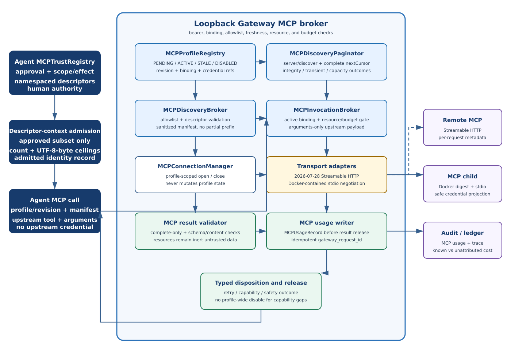

::: {.sheet .cover data-doc="Optimus-Cost-Agent - LLD v2.40" data-page="1" data-total="40"}
<div class="eyebrow">Optimus-Cost-Agent</div>

# Low-Level Design (LLD) Specification

<div class="subtitle">Gateway-Centric Cost Governance, Tooling, Observability and Runtime Control</div>

<div class="version">Version 2.40</div>

<div class="credit">Architected by: Vibhanshu Agarwal</div>
:::
::: {.sheet .compact data-doc="Optimus-Cost-Agent - LLD v2.40" data-page="2" data-total="40"}
# 0. Optimus AI Gateway Architecture

The Optimus Gateway is a deterministic local process bound to loopback. It separates the
LLM-driven agent from upstream credentials, policy enforcement, budget authority, provider usage
normalization, and controlled external egress.

The agent process receives only `OPTIMUS_GATEWAY_URL` and `OPTIMUS_API_KEY` and can resolve zero
upstream credentials. The Gateway process may hold one model aggregator credential plus multiple
operator-provisioned, profile-scoped MCP credential references in Gateway-owned storage. There is
no hosted Optimus service, tenant wallet, Vault, or public Gateway origin.

MCP v1 is a tools-only Gateway broker for two operator-preprovisioned profile forms: a mandatory
Docker-contained stdio child and a remote Streamable HTTP profile. Profiles are not autoloaded from
repository configuration. Dynamic OAuth acquisition and lifecycle remain future work; v1 accepts
static credentials only.

## A. Recommended architecture

OpenRouter is the default aggregator. Vercel AI Gateway is an optional second OpenAI-compatible
model endpoint when Python integration remains modest. Direct single-provider adapters are
removed.

{.diagram}

<div class="source-note">The component flow includes Gateway-owned MCP discovery/call brokering;
the agent-side trust registry remains separate from the Gateway profile registry.</div>
:::

::: {.sheet .ultra-tight data-doc="Optimus-Cost-Agent - LLD v2.40" data-page="3" data-total="40"}
# C. Gateway responsibilities

- Authenticate the local agent with a shared secret on strict loopback.
- Resolve model aliases through an approved OpenAI-compatible aggregator.
- Broker deterministic search, bounded extract, package lookup, and OSV advisory independently.
- Enforce execution mode, tool policy, domain rules, call caps, provenance, and run budget.
- Persist run/session/request/Gateway/provider request attribution.
- Isolate upstream credentials from the agent process.
- Accept structured trace ingress, map it to OTel, and export OTLP.
- Own `MCPProfileRegistry`, `MCPDiscoveryBroker`, bounded `MCPDiscoveryPaginator`,
  `MCPInvocationBroker`, `MCPConnectionManager`, stdio and Streamable HTTP adapters, the MCP
  result validator, and the MCP usage writer.
- Enforce profile state, revision/binding freshness, upstream-name allowlists, resource limits,
  and budget admission without reimplementing agent permission scope or effect-class logic.
- Keep the agent-side `MCPTrustRegistry` separate and require both agent and Gateway checks before
  execution. Agent-side descriptor-context admission extends the existing trusted-descriptor seam.

## D. Gateway-facing API shape

```text
# Responses API shape - top-level "input"
POST /v1/responses

# Chat Completions shape - "messages" array
POST /v1/chat/completions

# Typed tools
POST /v1/tools/web/search
POST /v1/tools/web/extract
POST /v1/tools/package/lookup
POST /v1/tools/security/advisory

# MCP discovery and call; no arbitrary method proxy
POST /v1/tools/mcp/discover
POST /v1/tools/mcp/call

# Authenticated structured trace ingress
POST /v1/observability/traces
```

All routes authenticate with the existing bearer check. Trace ingress is operational, not a
model/tool billing route. MCP discovery and call are the only agent-facing MCP routes.

Registration discovery requires `profile_id` and `profile_revision`; refresh requires those fields
plus `manifest_hash`. Call requires run/session/request context, profile ID/revision, manifest hash,
upstream tool name, and arguments. The Gateway checks active state, exact binding, freshness,
allowlist, resource policy, and budget before dispatch. A detected drift denies; a recoverable
refresh failure uses the prior approved binding with `freshness: stale_marked` rather than disabling
the profile.

The agent and planner use the namespaced form `profile_id.tool_name`; the Gateway joins it to the
upstream tool name only inside the approved profile binding. The Gateway filters every descriptor
to the upstream allowlist, rejects invalid definitions and invalid `x-mcp-header` values, and v1
never enables `Mcp-Param-*` argument mirroring.

Tool arguments are the only agent-originated payload forwarded upstream. The system prompt,
conversation history, policy text, and approval records never cross the Gateway; arguments pass
the existing redaction boundary.

For remote HTTP credential profiles, the Gateway emits only `server/discover`, `tools/list`, and
`tools/call` at `2026-07-28`, with required client/capability metadata in `_meta` on each request.
There is no remote `initialize` fallback, client ping, protocol-session handling, or standalone
GET/SSE. Unsupported version or tools capability yields `mcp.protocol_version_unsupported`.
Docker-contained stdio probes with `server/discover`, negotiates a modern version when supported,
and may use a legacy tools-only initialization path otherwise. No path advertises roots, sampling,
elicitation, logging, or extensions.

`tools/list` follows `nextCursor` to completion under page/tool/descriptor-byte/time bounds.
Repeated or malformed cursors and malformed/incomplete pages reject discovery atomically. Transient
failures retry; capacity exhaustion returns no manifest; v1 stores no cursor checkpoint. Effective
freshness is `min(local_max_age, valid ttlMs)`, and cache entries remain partitioned by profile
revision and credential binding regardless of upstream `cacheScope`. Context7 is the named real-
server dependency: its configured endpoint must pass an authenticated Gateway
discovery/version/tools probe before reachability is claimed.

## E. Process-scoped configuration boundary

| Agent process | Gateway process |
|---|---|
| `OPTIMUS_GATEWAY_URL` | `OPTIMUS_LOCAL_GATEWAY_PROVIDER=openrouter` |
| `OPTIMUS_API_KEY` | `OPTIMUS_LOCAL_GATEWAY_PROVIDER_API_KEY` |
| No upstream or OTel key | `OPTIMUS_LOCAL_GATEWAY_SHARED_SECRET` |
| Strict loopback URL | domains, Redis URL, optional OTLP endpoint |
| No override surface | no hosted origin, tenant profile, or production mode |
:::

::: {.sheet .compact data-doc="Optimus-Cost-Agent - LLD v2.40" data-page="4" data-total="40"}
# 0A. Local vs. Gateway Configuration and Provider-Cost Mapping

## Phase 1 runtime rule

The agent runtime allows only `OPTIMUS_GATEWAY_URL` and `OPTIMUS_API_KEY`. The Gateway owns the
developer's approved aggregator credential. Local agent-side Tavily, OpenAI, OpenRouter, GLM,
LangSmith, or other provider keys are rejected.

## Provider-cost mapping

`OPTIMUS_API_KEY` is a local shared secret, not a wallet key. The developer funds the aggregator
account directly. The Gateway records the aggregator response into one local ledger.

| Call class | Required accounting |
|---|---|
| Model completion | aggregator, actual provider/model when returned, tokens/cache, billing units, provider-reported `cost_usd`, request IDs |
| Deterministic search | separate minimal model call, structured citations, search-use accounting, provider-reported `cost_usd` |
| Package/advisory | operational request evidence; no fabricated provider cost |
| Trace export | delivery state and trace IDs; no allocated/amortized request charge |

```text
Agent shared secret
  -> loopback Gateway policy and budget
  -> developer aggregator account
  -> provider-reported usage and USD cost
  -> GatewayUsage + normalized local ledger
```

The separate USD rename removes `optimus_credits_debited` and other legacy credit-named fields
without changing their existing USD semantics or introducing cross-run policy.

## MCP profile and configuration contract

```text
MCPProfile = StdioMCPProfile | StreamableHTTPMCPProfile
```

Common fields are `profile_id`, opaque `profile_revision`, upstream allowlist, approved
`manifest_hash`, `PENDING_REGISTRATION | ACTIVE | STALE | DISABLED` state, discovery timestamp,
attribution policy, duration/byte limits, isolation policy, protocol version, discovery page/tool/
descriptor-byte/time bounds, descriptor-context count/byte ceilings, and connection idle/teardown
limits. Stdio adds immutable Docker image digest, command/arguments, container network policy, and
`--env NAME` credential projection; tags, host mounts, devices, and Docker socket projection are
invalid. HTTP adds pinned scheme/origin/path, static headers, and TLS policy.

Any Gateway-owned profile-field change mints a revision except initial approved-hash activation.
Disable does not mint; re-enable does. Activation is restart-based through the HMAC-authenticated
startup manifest; there is no live provisioning route. Future OAuth refresh preserves a revision
only when the protected resource, issuer, client registration, subject, scope set, credential-store
reference, transport target, and profile policy remain equal. Any tuple change, re-consent,
re-registration, step-up scope, operator token replacement, or credential-mode change mints a
revision and forces reapproval; audience/issuer/scope drift fails closed.
:::

::: {.sheet .compact data-doc="Optimus-Cost-Agent - LLD v2.40" data-page="5" data-total="40"}
# Gateway Tool and Observability Endpoints

The agent never calls OpenRouter, Vercel, package registries, OSV, Phoenix, or another OTLP backend
directly. It calls the loopback Gateway's typed endpoints.

```text
POST /v1/responses
POST /v1/chat/completions
POST /v1/tools/web/search
POST /v1/tools/web/extract
POST /v1/tools/package/lookup
POST /v1/tools/security/advisory
POST /v1/observability/traces
POST /v1/tools/mcp/discover
POST /v1/tools/mcp/call
```

Search is an authorized, separate, minimal OpenRouter plugin request. Package and advisory routes
remain independent of the paid-search configuration.

The canonical observability path is:

```text
agent structured trace event
  -> authenticated /v1/observability/traces
  -> Gateway validation and redaction
  -> OpenTelemetry span/event mapping
  -> OTLP export
  -> Phoenix by default
```

The agent has no backend credential or direct backend egress. LangSmith and amortized
observability-cost accounting are not part of this architecture. MCP calls are tools-only and
Gateway-owned; no arbitrary MCP-method proxy is exposed.
:::

::: {.sheet .compact data-doc="Optimus-Cost-Agent - LLD v2.40" data-page="20" data-total="40"}
# 6. Resilient Aggregator Calling Layer and Tenacity Rules

All model completions route from the agent to the strict-loopback Gateway using the local shared
secret. The Gateway resolves an Optimus model alias to an aggregator model identifier and calls
the approved OpenAI-compatible upstream: OpenRouter by default, or Vercel AI Gateway if retained.

The aggregator credential exists only in Gateway-owned local configuration or OS credential
storage. There is no Vault, hosted Optimus account, or direct single-provider adapter.

## Two agent-facing shapes, one upstream transport

- `/v1/responses` accepts the Responses API `input` field.
- `/v1/chat/completions` accepts the Chat Completions `messages` array.
- The validator rejects `messages` at `/v1/responses` and `input` at
  `/v1/chat/completions`.
- Both paths converge on one authenticated completion service.
- The surviving transport follows `UrllibOpenAICompatibleClient` in
  `src/optimus_gateway/upstream_client.py`.

Transient network, timeout, rate-limit, and provider-availability failures may retry. Permanent
authentication, schema, policy, and malformed-usage failures do not retry. A transient call has at
most three attempts; every retry records attempt number, classification, latency, and disposition.

::: {.warning}
Provider-reported `usage.cost` is authoritative in the corrected architecture. Missing, null,
negative, or malformed usage/cost fails closed before generated output is accepted.
:::

## MCP failure taxonomy and retry policy

MCP errors extend the existing `RetryPolicy`; they do not create a parallel retry engine. Only
transient `server/discover` and `tools/list` failures use capped exponential backoff/jitter and
restart a complete scan. `tools/call`, authorization drift, cursor-integrity failures, policy
denials, schema failures, and accounting failures never retry automatically. Older stdio protocol,
absent optional metadata, and recoverable refresh failure are feature- or call-scoped outcomes,
not profile-disable outcomes. Safe typed errors state retryability and operator action without raw
authorization challenges or unredacted server text.

HTTP requests are stateless. A stdio child may be reused only within a bounded active-revision
lease and terminates on disable, stale/revision change, idle/duration/resource breach, corruption,
or Gateway shutdown. Transport open/close cannot activate or rewrite a profile.
:::

::: {.sheet .compact data-doc="Optimus-Cost-Agent - LLD v2.40" data-page="21" data-total="40"}
# 6.1 OpenAI-compatible upstream pattern

```python
class UrllibOpenAICompatibleClient:
    """Gateway-owned aggregator transport.

    The agent never receives the upstream URL or credential. The transport
    has no direct-provider selection branch.
    """

    def __init__(self, *, api_key: str, base_url: str) -> None:
        self._api_key = api_key
        self._base_url = base_url.rstrip("/")

    def create_message(
        self, *, model: str, input_text: str
    ) -> ProviderMessageResult:
        payload = {
            "model": model,
            "messages": [{"role": "user", "content": input_text}],
        }
        body = self._post_json("/chat/completions", payload)
        return parse_openai_compatible_message_and_usage(body)
```

`parse_openai_compatible_message_and_usage` must validate output, provider request identity,
billing units, token/cache detail, resolved model/version when present, and provider-reported USD
cost. The Gateway returns the requested agent-facing shape plus the same validated GatewayUsage
contract.

```text
Agent /v1/responses "input" --------\
                                      > completion service
Agent /v1/chat/completions "messages"/       |
                                             v
                         OpenAI-compatible aggregator transport
```

The upstream transport may use Chat Completions while the Gateway preserves both agent-facing
contracts. Those shapes must never be mixed.

MCP transport execution is separate from this model client. Remote HTTP uses per-request
`server/discover`, `tools/list`, and `tools/call` metadata at `2026-07-28`; Docker-contained stdio
uses discovery-first modern/legacy negotiation. Neither adapter receives an agent-held upstream
credential. Results remain untrusted until the MCP result validator completes.
:::

::: {.sheet .compact data-doc="Optimus-Cost-Agent - LLD v2.40" data-page="26" data-total="40"}
# 9C. Typed Evidence Acquisition Wrappers

The agent authenticates only to the loopback Gateway. Search-provider mechanics remain behind
`/v1/tools/web/search`; extract, package, and advisory capabilities have independent dependencies.

## Strict-loopback settings

```python
class OptimusGatewaySettings(BaseModel):
    gateway_url: str = "http://127.0.0.1:8765"
    optimus_api_key: SecretStr

    @model_validator(mode="after")
    def validate_loopback_gateway(self) -> "OptimusGatewaySettings":
        parsed = urlsplit(self.gateway_url)
        if parsed.scheme not in {"http", "https"}:
            raise ValueError("Gateway URL must use HTTP(S)")
        if parsed.username is not None or parsed.password is not None:
            raise ValueError("Gateway URL must not contain userinfo")
        if parsed.hostname not in {"127.0.0.1", "localhost", "::1"}:
            raise ValueError("Gateway URL must resolve to strict loopback")
        return self
```

There is no production mode, built-in hosted origin, extra-origin override, signed tenant profile,
or non-loopback trust seam. The final source must remain aligned with the separately reviewed
strict-loopback implementation.
:::

::: {.sheet .compact data-doc="Optimus-Cost-Agent - LLD v2.40" data-page="27" data-total="40"}
# 9C.1 Deterministic search contract

The Gateway converts an authorized search request into a dedicated OpenRouter Chat Completions
request using one cheap Flash/Haiku-class model, low `max_tokens`, and
`plugins:[{"id":"web"}]`. Search is never attached to the primary generation call.

```json
{
  "model": "google/gemini-2.5-flash-lite",
  "messages": [{"role": "user", "content": "<minimal search request>"}],
  "max_tokens": 16,
  "plugins": [{
    "id": "web",
    "max_results": 3,
    "search_prompt": "<policy-bounded query>"
  }]
}
```

The Gateway forwards the effective domain policy, parses only
`annotations[].url_citation`, independently revalidates every returned URL, and copies upstream
usage/cost. Assistant prose and annotation character offsets are not evidence.

## Measured acceptance baseline

<div class="metric-grid">
<div class="metric"><b>3/3</b>minimal-call annotations present</div>
<div class="metric"><b>0</b>include-domain violations</div>
<div class="metric"><b>0</b>exclude-domain violations</div>
</div>

<div class="metric-grid">
<div class="metric"><b>9/9</b>citations structurally complete</div>
<div class="metric"><b>7,068.7 ms</b>mean latency per search</div>
<div class="metric"><b>$0.0051584</b>mean reported cost</div>
</div>

Three to five sequential searches project to 21.2-35.3 seconds. The supplied Tavily comparison is
about 1-2 seconds and $0.008/search; it was not measured in this spike.
:::

::: {.sheet .compact data-doc="Optimus-Cost-Agent - LLD v2.40" data-page="28" data-total="40"}
# 9C.2 Plugin deprecation and successor gate

The deterministic OpenRouter plugin is deprecated. A live release probe must block release on
removal or behavior change.

The first successor evaluation is a dedicated server-tool request with:

- `max_uses: 1`;
- a one-call budget;
- mandatory search-use accounting;
- valid structured annotations;
- domain-policy enforcement;
- fail-closed behavior when execution evidence is absent.

This is verified-or-fail, not deterministic by construction. If it fails, the fallback is a
standalone search provider with a second credential and balance.

# 9C.3 Bounded direct extract

Extract performs a Gateway-side HTTPS fetch only for URLs recorded by a prior approved search in
the same run. It:

- revalidates every redirect and final host;
- rejects URI userinfo and private, link-local, or loopback resolution;
- bounds connect/read time, bytes, redirects, and extracted characters;
- accepts only supported textual media;
- treats HTML and extracted text as untrusted input;
- never executes page content.

The spike fetched 270,008 bytes and parsed 60,077 characters in 589.5 ms. A 1,000,000-byte limit
failed closed on a legitimate larger page; production limits and streaming behavior require
explicit tests.
:::

::: {.sheet .compact data-doc="Optimus-Cost-Agent - LLD v2.40" data-page="29" data-total="40"}
# 9C.4 Independent tool dependency construction

Tavily currently gates all four typed tools because `build_tool_dependencies()` returns `None`
when `TAVILY_API_KEY` is absent. That coupling must be removed regardless of the selected search
backend.

```python
@dataclass(frozen=True)
class ToolDependencies:
    search: SearchBackend | None
    extract: ExtractBackend
    package: PackageRegistryBackend
    advisory: AdvisoryBackend


def build_tool_dependencies(settings: GatewaySettings) -> ToolDependencies:
    return ToolDependencies(
        search=build_search_backend_if_configured(settings),
        extract=BoundedHttpExtract(...),
        package=PublicPackageRegistries(...),
        advisory=OsvAdvisoryClient(...),
    )
```

Route registration is capability-specific:

| Capability | Availability rule |
|---|---|
| Search | Selected backend configured and live acceptance gate passes |
| Extract | Bounded HTTPS fetch and prior-search provenance support available |
| Package lookup | Always available with public PyPI/npm/Maven clients |
| Security advisory | Always available with public OSV client |

Do not delete the Tavily adapter until replacement acceptance tests and rollback review pass.
Record that a standalone search backend may need to return if the aggregator search path is
withdrawn.
:::

::: {.sheet .compact data-doc="Optimus-Cost-Agent - LLD v2.40" data-page="30" data-total="40"}
# 9D. Gateway Server-Side Policy Revalidation

The Gateway independently revalidates every privileged input. Agent-side checks are defense in
depth and never authoritative.

| Control | Gateway enforcement |
|---|---|
| Allowed domains | Intersect caller request with local allowlist; forward effective policy; reject returned URLs outside it |
| Extract provenance | Require exact prior search result for the same `run_id`; revalidate redirects and final URL |
| Budget | Enforce current-run USD cap against Gateway ledger before billable dispatch |
| Call caps | Key by run and tool; do not share a paid-search configuration gate |
| Tool policy | Recheck tool class, policy signal, execution mode, and authenticated local subject |
| Usage | Reject missing, malformed, negative, or unparseable provider-reported cost |

```python
def authorize_tool_call(request, *, policy, ledger):
    effective_domains = policy.intersect_domains(request.domains)
    policy.require_tool_allowed(request.tool, request.execution_mode)
    policy.require_call_capacity(request.run_id, request.tool)
    ledger.require_budget_capacity(request.run_id, request.max_cost_usd)
    return AuthorizedToolCall(
        request=request,
        effective_domains=effective_domains,
    )
```

There is no org/project dimension. Cross-run spend policy remains `P9.85-FU-3` and is not added by
this correction.

## MCP policy revalidation

For `/v1/tools/mcp/call`, the Gateway checks active profile state, profile revision, approved
manifest hash, last-known discovery freshness, upstream allowlist, resource policy, and budget
before transport execution. A direct bearer caller cannot exceed the operator-provisioned
allowlist, although agent-only permission scope and effect checks remain the agent's authority.
Detected drift denies; a failed but recoverable refresh serves the prior approved binding with
`freshness: stale_marked`.
:::

::: {.sheet .compact data-doc="Optimus-Cost-Agent - LLD v2.40" data-page="31" data-total="40"}
# 9E. Evidence Ledger Schema

Evidence entries retain structural provenance and provider-reported usage without adding a second
normalized-credit charge.

```python
class EvidenceLedgerEntry(BaseModel):
    evidence_id: str
    run_id: str
    session_id: str
    request_id: str
    gateway_request_id: str
    provider_request_id: str | None
    provider: str
    model: str | None
    model_version: str | None
    cache_hit: bool
    billing_units: int
    cost_usd: Decimal
    source_url: AnyHttpUrl | None
    trust: Literal["trusted", "untrusted"]
    policy_reason: str
    recorded_at: datetime
```

`cost_usd` is copied from validated GatewayUsage. `billing_units` remains provider-native
accounting normalized only to a stable integer field. Package/advisory operations may record zero
billable units without inventing vendor charges.

Reconciliation methods are `total_cost_usd()` and `total_billing_units()`. Credit-named fields and
`total_credits()` are removed under the separate USD rename.

## MCPUsageRecord and attribution contract

`GatewayUsage` and `ProviderUsage` remain unchanged. MCP adds a separate `MCPUsageRecord` with
mandatory `gateway_request_id`, run/session/request IDs, profile ID/revision, namespaced and
upstream tool names, transport, disposition, resource fields, request/response bytes, duration,
and `attribution_state`.

Result validation is complete-only: only `resultType: complete` may release a result. `input_required`
is a typed call-scoped denial in v1; `resource_link` and embedded resources are inert and cannot
trigger follow-on work. Image/audio blocks are discarded with a typed disposition note and are never
decoded or persisted.

The attribution state is exactly one of `settled`, `explicit_zero`, or `unavailable`. `settled`
requires authoritative billing units and `cost_usd`; `explicit_zero` is exactly zero and only a
revision-bound operator declaration of free external charge may select it; `unavailable` has absent
monetary fields and never becomes zero in display or reconciliation. Strict-dollar budgets deny
`unavailable` before dispatch unless the revision-bound policy permits unattributed spend, using
`mcp.budget.unattributed_spend_denied`. Accounting failure holds the run and withholds the result
until the same `gateway_request_id` can be persisted; only that idempotent persistence write may
retry.

Future server-initiated sampling would require normal provider usage plus an `MCPUsageRecord` linked
to the initiating profile/tool and two human decisions. V1 sampling denial proves that no sampling
row, field population, or budget reservation is created.
:::

::: {.sheet .compact data-doc="Optimus-Cost-Agent - LLD v2.40" data-page="32" data-total="40"}
# 9E.1 Protocol-visible USD rename custody

`ledger_run_total_credits` is exposed in ACP result payloads for search, extract, package, and
advisory responses. Its rename is therefore a wire-contract migration, not an internal refactor.

The separate subtask must:

1. define the USD-named response field;
2. decide and document any compatibility interval;
3. update ACP schemas and independently authored ACP-client expectations;
4. update unit, integration, golden, and real-client evidence;
5. prove the old credit-named response field is retired;
6. preserve the field's existing USD semantics;
7. add no cross-run policy.

| Record | Required evidence |
|---|---|
| Search/extract response | GatewayUsage and run-total USD reconcile |
| Package/advisory response | Free operation remains non-fabricated and run total is stable |
| EvidenceLedger | Decimal-safe sum by run/session/request identity |
| ACP schema | USD field documented and compatibility decision explicit |
| Real ACP client | Response parses without project-authored client assumptions |

The ledger remains append-only and must reject a duplicate charge for the same
`gateway_request_id`.
:::

::: {.sheet .compact data-doc="Optimus-Cost-Agent - LLD v2.40" data-page="33" data-total="40"}
# 10. Usage Accounting Service and TimeSeries Policy

`UsageAccountingService` accepts only validated GatewayUsage/ProviderUsage records. It persists
provider-reported billing units, tokens/cache details, model/version, and `cost_usd`.

```python
def record_usage(self, usage: GatewayUsage, *, context: RequestContext) -> None:
    require_nonempty(usage.gateway_request_id)
    require_nonnegative_decimal(usage.cost_usd)
    require_nonnegative_int(usage.billing_units)
    self.ledger.append(
        ProviderUsage.from_gateway_usage(usage, context=context)
    )
```

It never substitutes a locally calculated charge when provider cost exists. Missing, null,
negative, or malformed cost fails closed before generated content or evidence is applied.

A versioned price snapshot may remain as labeled diagnostic/comparison metadata only. It cannot
overwrite provider-reported cost or silently supply a release-grade value.

## Required identity

- `run_id`
- `session_id`
- `request_id`
- `gateway_request_id`
- `provider_request_id` when returned
- aggregator and actual provider when returned
- requested alias and resolved model/version

MCP accounting is a separate envelope/row and never contaminates the settled model usage contract.
Known-cost totals and unattributed-call counts are displayed separately. The consumer sweep covers
persistence, current-run budget enforcement, display, reconciliation, telemetry, Redis schemas,
EvidenceLedger, golden tasks, and Test Strategy evidence; no consumer may interpret unknown MCP
cost as zero.
:::

::: {.sheet .compact data-doc="Optimus-Cost-Agent - LLD v2.40" data-page="34" data-total="40"}
# 10.1 RedisTimeSeries persistence

RedisTimeSeries retention and idempotent creation mechanics remain unchanged.

```text
TS.CREATE optimus:usage:<run_id>:cost_usd
  RETENTION 2592000000
  LABELS run_id <run_id> metric cost_usd

TS.CREATE optimus:usage:<run_id>:billing_units
  RETENTION 2592000000
  LABELS run_id <run_id> metric billing_units
```

Use `TS.ALTER` when an existing series needs required labels or retention correction. Never drop
existing measurements during schema alignment.

## Reconciliation

For each accepted Gateway request:

```text
Gateway response cost_usd
  == ProviderUsage.cost_usd
  == EvidenceLedger entry cost_usd, when evidence-producing
  == RedisTimeSeries appended value
```

Duplicate `gateway_request_id` records must be idempotent or rejected before a second charge is
written. Price snapshots are diagnostic only. Observability export is not a billable usage record.
:::

::: {.sheet .compact data-doc="Optimus-Cost-Agent - LLD v2.40" data-page="35" data-total="40"}
# 10A. Provider Usage Ledger and Observability Export

ProviderUsage persists the wire-level GatewayUsage fields verbatim and adds reconciliation
attribution: aggregator, actual provider, resolved model/version, service, native unit,
run/session/request IDs, and an optional diagnostic price-snapshot ID.

It does not add an Optimus credit charge. `cost_usd` is the upstream-reported aggregator charge.
Public package/advisory calls record operational evidence without invented cost.

## OpenTelemetry export

The agent sends authenticated structured trace events to `/v1/observability/traces`. The Gateway:

1. validates the event schema and local subject;
2. redacts credentials and sensitive content;
3. maps fields to OTel spans/events;
4. exports OTLP;
5. records delivery status and trace identifiers.

Phoenix is the documented local default. Required attributes include run, session, request,
Gateway/provider request, execution mode, generation scope, model/provider, cache, `cost_usd`,
billing units, policy/tool, validation, retry, and failure fields.

Trace delivery has no allocated or amortized per-request observability charge. External MCP logging
is deprecated and closed in v1: the Gateway does not send `logging/setLevel` and no MCP logging
channel feeds or changes Optimus append-only audit logging or telemetry.
:::

::: {.sheet .tight data-doc="Optimus-Cost-Agent - LLD v2.40" data-page="36" data-total="40"}
# 11. Sprint 1 Implementation Checklist

## Trust boundary

- Accept `127.0.0.1`, `localhost`, and `::1`; reject every non-loopback Gateway URL.
- Remove production-mode, extra-origin, hosted-origin, and tenant-profile bypasses.
- Prove WSL2 agent and Gateway run in the same network namespace.
- Prove the agent process resolves only Gateway URL/shared secret.
- Prove the Gateway credential never appears in agent state, logs, errors, telemetry, or children.

## Model transport

- Use OpenRouter as default aggregator and the OpenAI-compatible transport.
- Retain Vercel only if Python integration is modest; otherwise assign a named backlog entry.
- Remove direct provider branches and `anthropic_client.py`.
- Parse provider-reported usage/cost; fail closed when incomplete.
- Bound transient attempts at three and classify permanent failures.

## Tool capability

- Separate package/OSV route construction from paid-search configuration.
- Keep Tavily until replacement acceptance and rollback review pass.
- Prove deterministic annotations, domains, URL revalidation, usage, and plugin live gate.
- Prove extract redirect, SSRF, media, size, time, and provenance controls.
- Prove separate agent `MCPTrustRegistry` and Gateway `MCPProfileRegistry` custody, zero upstream
  credentials in the agent, and no secret-derived identifier crossing the boundary.
- Prove remote HTTP `2026-07-28` methods and no legacy handshake/session/ping; prove Docker stdio
  discovery-first negotiation, image-digest/no-mount containment, and bounded teardown.
- Prove complete `nextCursor` pagination, cursor-integrity denial, transient retry, capacity
  disposition, profile revision/binding freshness, and Context7 authenticated live compatibility.
:::

::: {.sheet .tight data-doc="Optimus-Cost-Agent - LLD v2.40" data-page="37" data-total="40"}
# 11.1 Accounting, telemetry, and release evidence

## Accounting

- Persist provider-reported Decimal-safe `cost_usd` and billing units.
- Preserve run/session/request/Gateway/provider request attribution.
- Remove credit-named fields in the separate wire-aware USD migration.
- Prove RedisTimeSeries retention and idempotent creation/alter behavior.

## Telemetry

- Export real OTLP spans to a live Phoenix evidence tier.
- Prove no LangSmith dependency, key, or direct backend egress.
- Record validation, retry, tool-policy, and final-disposition attributes.

## Release gate

The agent process has only Gateway URL/shared secret and zero upstream credentials. The Gateway
holds only operator-approved model and profile-scoped MCP credential references. No direct-provider,
Tavily, or LangSmith key remains in the agent.

Real evidence tiers must use their named dependencies. ACP protocol evidence uses the independent
`acpx` client. Fake-based tests remain unit evidence and cannot justify live sign-off.

::: {.warning}
The deterministic search plugin is release-blocking while it remains the Phase 1 path. A successor
server tool is not accepted until live verified-or-fail evidence proves exactly one search,
search-use accounting, valid annotations, domain controls, and fail-closed behavior.
:::
:::

::: {.sheet .compact data-doc="Optimus-Cost-Agent - LLD v2.40" data-page="38" data-total="40"}
# 11A. Test Coverage and Observability Cross-Reference

The Test Strategy v1.6 is authoritative for coverage, release, live-dependency, and trace evidence.

Code coverage remains at least 80% aggregate production-code coverage, with safety-critical modules
protected from regression. OTel/OTLP trace assertions validate debugging and regression fields but
do not count toward code coverage.

| Evidence class | Required dependency |
|---|---|
| Unit | Fakes allowed; no network/I/O unless intrinsic |
| Redis integration | Real TimeSeries-capable Redis |
| Gateway live | Real Optimus credentials and live local Gateway |
| ACP protocol | Independent `acpx` client |
| Trace live | Real OTLP export to Phoenix |
| Release | Agent/Gateway credential and egress scopes proven separately |

LangSmith trace assertions and amortized observability accounting are deleted.

MCP live evidence additionally requires real remote HTTP and Docker-contained stdio dependencies,
complete discovery pagination, typed error dispositions, accounting-before-release, indeterminate
side-effect holds, catalog-only provisioning, connection/profile-axis separation, and a Context7
Gateway-originated discovery/version/tools probe. A fake server or transport configuration snippet
does not prove reachability.
:::

::: {.sheet .ultra-tight data-doc="Optimus-Cost-Agent - LLD v2.40" data-page="39" data-total="40"}
# 12. Guardrail and Workflow Component Contracts

All model-touching guardrails use the same loopback Gateway, developer aggregator account, USD
budget, provider-reported cost, and OTel trace path.

This section specifies the Phase 1 enforcement and workflow components introduced as a cross-cutting
concern in HLD §13. The authoritative policy rationale lives in the companion Agent Execution
Guardrails & Workflow Strategy v1.2 (§2-§9); the representative Pydantic type shapes are in its
§10.2. The contracts below are owned by this section. All model-touching elements (the borderline
classifier and the loop completion evaluator) route through the Optimus Gateway under the existing
developer aggregator account and normalized ledger (§0A, §10A); the guardrails introduce no second
cost path.

## 12A. Permission & Pre-Tool Enforcement

`PermissionPolicy` evaluates mode -> user_deny -> project_allow -> impact -> classifier and returns
a single `PermissionDecision` (`ALLOW` | `DENY` | `HOLD`); deny always precedes allow; the
classifier cannot overturn a deny.

`PermissionDecision` contains `verdict`, `layer`, `rule_id`, `reason`, and
`requires_human_approval`.

`PreToolGuard` fires after the agent assembles a tool call, before execution (cf. PreToolUse), for
every tool class (bash, file_edit, mcp_call, web); deterministic checks run before any classifier.
It returns `PreToolResult`.

`CommandSafetyValidator` is a local, in-process shell validator covering destructive commands,
pipe-to-shell, environment/credential access, Unicode homoglyph/confusable characters, ANSI/control
sequences, insecure transport, and unexpected network egress. Satisfiable by Tirith or an equivalent
validator; the design takes no hard dependency on any one implementation.

`ToolInvocationAuditEvent` is an append-only record of each decision (verdict, layer, failed checks,
approver) feeding the same trace sink as evidence and cost telemetry.

## 12B. Prompt-Injection & MCP Supply-Chain Trust

`MCPTrustRegistry` captures `server_id`, `manifest_hash`, `allowed_tools`, `permission_scope`, and
`approved`. MCP servers are never auto-loaded from cloned repositories; a manifest-hash change
forces re-approval; tool descriptors (name/description/schema) are inspected for injection before
being surfaced to the planner.

`ConfigTrustScanner` treats agent config and rule files as code, scanning on ingest for embedded
instructions, exfiltration endpoints, and homoglyph/ANSI content before they may influence behavior.

The remote/profile-aware manifest variant stores the namespaced allowed tools and binding pair in
agent approval state; Gateway profile credentials and secret-derived values never cross the boundary.
`mcp.manifest_hash_changed` remains the denial class for rotation and every Gateway profile change.
After an indeterminate call, `PreToolGuard` permits read-only re-invocation but holds a side-effecting
`(profile_id, tool)` until operator acknowledgement. The durable hold survives agent-session and
agent-process restart.

Elicitation is future-open only as one coordinated amendment: method capability advertisement,
durable `input_required` hold, attributed operator UI, schema/URL-origin validation,
accept/decline/cancel, rate/round/deadline bounds, redaction, and opaque untrusted `requestState`.
V1 rejects the method/result/content triple and never redispatches.

| General architectural observation | Voice / owner |
|---|---|
| LLM01 tools/retrieval; LLM02 output; LLM03 configuration; LLM05 packages/skills/plugins; LLM06 model/tool output; LLM07 permissions/autonomy/spend; LLM10 hidden context/retries/long-lived work/resource use | `REFERENCE — Cross-cutting` |

| Normative MCP control | Voice / owner | Plan 6.5 seam / named evidence |
|---|---|---|
| Descriptor/result distrust and output validation | `NORMATIVE — P11-FEAT-GATEWAY-MCP` | Plan 6.5 descriptor scanner and MCP result-validator evidence |
| Credential/payload isolation and preprovisioned supply-chain pins | `NORMATIVE — P11-FEAT-GATEWAY-MCP` | Plan 6.5 credential-boundary and pinned-profile evidence |
| Split agency: human approval versus Gateway profile, allowlist, and budget authority | `NORMATIVE — P11-FEAT-GATEWAY-MCP` | Plan 6.5 `PreToolGuard` plus Gateway live authorization evidence |
| Prompt non-forwarding and arguments-only upstream payloads | `NORMATIVE — P11-FEAT-GATEWAY-MCP` | Plan 6.5 payload-capture evidence showing no system prompt or conversation history |
| Pagination, descriptor-context, resource, budget, and connection bounds | `NORMATIVE — P11-FEAT-GATEWAY-MCP` | Plan 6.5 bounded-discovery, admission, resource, budget, and transport evidence |

## 12C. Bounded Agent Loops

`GoalLoopController`, `IterationState`, `CompletionEvaluator`, `ProgressLedger`,
`LoopBudgetPolicy` (`max_iterations`, `max_budget_usd`, `max_wall_clock_minutes`), and
`LoopStopReason` (`COMPLETED` | `MAX_ITERATIONS` | `BUDGET_EXHAUSTED` | `WALL_CLOCK` |
`REPEATED_FAILURE` | `HUMAN_HALT`) are the bounded-loop contracts.

Persistent state lives in files, git history, task manifests, traces, and the evidence ledger (§9E),
not in an ever-growing chat context. The pre-tool guard (§12A) is never bypassed inside a loop, and
the completion evaluator is a cheap Gateway-routed model, not the main reasoning model.
:::

::: {.sheet .compact data-doc="Optimus-Cost-Agent - LLD v2.40" data-page="40" data-total="40"}
# 12D. Curated Workflow Skills

`SkillRegistry`, `SkillManifest` (`name`, `description`, `globs`, `allowed_tools`, `owner`, `version`,
`trust_level`), `SkillTrustPolicy` (draft/untrusted skills blocked in Agent mode), and
`SkillInvocationPolicy` define curated workflow skill resolution.

A skill's declared `allowed_tools` are enforced by the pre-tool guard (§12A) - a skill can never
widen the agent's tool surface - and a skill can never override project or user deny rules.
:::
