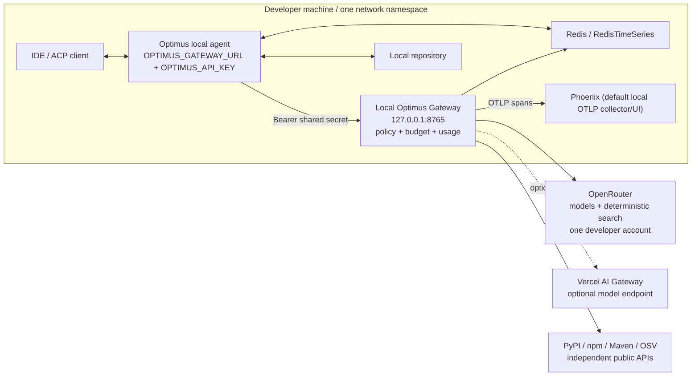
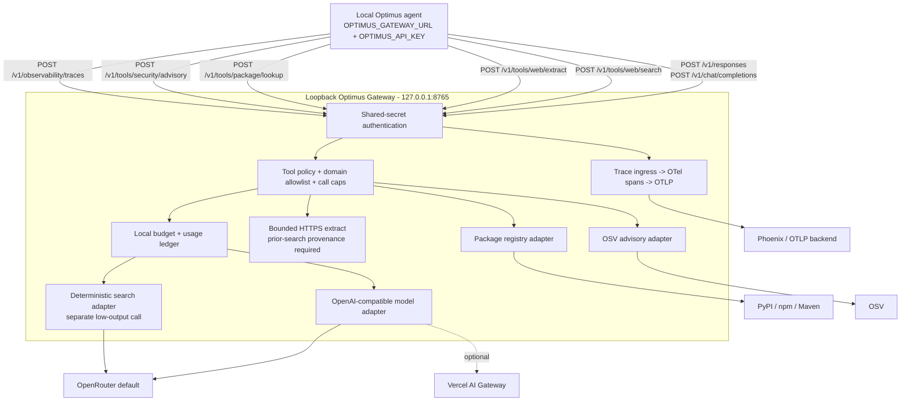

# Local Gateway Architecture Consolidated Document Redline - v3

**Status:** Draft for source review; no source PDF has been modified or generated
**Date:** 2026-07-27
**Authority order:** correction brief v3, then v2, then v1; approved aggregator architecture design;
measured OpenRouter spike
**Target versions:** HLD v2.16, LLD v2.39, Test Strategy v1.5, Guardrails v1.1

## 1. Source pins and review method

This redline was re-derived from the approved v3 architecture. It does not apply the v1/v2 redline
verbatim.

| Source | Pages | SHA-256 |
|---|---:|---|
| `docs/Optimus-Cost-Agent-Architecture-v2.15.pdf` | 13 | `A386EEE8463A169A20A18B59BA923CFA80C0F6707DF7FEA3DB91B83FE3386C0B` |
| `docs/Optimus-Cost-Agent-LLD-v2.38.pdf` | 40 | `0471DCAE8100F41340AD6F3FE30F19B7CA8042C2949A534973B2A8D9564944DB` |
| `docs/Optimus-Cost-Agent-Test-Strategy-v1.4.pdf` | 14 | `6F7EB2B48447F1CE3D882FC60E16DA8B41C1DD7C926C359F45185823492DA5DB` |
| `docs/Optimus-Cost-Agent-Agent-Execution-Guardrails-and-Workflow-Strategy-v1.0.pdf` | 16 | `4669940B34C8C0CAAB5501C193213C3087C45FAE0CBA3011E1DBF87EB74B4D0C` |

Text quotations were checked against PDF page extraction. Diagram pages HLD p.7 and LLD pp.2-3,
plus the code-heavy LLD pages cited below, were rendered and inspected visually. The LLD §0.B clip
is visible at the bottom of rendered p.2; the route block ends mid-flow.

## 2. Settled global rules

Every replacement below obeys these rules:

1. The Optimus Gateway is a deterministic local process bound to loopback, not a hosted Optimus
   service.
2. The agent process has only `OPTIMUS_GATEWAY_URL` and `OPTIMUS_API_KEY`.
3. The Gateway process has the developer's upstream aggregator credential in `.env.gateway` or OS
   credential storage. The credential is on the developer machine but is never inherited by,
   returned to, logged by, or persisted by the agent process.
4. OpenRouter is the default upstream. Vercel AI Gateway is an allowed OpenAI-compatible second
   model endpoint only if its Python integration remains modest; otherwise it receives a named
   backlog entry.
5. Direct single-provider adapters are removed. The surviving model transport is OpenAI-compatible.
6. OpenRouter deterministic plugin search is a separate low-output model call. Search is never
   attached to the main generation call.
7. The plugin is deprecated. One-key-for-search is therefore a Phase 1 capability, not a permanent
   guarantee. The designated contingency is a separately spiked verified-or-fail OpenRouter server
   tool request; a standalone search API with a second key remains the fallback if that fails.
8. Tavily remains until replacement acceptance tests and rollback review pass, then is deliberately
   deleted. The deletion record must preserve the risk that a standalone backend may be needed
   again.
9. PyPI, npm, Maven Central, and OSV are free independent capabilities. Their routes must not be
   hidden when search is unavailable.
10. Search and completion cost come from upstream response usage fields. The Gateway does not
    replace provider-reported cost with a local estimate.
11. Observability is OpenTelemetry-native. Phoenix is the documented local default. LangSmith and
    allocated/amortized observability cost are removed.
12. Cost attribution retains `run_id`, `session_id`, `request_id`, `gateway_request_id`, and
    `provider_request_id`; only tenant/org/project identity is removed.
13. The USD field rename is documented here but remains a separate implementation subtask. No
    cross-run budget policy is added by that rename.
14. MCP is outside this correction. No diagram or route list gains an MCP endpoint.
    `P11-FU-3` remains open and `P11-FEAT-GATEWAY-MCP` remains blocked.
15. WSL2 constraint: an agent in WSL2 cannot reach a Windows-host Gateway through loopback. Phase 1
    requires both processes in the same network namespace, such as both running inside WSL2.

## 3. HLD v2.15 -> v2.16

### HLD-1 - §5A title and body (PDF pp.3-4)

**Quote old**

> "5A. Provider-Cost Normalization & Single-Key Wallet Model"
>
> "The Optimus API key is the only developer-facing credential. It maps to an internal
> tenant/user/project budget wallet. Upstream provider keys for LLMs, Tavily, LangSmith, and any
> other vendor are owned by the Optimus Gateway and are never configured locally."
>
> "From a cost perspective, OPTIMUS_API_KEY is not a physical upstream key; it is an internal
> account / wallet key."
>
> "Providers -> bill Optimus / org account"
>
> "This preserves the thesis: one key, one budget, one ledger, with many providers behind the
> curtain. Tavily is treated as a first-class Gateway tool and LangSmith as a Gateway-managed
> observability sink; neither becomes a local developer dependency."

**Replace with**

> **5A. Upstream Aggregator Cost Normalization and Single-Key Model**
>
> `OPTIMUS_API_KEY` is the only agent-facing credential. It is a local shared secret used to
> authenticate the agent process to the loopback Optimus Gateway; it is not an upstream vendor key
> or an Optimus tenant wallet. The Gateway process holds one developer-owned aggregator credential
> in its own local configuration or OS credential storage. OpenRouter is the default aggregator.
> Vercel AI Gateway is an allowed second OpenAI-compatible endpoint when its Python integration is
> modest.
>
> The developer funds the aggregator account directly. The aggregator supplies access to many
> models, routes across upstream providers, reports normalized usage and USD cost, and debits one
> developer-owned balance. The local Gateway preserves the one-key, one-budget, one-ledger thesis
> by isolating that credential from the LLM-driven agent, enforcing policy and budget controls, and
> recording provider-reported usage. There is no Optimus-hosted account, prepaid balance,
> subscription, tenant, org, or project wallet.
>
> Web search currently shares the OpenRouter credential and balance through a dedicated,
> deterministic plugin request. Package registry and OSV calls are free public APIs and are not
> funding paths. OpenTelemetry trace export has no invented per-request charge.
>
> The one-key property for search is explicitly conditional: OpenRouter has deprecated its
> deterministic plugin, and no deterministic aggregator successor is presently documented.
> Plugin withdrawal may require a verified-or-fail server-tool design or a standalone search
> provider with a second key and balance.
>
> Cost path: agent shared secret -> local Gateway policy -> developer aggregator account ->
> provider-reported usage/cost -> GatewayUsage and the local normalized ledger.

**Reason**

Keeps the v3 thesis while removing hosted Optimus billing. It also records the approved temporary
nature of one-key search and distinguishes free package/advisory routes from funded search.

### HLD-2 - §6 step [6] (PDF p.4)

**Quote old**

> "[6] Delivery to Optimus AI Gateway -> Frontier Model Providers (GLM-5.2 Primary Generation
> Loop), returning the raw unified diff patch alongside the API usage object."

**Replace with**

> "[6] Delivery to the loopback Optimus Gateway -> approved upstream aggregator (OpenRouter by
> default; Vercel AI Gateway if retained), returning the model output and provider-reported usage
> and USD cost. Model aliases remain policy inputs, but the agent never selects or contacts a
> direct provider adapter."

### HLD-3 - §10.A System Context Diagram and caption (PDF p.7)

**Quote old**

> "All provider calls flow through the Optimus AI Gateway; the local agent holds only a single
> Optimus credential."
>
> "Figure 10.A - System Context - single Optimus credential; all provider keys Vault-held
> server-side."

The rendered diagram places the Gateway outside the dashed "Developer Environment" box and labels
it "provider routing / Vault-held keys / Usage accounting."

**Replace prose with**

> The system context places the IDE, agent process, loopback Gateway process, Redis, repository,
> and optional local Phoenix collector inside one developer environment. The agent and Gateway are
> separate processes with separate environments. The agent authenticates to the Gateway with a
> local shared secret and cannot read the Gateway's aggregator credential. The Gateway alone may
> contact the approved upstream aggregator, package registries, OSV, and the configured OTLP
> collector.

**Replace diagram with this content specification**



**Caption replacement**

> "Figure 10.A - Local process boundary: one agent credential; the aggregator credential remains in
> Gateway-owned local configuration. No MCP endpoint is implied."

### HLD-4 - §10.C Phase 1 release-gate label (PDF p.9)

**Quote old**

> "Release Gate: one-key setup -> no direct provider keys on developer machines"

**Replace with**

> "Release Gate: the agent runs with only `OPTIMUS_GATEWAY_URL` and `OPTIMUS_API_KEY`; no upstream
> key is resolvable in the agent process. The separate loopback Gateway receives only its approved
> aggregator key and optional infrastructure configuration."

**Reason**

An upstream key legitimately exists on the developer machine in `.env.gateway`; the security
boundary is process isolation, not physical absence from the machine.

### HLD-5 - §11 Gateway purpose, responsibilities, and configuration (PDF p.10)

**Quote old**

> "The gateway holds all provider credentials server-side in a Vault."
>
> "This eliminates credential sprawl on developer machines and centralises cost attribution."
>
> "Inject provider API keys server-side from Vault; no key is ever transmitted to the local agent."
>
> "Enforce origin allowlist: local agent gateway_url must resolve to a trusted origin; rogue gateway
> attacks are blocked via production_mode + signed tenant profile."
>
> `OPTIMUS_GATEWAY_URL=https://gateway.optimus.ai`

**Replace with**

> **11. Local Optimus Gateway - Phase 1 Mandatory**
>
> The Gateway is a small deterministic process started by the developer and bound to loopback. All
> model, evidence, package, advisory, accounting, and trace-ingress traffic from the agent flows
> through it. The Gateway's authority comes from process separation: the LLM-driven agent cannot
> access upstream credentials or mutate Gateway policy and budget state.
>
> **Gateway responsibilities**
>
> - Authenticate the agent with the local shared secret.
> - Reject non-loopback bind and target URLs. Phase 1 has no non-loopback deployment mode,
>   production-mode exception, hosted origin, extra trusted origin, or signed tenant profile.
> - Route model completions through the OpenAI-compatible aggregator transport. OpenRouter is the
>   default; Vercel is optional if retained. Direct OpenAI/Anthropic/provider adapters are absent.
> - Execute authorized web search as a separate minimal OpenRouter plugin request, preserve the
>   harness decision, and fail closed on missing citations, off-policy URLs, or missing usage/cost.
> - Fetch approved extract URLs directly over bounded HTTPS after revalidating prior-search
>   provenance.
> - Expose package and OSV routes independently of search configuration.
> - Record actual provider, resolved model/version, request IDs, cache detail, billing units, and
>   provider-reported `cost_usd`.
> - Independently enforce domain policy, call caps, tool policy, and local budget limits.
> - Convert accepted trace events to OTel spans and export OTLP; recommend Phoenix locally.
>
> **Agent configuration**
>
> ```dotenv
> OPTIMUS_GATEWAY_URL=http://127.0.0.1:8765
> OPTIMUS_API_KEY=<local shared secret>
> ```
>
> **Gateway-owned configuration**
>
> ```dotenv
> OPTIMUS_LOCAL_GATEWAY_PROVIDER=openrouter
> OPTIMUS_LOCAL_GATEWAY_PROVIDER_API_KEY=<developer OpenRouter key>
> OPTIMUS_LOCAL_GATEWAY_SHARED_SECRET=<same local shared secret>
> OPTIMUS_GATEWAY_TOOL_ALLOWED_DOMAINS=<comma-separated policy>
> OPTIMUS_GATEWAY_TOOL_REDIS_URL=redis://127.0.0.1:6379/0
> OTEL_EXPORTER_OTLP_ENDPOINT=<configured local Phoenix/OTLP trace endpoint>
> ```
>
> Run the agent and Gateway in the same network namespace. In particular, an agent inside WSL2
> cannot use loopback to reach a Gateway running on the Windows host; run both inside WSL2.

### HLD-6 - §11 request/response sequence (PDF p.11)

**Quote old**

> "Swimlane: Local Agent · Optimus Gateway · Vault · Model Provider · RedisTimeSeries."
>
> "The Gateway injects the correct provider API key from Vault, routes to the selected model (GLM,
> Haiku, Sonnet, or Opus), and returns a GatewayUsage envelope..."
>
> "No provider credentials ever leave the Gateway server."

**Replace with**

> "Swimlane: Local Agent -> Loopback Gateway -> OpenRouter/Vercel -> RedisTimeSeries, with an
> independent Gateway -> Phoenix OTLP path."
>
> The agent sends one authenticated request to the loopback Gateway. The Gateway applies policy and
> budget controls, calls the configured aggregator with its Gateway-owned credential, parses
> provider-reported usage and cost, and returns the normalized GatewayUsage envelope. The
> aggregator credential never enters the agent process or response. Search follows a separate
> authorized request/annotation path; package and OSV routes do not depend on search availability.

### HLD-7 - §11A Trace Observability (PDF p.12)

**Quote old**

> "Phase 1 uses LangSmith for trace observability..."
>
> "LangSmith cost is recorded the same way as any other provider cost..."
>
> "...allocated / amortized observability cost..."

**Replace with**

> **11A. OpenTelemetry Trace Observability**
>
> Phase 1 uses OpenTelemetry spans and OTLP as the vendor-neutral trace contract across planning,
> Gateway calls, tool invocation, validation, retries, and final response generation. The local
> agent sends authenticated structured trace ingress to the Gateway; the Gateway maps required
> fields to OTel spans and exports OTLP. Arize Phoenix is the documented local default. Any
> OTLP-compatible backend may replace it without changing Optimus instrumentation; Langfuse may be
> considered for team-scale deployments.
>
> Trace export records operational telemetry, not an invented billable provider request. No
> allocated or amortized observability `cost_usd` is added to the usage ledger. Infrastructure cost
> is an operator concern outside per-request accounting.
>
> Trace attributes retain run, session, request, Gateway/provider request, model/provider, cache,
> cost, billing, policy, tool, validation, and failure attribution. Secrets are redacted before
> export.

### HLD-8 - §12 quality taxonomy (PDF p.12)

**Quote old**

> "...together with LangSmith trace observability are tracked separately..."
>
> "Trace observability | LangSmith (Gateway-managed key)"

**Replace with**

> "...together with OTel/OTLP trace validation are tracked separately..."
>
> "Trace observability | OpenTelemetry + OTLP; Phoenix default local backend | Debugging and
> regression analysis; not a coverage metric"

## 4. LLD v2.38 -> v2.39

### LLD-1 - §0 introduction and §0.A Recommended Architecture (PDF p.2)

**Quote old**

> "Asking every developer to supply a Tavily key, an OpenAI key, and any other provider credential
> creates credential sprawl..."
>
> "...the developer authenticates once with Optimus, and the gateway holds all provider credentials
> server-side in a Vault. This mirrors the model used by Cursor, JetBrains AI..."
>
> `OPTIMUS_GATEWAY_URL=https://gateway.optimus.ai`
>
> "# Sign in with Optimus (OAuth / device flow)"
>
> "The gateway then maps that credential to the org / user / project context..."

**Replace with**

> **0. Local Optimus Gateway Architecture**
>
> The Optimus Gateway is mandatory Phase 1 infrastructure, but it is not a hosted service. It is a
> deterministic local process bound to loopback and run beside the agent. The agent knows only the
> loopback URL and a shared secret. The Gateway independently owns the developer's upstream
> aggregator credential, policy, call counters, budget state, and usage accounting.
>
> ```dotenv
> OPTIMUS_GATEWAY_URL=http://127.0.0.1:8765
> OPTIMUS_API_KEY=<local shared secret>
> ```
>
> There is no OAuth/device flow, tenant, org, project wallet, signed tenant profile, hosted built-in
> origin, or public Optimus Gateway. OpenRouter is the default aggregator and Vercel AI Gateway is
> the optional second OpenAI-compatible model endpoint. Process separation protects the
> Gateway-owned credential from the LLM-driven agent.

### LLD-2 - §0.B Gateway Component Flow (PDF p.2)

**Quote old**

The visible, clipped block begins:

> "IDE Plugin / Local Optimus Agent"
>
> "1 Optimus key or OAuth token"
>
> "Auth + Project Policy (validates credential, resolves org/project)"
>
> "Cost Ledger / Budget Engine (enforces spend caps, attribution)"
>
> "Secret Vault (holds provider credentials, never exposed)"
>
> "POST /v1/tools/web/search (Tavily, proxied)"

The rendered page ends mid-block. The continuation is not visible on p.3.

**Replace the complete diagram with**



**Required render acceptance**

- The full flow, including `/v1/observability/traces`, fits without clipping.
- No MCP route, endpoint, tool contract, or implied branch appears.
- `P11-FU-3` stays open and `P11-FEAT-GATEWAY-MCP` stays blocked.

### LLD-3 - §0.C responsibilities and §0.E configuration boundary (PDF p.3)

**Quote old**

> "Single developer authentication - one credential, one session."
>
> "Model routing across OpenAI / OpenRouter / Azure and other LLM providers."
>
> "Tool brokering for Tavily, OSV, package registries, and MCP tools."
>
> "Centralised prepaid balance or subscription billing."
>
> "Cost attribution by org_id, user_id, project_id, run_id."
>
> "Secret isolation: provider keys live in Vault, never on developer machines."

The §0.E table labels the second column:

> "Gateway / Vault (server-side only)"

and lists `production_mode`, enterprise origins, and signed tenant profiles on the agent side.

**Replace responsibilities with**

> - **Local authentication:** shared secret between agent and loopback Gateway.
> - **Aggregator model routing:** OpenRouter default; Vercel optional; no direct provider adapters.
> - **Typed tools:** deterministic web search, bounded web extract, package lookup, and OSV advisory.
>   MCP remains outside this correction and has no Phase 1 Gateway endpoint.
> - **Budget enforcement:** local Gateway limits against the developer's aggregator balance and
>   local ledger.
> - **Attribution:** `run_id`, `session_id`, `request_id`, `gateway_request_id`, and
>   `provider_request_id`; no org/user/project tenancy.
> - **Policy enforcement:** execution mode, tool class, call caps, domain policy, and provenance.
> - **Credential isolation:** upstream keys exist only in Gateway-owned local configuration or OS
>   credential storage, never in the agent process.
> - **Independent capabilities:** package and OSV routes remain available without a search backend.

**Replace §0.E table with**

| Agent process environment | Gateway process local configuration |
|---|---|
| `OPTIMUS_GATEWAY_URL` | `OPTIMUS_LOCAL_GATEWAY_PROVIDER=openrouter` |
| `OPTIMUS_API_KEY` | `OPTIMUS_LOCAL_GATEWAY_PROVIDER_API_KEY` |
| No provider/search/OTel credentials | `OPTIMUS_LOCAL_GATEWAY_SHARED_SECRET` |
| Loopback URL only | allowed domains, Redis URL, optional OTLP endpoint |
| No production mode or trusted-origin override | no hosted origin, tenant profile, or non-loopback mode |

### LLD-4 - §0.D Gateway-Facing API Shape (PDF p.3)

**Quote old**

The route block lists the two model endpoints and four typed tool endpoints:

> `POST /v1/responses`
>
> `POST /v1/chat/completions`
>
> `POST /v1/tools/web/search`
>
> `POST /v1/tools/web/extract`
>
> `POST /v1/tools/package/lookup`
>
> `POST /v1/tools/security/advisory`

It does not list the trace-ingress route.

**Replace route block with**

```text
# Model completions - Responses API shape (uses "input" field)
POST /v1/responses

# Model completions - Chat Completions shape (uses "messages" array)
POST /v1/chat/completions

# Internal tool endpoints (called by local agent via Gateway)
POST /v1/tools/web/search
POST /v1/tools/web/extract
POST /v1/tools/package/lookup
POST /v1/tools/security/advisory

# Authenticated structured trace ingress (called by local agent via Gateway)
POST /v1/observability/traces
```

All seven routes authenticate to the strict-loopback Gateway with the local shared secret. Trace
ingress is an operational OTel/OTLP path, not a model/tool billing route, and it does not create an
allocated or amortized observability charge. No MCP endpoint is added; `P11-FU-3` remains open and
`P11-FEAT-GATEWAY-MCP` remains blocked.

### LLD-5 - §0A Provider-Cost Mapping (PDF pp.4-5)

**Quote old**

> "OPTIMUS_API_KEY is not a physical upstream key; it is an internal account / wallet key. The
> Gateway maps it to a tenant / user / project / budget wallet..."
>
> "Vendors such as Tavily, LangSmith, OpenAI, and OpenRouter each expect their own credential and
> bill the Optimus org account..."
>
> `cost_usd = price_snapshot(model) applied to usage`
>
> `optimus_credits_debited = normalized internal charge`
>
> "LangSmith trace: ... allocated or amortized observability cost"

**Replace with**

> `OPTIMUS_API_KEY` is a local agent-to-Gateway shared secret, not a wallet key. The Gateway owns
> one developer-funded aggregator credential. It records the aggregator's provider-reported usage
> and cost into one local ledger.
>
> **Model or deterministic search call**
>
> - aggregator: `openrouter` by default; optional `vercel`
> - actual provider and resolved model/version: copied from upstream response when returned
> - billing units and token/cache detail: copied from upstream usage
> - `cost_usd`: copied from upstream `usage.cost`; missing or malformed cost fails closed
> - IDs: Gateway, provider, run, session, and request IDs retained
>
> **Package/advisory call**
>
> - provider: PyPI, npm, Maven, or OSV
> - no provider-funding language; these are independent public APIs
> - operational request counts may be recorded, but no vendor cost is fabricated
>
> **Trace export**
>
> - OTel span/OTLP delivery status is operational telemetry
> - no allocated or amortized per-request observability charge
>
> The separate USD rename removes `optimus_credits_debited` and legacy credit-named budget fields
> without changing their existing USD semantics or adding cross-run policy.

### LLD-6 - Gateway tool and observability endpoints (PDF p.5)

**Quote old**

> "The local agent never calls Tavily or LangSmith directly."
>
> "Canonical Phase 1 LangSmith wiring..."

**Replace with**

> The local agent never calls OpenRouter, Vercel, package registries, OSV, or an observability
> backend directly. It calls the loopback Gateway's existing typed routes. Search is implemented as
> an authorized, separate minimal OpenRouter plugin request; package and advisory routes remain
> independent.
>
> The canonical observability path is agent structured trace ingress ->
> `/v1/observability/traces` -> Gateway OTel mapping -> OTLP backend. Phoenix is the default local
> backend. The agent has no backend credential and no direct backend egress.

The route list remains the four typed tool endpoints plus the two model endpoints and
`/v1/observability/traces`. No MCP endpoint is added.

### LLD-7 - §6 Resilient Provider Calling Layer and Tenacity Rules (PDF pp.20-21)

**Quote old**

> "The gateway resolves the model alias, selects the upstream provider, injects its own Vault-held
> key, and returns a normalised response."

The illustrative provider-call docstring also says:

> "The gateway selects the upstream model, injects its Vault credentials, and returns a normalised
> completion response."

**Replace with**

> All model completions route from the agent to the strict-loopback Optimus Gateway using the local
> shared secret. The agent never calls an upstream model endpoint and never receives an aggregator
> credential. The Gateway resolves the Optimus model alias to an aggregator model identifier and
> calls the approved OpenAI-compatible upstream: OpenRouter by default, or Vercel AI Gateway if its
> bounded Python integration is retained. The developer-owned aggregator credential exists only in
> Gateway-owned local configuration or OS credential storage. There is no Vault, hosted Optimus
> account, or direct single-provider adapter.
>
> The Gateway continues to expose two distinct agent-facing wire shapes. `/v1/responses` accepts
> the Responses API `input` field; `/v1/chat/completions` accepts the Chat Completions `messages`
> array. The schema validator rejects mixed shapes. Both paths converge on the same authenticated
> completion service and the surviving `UrllibOpenAICompatibleClient` transport pattern in
> `src/optimus_gateway/upstream_client.py`.
>
> The upstream transport posts the resolved model and normalized input to the aggregator's
> OpenAI-compatible endpoint, parses the response, and returns output plus provider-reported usage
> and USD cost. Missing or malformed usage/cost fails closed before a success envelope is emitted.
> Transient retry classification remains separate from permanent validation/authentication errors,
> with at most three attempts and retry telemetry on every attempt.

**Replace the illustrative code semantically**

```python
class UrllibOpenAICompatibleClient:
    """Gateway-owned aggregator transport; no agent credential or direct-provider branch."""

    def create_message(self, *, model: str, input_text: str) -> ProviderMessageResult:
        payload = {
            "model": model,
            "messages": [{"role": "user", "content": input_text}],
        }
        body = self._post_json("/chat/completions", payload)
        return parse_openai_compatible_message_and_usage(body)
```

The final §6 example must preserve the two agent-facing endpoint shapes and the do-not-mix
validator rule, while clearly separating them from the single OpenAI-compatible upstream transport.
It must not copy the current local price-snapshot fallback into the corrected specification:
provider-reported `usage.cost` is authoritative under this architecture.

### LLD-8 - §9C Typed Evidence Acquisition Wrappers and origin model (PDF pp.26-30)

**Quote old**

> "Authentication to all downstream services (Tavily, OSV, package registries) is handled by the
> Optimus AI Gateway."
>
> "...the gateway resolves the provider route and injects its own Vault-held keys server-side. This
> eliminates credential sprawl on developer machines and centralises cost attribution."

The rendered example on pp.27-28 defines:

> `OPTIMUS_BUILTIN_TRUSTED_ORIGINS`
>
> `read_signed_tenant_profile_origins()`
>
> `production_mode`
>
> `extra_trusted_origins`
>
> `GatewayProviderSecrets` with OpenAI, OpenRouter, and Tavily keys

and the wrapper labels provider defaults as `tavily`.

**Replace prose with**

> The local agent has no upstream credential. It authenticates only to the loopback Gateway.
> `OptimusGatewaySettings` has one URL, one shared secret, and strict loopback validation. It has no
> production mode, built-in hosted origins, extra origins, or signed tenant-profile seam.
>
> Gateway-owned upstream configuration selects OpenRouter by default and may select Vercel if the
> approved Python integration is retained. The model transport is OpenAI-compatible. Search
> provider mechanics remain entirely behind `/v1/tools/web/search`.

**Replace the origin example semantically with**

```python
class OptimusGatewaySettings(BaseModel):
    gateway_url: str = "http://127.0.0.1:8765"
    optimus_api_key: SecretStr

    @model_validator(mode="after")
    def validate_loopback_gateway(self) -> "OptimusGatewaySettings":
        # Require HTTP(S), no URI userinfo, and hostname in
        # {"127.0.0.1", "localhost", "::1"}.
        # Reject every non-loopback host; there is no override surface.
        ...
```

The final PDF code must mirror the separately approved strict-loopback implementation rather than
invent a second validator.

**Add Gateway search contract**

> The Gateway converts an authorized web-search request into a dedicated OpenRouter Chat
> Completions request with one cheap Flash/Haiku-class model, low `max_tokens`, and
> `plugins:[{"id":"web"}]`. It forwards the effective domain policy, parses only
> `annotations[].url_citation`, independently revalidates every returned URL, and copies upstream
> `usage.cost`. Assistant prose and annotation character offsets are not evidence.
>
> Approved spike baseline: `max_tokens=16`, 3/3 annotations present, 0 include-domain violations,
> 0 exclude-domain violations, 9/9 citations structurally complete, mean 7,068.7 ms/search, and
> $0.0051584/search. Three to five sequential searches project to 21.2-35.3 seconds. The supplied
> Tavily comparison is about 1-2 seconds and $0.008/search; it was not measured in the spike.

**Add plugin-deprecation contract**

> The deterministic plugin is deprecated. Its live release probe must block release on removal or
> behavior change. The first successor evaluation is a dedicated server-tool request with
> `max_uses: 1`, one-call budget, mandatory search-use accounting and annotations, and fail-closed
> behavior when no search occurs. This is verified-or-fail, not deterministic by construction.

**Replace extract provider behavior with**

> Extract performs a bounded Gateway-side HTTPS fetch only for URLs recorded by a prior approved
> search in the same run. It revalidates every redirect and final host, blocks private/link-local/
> loopback resolution and userinfo, bounds time/bytes/characters, rejects unsupported media, and
> treats HTML as untrusted text. The spike fetched 270,008 bytes and parsed 60,077 characters in
> 589.5 ms; an earlier 1,000,000-byte limit failed closed on a legitimate larger page. Production
> limits and streaming behavior require explicit tests.

### LLD-9 - §9D Gateway Server-Side Policy Revalidation (PDF p.30)

**Quote old**

> "Allowed domains: the gateway re-applies the org/project domain whitelist..."
>
> "Budgets: the gateway re-enforces per-org, per-user, and per-project spend caps..."
>
> "Tool policies: ...permitted for the authenticated org / project / execution mode."

**Replace with**

> **Allowed domains:** the Gateway intersects caller-requested domains with the locally configured
> allowlist, forwards that effective policy upstream, and independently rejects every returned URL
> outside it.
>
> **Extract provenance:** every URL must be an exact prior Gateway-recorded search result for the
> same `run_id`; redirect and final URLs are revalidated.
>
> **Budgets:** the separate Gateway process enforces the current run's USD cap against its own local
> ledger before billable dispatch. Agent budget state is informational. Cross-run budget policy
> remains `P9.85-FU-3` and is not added here.
>
> **Call caps:** Gateway counters remain keyed by run and tool; route-specific capabilities do not
> share a paid-search configuration gate.
>
> **Tool policy:** the Gateway rechecks tool class, policy signal, execution mode, and authenticated
> local subject. There is no org/project dimension.

### LLD-10 - §9E Evidence Ledger (PDF pp.31-32)

**Quote old**

> `credits_used: int = 0`
>
> `total_credits()`
>
> "total_credits() for backward compatibility..."
>
> "ProviderUsage ... optimus_credits_debited"

**Replace with**

> Remove credit-named fields and methods under the separate USD rename subtask. Evidence entries
> retain `billing_units` and Decimal-safe `cost_usd` copied from GatewayUsage, plus run/session/
> request/Gateway/provider request attribution. `total_cost_usd()` and `total_billing_units()` are
> the reconciliation methods. Do not add a second normalized-credit charge.

**USD rename custody**

`ledger_run_total_credits` is protocol-visible in the ACP result payloads produced by
`src/optimus/acp/dispatcher.py` (current lines 392, 408, 439, and 451). The separate USD rename
subtask must therefore treat its replacement as a wire-contract migration: define the USD-named
field, decide and document any compatibility interval, update independently authored ACP-client
expectations and schema/golden evidence, and prove the old credit-named response field is retired
without changing its existing USD semantics. This is not an internal-only mechanical rename.

### LLD-11 - §10 Usage Accounting (PDF pp.33-34)

**Quote old**

The example calculates request cost from tokens and local rates:

> `calculate_request_cost(...)`
>
> `default_rates = {"input_rate": 1.40, "cached_rate": 0.26, "output_rate": 15.0}`
>
> `cost = ((input_tokens * input_rate) + (output_tokens * output_rate)) / 1000000`

**Replace with**

> UsageAccountingService accepts a validated GatewayUsage/ProviderUsage record whose billing units,
> token/cache details, and `cost_usd` came from the upstream aggregator response. It persists those
> values and never substitutes a locally calculated charge when provider cost exists. Missing,
> null, negative, or malformed cost fails closed before generated content or evidence is applied.
>
> A versioned price snapshot may remain as labeled diagnostic/comparison metadata only. It cannot
> overwrite provider-reported cost or silently supply a release-grade value.

The RedisTimeSeries retention and idempotent `TS.CREATE`/`TS.ALTER` mechanics remain unchanged.

### LLD-12 - §10A Provider Usage Ledger and Observability (PDF p.35)

**Quote old**

> "ProviderUsage ... adds the normalization fields (service, native_unit,
> optimus_credits_debited, price_snapshot_id)."
>
> "any upstream cost (tokens, Tavily credits, trace events) reconciles to a single Optimus ledger."
>
> `provider: str  # tavily | openai | langsmith | glm | ...`
>
> `optimus_credits_debited: Decimal`
>
> "LangSmith Trace Export Mechanics"

**Replace with**

> **ProviderUsage / GatewayUsage consistency**
>
> ProviderUsage persists the wire-level GatewayUsage fields verbatim and adds attribution required
> for reconciliation: aggregator, actual provider, resolved model/version, service, native unit,
> run/session/request IDs, and optional diagnostic price-snapshot ID. It does not add an Optimus
> credit charge. `cost_usd` is the upstream-reported aggregator charge.
>
> Public package/advisory calls record their operational provider and request evidence without
> invented vendor cost. OTel export records delivery status and trace identifiers, not amortized
> observability cost.
>
> **OpenTelemetry export mechanics**
>
> The agent sends authenticated structured trace events to `/v1/observability/traces`. The Gateway
> validates and redacts them, maps them to OTel spans/events, and exports OTLP. Phoenix is the local
> documented default. Required attributes include run, session, request, Gateway/provider request,
> execution mode, generation scope, model/provider, cache, `cost_usd`, billing units, policy/tool,
> validation, retry, and failure fields.

### LLD-13 - §11 implementation checklist/release gate (PDF pp.36-37)

**Quote old**

> "Validate gateway_url allowlist: production URL accepted..."
>
> "...OPTIMUS_EXTRA_GATEWAY_ORIGINS..."
>
> "...registered in signed tenant profile..."
>
> "Confirm ProviderUsage ledger records persist normalized optimus_credits_debited alongside
> provider-native billing_units for LLM, Tavily, and LangSmith usage..."
>
> "Confirm LangSmith trace export..."

**Replace checklist items with**

> - Accept `127.0.0.1`, `localhost`, and `::1`; reject every non-loopback Gateway URL with no
>   production-mode, extra-origin, or tenant-profile bypass.
> - Verify WSL2 agent and Gateway run inside the same network namespace for loopback operation.
> - Prove search, extract, package, and advisory route availability is independent; no Tavily/search
>   credential may hide package or OSV routes.
> - Prove deterministic search annotations, domain filters, returned-URL revalidation, call caps,
>   provider usage/cost propagation, and deprecation live gate.
> - Prove direct extract redirect/SSRF/media/size/time/provenance controls.
> - Persist provider-reported Decimal-safe `cost_usd` and billing units; remove credit-named fields
>   in their separate migration.
> - Export real OTLP spans to a live Phoenix evidence tier and prove no LangSmith dependency or key.
> - Release gate: agent process has only Gateway URL/shared secret; Gateway process has only the
>   approved aggregator key and no direct-provider/Tavily/LangSmith key after migration acceptance.

### LLD-14 - §11A and §12 cross-references (PDF pp.38-39)

**Quote old**

> "LangSmith traces are used for debugging and regression analysis..."
>
> "LangSmith trace assertions..."
>
> "...under the existing budget wallet..."
>
> `LoopBudgetPolicy (max_iterations, max_budget_credits, ...)`

**Replace with**

> OTel/OTLP trace assertions validate debugging and regression fields but do not count toward code
> coverage. The Test Strategy v1.5 remains authoritative.
>
> All model-touching guardrails use the same local Gateway, developer aggregator account, USD
> budget, provider-reported cost, and OTel trace path. Rename `max_budget_credits` to
> `max_budget_usd` in the separate field-migration subtask; no cross-run policy is introduced.

## 5. Test Strategy v1.4 -> v1.5

### TS-1 - §1 objectives and §2 scope (PDF p.2)

**Quote old**

> "one-key setup end-to-end with no direct provider keys in the local environment at any point
> during a run."
>
> "Origin allowlist: production_mode enforcement, OPTIMUS_EXTRA_GATEWAY_ORIGINS dev/test path."

**Replace with**

> Prove the agent process completes full Plan and Agent runs with only
> `OPTIMUS_GATEWAY_URL` and `OPTIMUS_API_KEY`; no upstream credential is resolvable by the agent.
> Prove separately that the loopback Gateway receives only its approved aggregator credential and
> never exposes it.
>
> Replace the origin-allowlist scope with strict loopback URL/bind enforcement and explicit WSL2
> same-network-namespace coverage. Remove production mode, hosted origins, extra origins, and
> signed tenant profiles from the test taxonomy.

Add in-scope categories:

- OpenRouter deterministic plugin live compatibility and deprecation gate.
- Domain include/exclude enforcement plus Gateway returned-URL revalidation.
- Independent package/OSV routes without search configuration.
- Direct bounded HTTPS extract and provenance/SSRF controls.
- Provider-reported usage/cost authority.
- OTel/OTLP export to real Phoenix.

### TS-2 - §3 test pyramid (PDF p.3)

**Quote old**

> "End-to-End (E2E) | Golden task suite | Real gateway (staging)"
>
> "Integration Tests | ... | Mocked gateway/providers"

**Replace with**

> Unit tests may use fakes and have no network. Named live tiers use the dependency they claim:
> `requires_redis` uses real TimeSeries-capable Redis, `requires_gateway` uses the real local
> Gateway and approved upstream credential, and `e2e` spawns the real ACP process. There is no
> hosted staging Gateway. ACP protocol evidence uses the independently authored `acpx` client.
> Provider fakes remain confined to unit/contract tests and cannot justify a live claim.

### TS-3 - §6 Tool Invocation tests (PDF p.5)

**Quote old**

> "Web extract with URL in result set but origin not in gateway_trusted_origins..."
>
> "Search call -> gateway -> response parsed..."

**Replace with**

> - Search is authorized only by the existing policy signals and harness gate.
> - The Gateway forwards the effective include/exclude policy and independently rejects any
>   off-policy citation URL.
> - At `max_tokens=16`, the live deterministic plugin returns non-empty typed URL annotations or
>   the test fails.
> - Annotation offsets are ignored; URL, title, and content are required.
> - Extract requires exact prior Gateway-recorded search provenance and passes redirect/SSRF/
>   content-type/size/time bounds.
> - Search, extract, package, and OSV usage/cost envelopes are recorded independently.
> - Package and OSV routes remain callable with no Tavily/search credential.

### TS-4 - §7 OptimusGatewaySettings unit tests (PDF p.5)

**Quote old**

> "gateway_url set to https://gateway.optimus.ai (built-in): validate_trusted_gateway() passes."
>
> "production_mode=True with extra_trusted_origins non-empty: raises ValueError..."
>
> "production_mode=False with OPTIMUS_EXTRA_GATEWAY_ORIGINS=..."
>
> "only built-in + signed tenant profile origins accepted."

**Replace with**

> - Default `http://127.0.0.1:8765` passes.
> - `localhost` and canonical IPv6 loopback pass.
> - Non-loopback DNS names and IP literals fail closed.
> - URI userinfo, ambiguous host parsing, and non-HTTP(S) schemes fail closed.
> - No environment or constructor field can authorize a non-loopback origin.
> - `production_mode`, `extra_trusted_origins`, built-in hosted origins, and signed tenant profiles
>   are absent from the public configuration surface.
> - `optimus_api_key` is masked in representation, serialization, logs, telemetry, and state.

### TS-5 - §7 integration, E2E, and egress gates (PDF p.6)

**Quote old**

> "send policy-violating request ... directly to staging gateway"
>
> "Provider failover: primary provider returns 503; gateway routes to fallback..."
>
> "no ... provider key is resolvable at any point during a full Plan+Agent run."
>
> "assert that every HTTP request originates from OPTIMUS_GATEWAY_URL."

**Replace with**

> - Direct policy-violation tests target the real loopback Gateway, not a hosted staging service.
> - Aggregator routing/fallback evidence records the actual returned provider and model.
> - The agent process and ACP child may egress only to the loopback Gateway.
> - The Gateway process may egress only to the configured aggregator, approved package/OSV hosts,
>   approved extract targets, Redis, and configured OTLP endpoint.
> - Scan the agent and Gateway environments separately. The agent has no upstream key. The Gateway
>   has the aggregator key by design; after replacement acceptance it has no direct-provider,
>   Tavily, or LangSmith key.
> - A crafted tool-output provider URL cannot cause direct agent egress.
> - In WSL2, prove both processes share the same network namespace; a Windows-host split is not a
>   Phase 1 topology.

### TS-6 - §8A taxonomy and observability (PDF p.8)

**Quote old**

> "LangSmith | Trace observability | Production debugging & trace analysis..."
>
> "Phase 1 uses LangSmith for trace observability..."
>
> "LangSmith trace assertions validate..."

**Replace with**

> "OpenTelemetry/OTLP | Trace observability | Vendor-neutral span contract and export; not a
> coverage tool"
>
> Run a real Phoenix evidence tier and assert the required span attributes, parent/child
> relationships, redaction, batching/retry outcome, and failure disposition. Phoenix is the
> documented default, not an API dependency. No LangSmith dependency, endpoint, credential, or
> amortized charge exists.

### TS-7 - search acceptance baseline and latency/cost tradeoff

Add to §7 or a new §7A:

> The deterministic search compatibility gate uses one cheap Flash/Haiku-class model and one
> default engine request shape. The approved 2026-07-27 baseline is:
>
> - `max_tokens=16`
> - 3 annotations on the minimal-output probe
> - 3/3 include-domain results allowed; 0 violations
> - 0/3 excluded-domain results forbidden; 0 violations
> - 9/9 annotations with HTTPS URL, title, and non-empty content
> - mean latency 7,068.7 ms/search
> - provider-reported mean cost $0.0051584/search
> - direct extract 270,008 bytes -> 60,077 text characters in 589.5 ms
>
> These are evidence values, not permanent performance thresholds. The test must report fresh
> measured values and fail on missing search execution, annotations, domain enforcement, or
> provider usage/cost. It must also detect plugin removal/deprecation breakage. Engine/model
> matrices are out of scope.

Add successor contingency test specification:

> A verified-or-fail server-tool successor is not accepted until a separate live test proves a
> dedicated request with `max_uses: 1` performs exactly one search, reports search-use accounting,
> returns valid annotations, respects domains, and fails closed when execution evidence is absent.

### TS-8 - §§11-13 security and final release gates (PDF pp.10-12)

**Quote old**

> "including LANGSMITH_API_KEY"
>
> "Each scenario runs against the staging Optimus Gateway..."
>
> "OptimusGatewaySettings rejects rogue gateway URLs in both production_mode and
> non-production_mode."
>
> "LangSmith trace assertions pass..."
>
> "No provider API key ... is resolvable from the local environment, config files, or process state
> at any point during the run."

**Replace with**

> - Secret scans include the aggregator key and every retired direct-provider/Tavily/LangSmith key.
> - Golden tasks run against the real local Gateway; live claims use real named dependencies.
> - Strict-loopback validation replaces production-mode permutations.
> - OTel/OTLP-to-Phoenix trace evidence replaces LangSmith assertions.
> - The final gate distinguishes process scopes: no upstream key is resolvable by the agent; the
>   Gateway has exactly the approved aggregator key and does not expose it through logs, telemetry,
>   state, responses, child environments, or error text.
> - Full Plan and Agent runs use only the two agent-facing variables and no direct agent egress.

## 6. Guardrails v1.0 -> v1.1

The wording changes, so the version must bump to v1.1.

### GR-1 - §7.2 Required Controls (PDF p.10)

**Quote old**

> "max_budget_credits | Gateway budget cap across the whole loop."

**Replace with**

> "`max_budget_usd` | Local Gateway USD cap across the whole loop, reconciled from
> provider-reported cost."

This is documentation for the separately reviewed USD field rename. It does not add a cross-run
limit.

### GR-2 - §7 completion-evaluator cost note (PDF p.11)

**Quote old**

> "The completion evaluator must be a cheap model routed through the Optimus Gateway, not the main
> reasoning model, and max_budget_credits is enforced by the same gateway budget policy as every
> other call."

**Replace with**

> The completion evaluator must be a cheap model routed through the strict-loopback Optimus
> Gateway, not the main reasoning model, and `max_budget_usd` is enforced by the same local Gateway
> budget policy against provider-reported cost as every other model call. The evaluator uses the
> developer-owned aggregator account and emits OTel/OTLP telemetry through the Gateway; it has no
> direct provider credential or separate observability path.

This is part of the separately reviewed, wire-aware USD field rename and does not add a cross-run
limit.

### GR-3 - §9 Cost Model Alignment (PDF p.12)

**Quote old**

> "Every model-touching element ... is routed through the Optimus Gateway under the same budget
> wallet, normalized ledger, and observability sink as all other calls..."

**Replace with**

> Every model-touching guardrail uses the same loopback Gateway, developer-owned aggregator
> account, USD budget, provider-reported cost ledger, and OTel/OTLP trace path as all other model
> calls. Guardrails introduce no second credential, direct provider adapter, ungoverned cost path,
> or observability backend dependency.

## 7. Explicitly unchanged or deferred

- No PDF source or generated PDF is changed by this redline.
- No Pandoc or WeasyPrint installation has been attempted.
- HLD v2.16 and LLD v2.39 source production and PDF generation require the already accepted
  Markdown/CSS/SVG -> Pandoc -> WeasyPrint approach, but installation remains separately gated.
- LLD source production is intentionally partial: untouched image-backed pages 6-13, 15-19, and
  22-25 are carried forward from v2.38 during PDF assembly. Editable source recovery for those
  illustrative specification pages is a separate future effort; they must not be OCRed or replaced
  with current implementation code in this correction.
- The authoritative section map is not re-pinned until final PDFs exist.
- README, `.env.example`, deep-requirement inventory, and backlog dispositions remain in the later
  post-PDF/document-finalization sequence.
- Strict-loopback, USD rename, upstream/tool restructuring, and OTel export remain separate
  implementation plans and test runs.
- The USD rename subtask explicitly owns protocol-visible `ledger_run_total_credits` ACP response
  fields as well as the previously named internal credit fields.
- `P9.85-FU-3` is unblocked by the architecture correction but is not designed here.
- `P11-FU-3` remains open because MCP disposition/contract work is not part of this correction.

## 8. Review acceptance checklist

### Dropped-entry cross-check

No standalone earlier entry-list artifact exists in the repository. The first targeted comparison
used the correction brief's document-by-document impact tables plus this redline's prior headings
and found LLD §0.D on p.3 and the Guardrails completion-evaluator cost note on p.11. That check was
insufficient: it missed the hosted-Vault language in image-backed LLD §6 on pp.20-21. A subsequent
render-based review found and added §6 before source production. The corrected inventory is HLD 8
entries, LLD 14 entries, Test Strategy 8 entries, and Guardrails 3 entries - 33 total. This history
is retained so the extraction blind spot and the failed "no other prior entry" conclusion are not
silently erased.

- [ ] Every old quotation matches the pinned PDF page.
- [ ] HLD keeps and retargets the one-key/budget/ledger thesis.
- [ ] One-key-for-search is explicitly temporary.
- [ ] OpenRouter default, Vercel bounded option, and direct-adapter removal are consistent.
- [ ] Search is a separate minimal call; main generation never carries `:online`.
- [ ] Plugin deprecation and verified-or-fail contingency are explicit.
- [ ] Measured latency, cost, annotations, domain behavior, and extract evidence appear.
- [ ] Tavily deletion timing and plausible future restoration risk are traceable.
- [ ] Package/OSV routes are independent of paid search configuration.
- [ ] Provider-reported cost is authoritative; local pricing is diagnostic only.
- [ ] OTel/Phoenix replaces LangSmith and amortized observability cost.
- [ ] Strict loopback and WSL2 topology constraints are explicit.
- [ ] Run/session/request attribution survives removal of tenant/org/project identity.
- [ ] Test Strategy v1.5 distinguishes agent and Gateway credential/egress scopes.
- [ ] Guardrails changes are substantive, so v1.1 is justified.
- [ ] §0.B is unclipped by specification and contains no MCP endpoint.
- [ ] §0.D lists `/v1/observability/traces` and contains no MCP endpoint.
- [ ] §6 contains no Vault or direct-provider adapter and preserves both endpoint shapes.
- [ ] The Guardrails p.11 completion-evaluator budget field and policy language are corrected.
- [ ] Protocol-visible `ledger_run_total_credits` remains in the separate USD rename subtask.
- [ ] No PDF generation, section-map re-pin, README/backlog mutation, or code implementation is
      included.
