# Plan 11.2: P11-FEAT-GATEWAY-TOOLS Design Specification

**Status:** Pending reviewer-agent and operator approval; implementation is not authorized.

**Stable feature:** `P11-FEAT-GATEWAY-TOOLS` (Plan 11.2 at this pickup). This specification
covers Gateway-backed web, package, and advisory tools. It does not scope MCP brokering, which is
owned by the separately ratified but gated `P11-FEAT-GATEWAY-MCP` identity.

**Baseline:** `origin/main` at `bd216388c0da995e04df254ec198a00e4aab23d4`, with the committed
Plan 11 requirement inventory baseline at `4638b195dc345c695560f4ec248f92948a8480a0`. This is the
post-Plan 11.1 CORE baseline; the CORE implementation and the `P11-FU-6` flake custody entry are
already present and are preserved by this TOOLS draft.

## Frozen authoritative source set

The four documents below are the authoritative requirement sources for this feature. The hashes are
over the exact PDF bytes and must be re-verified before implementation begins. The section map and
deep inventory are extraction aids and do not replace these sources.

| Source | Version | SHA-256 |
|---|---:|---|
| `docs/Optimus-Cost-Agent-Architecture-v2.15.pdf` | v2.15 | `A386EEE8463A169A20A18B59BA923CFA80C0F6707DF7FEA3DB91B83FE3386C0B` |
| `docs/Optimus-Cost-Agent-LLD-v2.38.pdf` | v2.38 | `0471DCAE8100F41340AD6F3FE30F19B7CA8042C2949A534973B2A8D9564944DB` |
| `docs/Optimus-Cost-Agent-Agent-Execution-Guardrails-and-Workflow-Strategy-v1.0.pdf` | v1.0 | `4669940B34C8C0CAAB5501C193213C3087C45FAE0CBA3011E1DBF87EB74B4D0C` |
| `docs/Optimus-Cost-Agent-Test-Strategy-v1.4.pdf` | v1.4 | `6F7EB2B48447F1CE3D882FC60E16DA8B41C1DD7C926C359F45185823492DA5DB` |

**Requirement inventory:**
`docs/superpowers/reports/2026-07-25-plan-11-p11-feat-gateway-deep-requirement-inventory.md`
(SHA-256 `7DD4FA40916B2306C55492B36D37FC0178798CC20552B6E73CF13CBF5B69FDC5`).

## Goal

Make the Gateway tool surface a typed, policy-revalidated broker for:

- `POST /v1/tools/web/search` and `POST /v1/tools/web/extract`, preserving the local evidence
  wrappers while moving authoritative domain and provenance checks to the Gateway;
- `POST /v1/tools/package/lookup` and `POST /v1/tools/security/advisory`, closing `P11-FU-2`
  with dedicated package/advisory routing rather than generic web search; and
- one common typed-tool response envelope that carries provenance, untrusted result data, and the
  Gateway usage record without exposing provider credentials or inventing cost values.

The local agent remains a one-key client. It resolves only `OPTIMUS_GATEWAY_URL` and
`OPTIMUS_API_KEY`; Tavily, OSV, package-registry, and other provider credentials remain Gateway-side.

## Current evidence and problem statement

The local client already has a generic Gateway tool transport in
`src/optimus/gateway/client.py:121-133`. The web evidence service already performs local typed
validation, domain checks, pre-tool checks, Gateway I/O, provenance recording, and ledger joins in
`src/optimus/evidence/acquisition.py:39-187`. The existing request and response models live in
`src/optimus/evidence/models.py`, and wire builders/parsers live in
`src/optimus/evidence/gateway_io.py`.

The merged Plan 11.1 CORE Gateway now serves `/v1/responses`, `/v1/chat/completions`, and
`/v1/observability/traces` through `src/optimus_gateway/server.py:23-31`; the `/v1/tools/*` paths
remain outside CORE and return 404. TOOLS must extend this existing dispatch and reuse the merged
CORE contracts and failure seams rather than recreate them. The current seams are:

- `src/optimus_gateway/chat_completions.py:17-42` for the existing chat-completions handler and
  normalized model-completion path;
- `src/optimus_gateway/observability.py:32-54` for structured trace-ingress validation and
  acknowledgement;
- `src/optimus_gateway/models.py:94-115` for the shared `/v1/responses` and
  `/v1/chat/completions` envelope validators and bearer authorization;
- `src/optimus_gateway/upstream_client.py:48-70` for bounded transient-fault retry, reused by
  tool-provider adapters rather than replaced with an independent retry loop; and
- `src/optimus/gateway/models.py:11-88` for the canonical typed `GatewayUsage` envelope and strict
  usage parser, which the TOOLS envelope consumes for usage/cost fields.

The local policy also has a known ownership mismatch: `src/optimus/tools/policy.py:85-93` puts
`DEPENDENCY_VERSION_CHECK` and `SECURITY_OR_CVE_CHECK` into `WEB_SEARCH_TRIGGERS`, while LLD §9B
assigns both signals to `ToolClass.PACKAGE_AND_ADVISORY_METADATA`. `P11-FU-2` changes that existing,
tested routing behavior as well as adding the two Gateway endpoint families.

The authoritative inventory establishes the boundary: web search/extract, server-side policy
revalidation, and `P11-FU-2` belong to TOOLS; provider-native cost normalization and LangSmith
export belong to COST-OBS; and MCP endpoint shape is a source-contract gap owned by `P11-FU-3`.

## Scope boundary

| In scope for Plan 11.2 | Explicitly out of scope or separately owned |
|---|---|
| Typed client and Gateway contracts for web search, web extract, package lookup, and security advisory. | MCP brokering, MCP transport, and MCP Gateway payloads. These belong to `P11-FEAT-GATEWAY-MCP` and are blocked on `P11-FU-3`; no MCP contract may be inferred here. |
| Gateway-side web provider adapters and server-side provider-secret isolation. | Repairing clipped LLD §0.B or defining the missing MCP endpoint shape in LLD §0.D. |
| Domain allowlist revalidation against fully resolved URLs, including returned search URLs and package/advisory citations. | Cross-org/project budget enforcement, wallet debits, or spend caps. Every budget-authority row remains `Deferred → P9.85-FU-3 (parked; operator decision pending)`. |
| Gateway-logged search-result provenance for same-`run_id` extract authorization. | COST-OBS provider-native normalization, ledger reconciliation redesign, LangSmith export, and amortization depth. TOOLS consumes the existing `gateway_usage` contract and ledger seam. |
| Gateway-side tool-class, execution-mode, model, and call-cap revalidation as a defense-in-depth layer. | New local provider keys, direct local Tavily/OSV/package-registry calls, or a second local credential path. |
| Dedicated package/advisory tool class and signal routing for `P11-FU-2`. | Plan 11.1 CORE model routes, `/v1/observability/traces`, ACP registry work, session resume, or IDE work. |
| Untrusted-output labeling, sanitized structured errors, and unit/integration/live evidence for the named contracts. | Treating tool output, web text, citations, or metadata as executable instructions or policy without deterministic validation. |

## Design decisions

### 1. Shared typed-tool envelope

The client and Gateway share contract models in `src/optimus/gateway/tool_models.py`. The Gateway
server validates the request before any provider adapter runs; the local client parses the same
envelope before recording evidence or returning data to the ACP layer.

Every successful tool response has this shape:

```json
{
  "tool_class": "web_search",
  "policy_signal": "CURRENT_OR_LATEST_FACT",
  "run_id": "run-1",
  "result": {"results": []},
  "provenance": {
    "search_id": "search-1",
    "source_urls": [],
    "trust": "untrusted"
  },
  "gateway_usage": {
    "gateway_request_id": "gw-tool-1",
    "provider": "tavily",
    "cache_hit": false,
    "billing_units": 1,
    "cost_usd": "0.001"
  }
}
```

The envelope is typed, but its `result` is a tool-specific typed model rather than an arbitrary
provider response. `gateway_usage` is parsed directly from the Gateway response. A missing,
malformed, or null usage field fails closed; TOOLS never estimates tokens, credits, or dollars.
Provider request IDs, model versions, and pricing snapshot IDs remain optional extensions of the
existing `GatewayUsage` model.

The shared result types have these concrete fields:

| Type | Fields |
|---|---|
| `WebSearchResultSet` | `results: tuple[WebSearchResult, ...]`, where each result has `title`, HTTPS `url`, and `snippet`. |
| `WebExtractResultSet` | `items: tuple[WebExtractItem, ...]`, where each item has HTTPS `url`, `title`, and untrusted `content`. |
| `PackageLookupResult` | `package`, `ecosystem`, `requested_version: str | None`, `latest_version: str | None`, `versions: tuple[PackageVersionRecord, ...]`, and HTTPS `citations`. |
| `SecurityAdvisoryResult` | `identifier`, `ecosystem: str | None`, `version: str | None`, and `advisories: tuple[AdvisoryRecord, ...]`. |
| `PackageVersionRecord` | `version`, `released_at: str | None`, and HTTPS `source_url`. |
| `AdvisoryRecord` | `advisory_id`, `summary`, `severity: str | None`, `affected_ranges`, `fixed_versions`, and HTTPS `citations`; all descriptive text is untrusted. |

`provenance` is metadata, not authorization by itself. Search responses contain a Gateway-issued
`search_id` and the HTTPS result URLs that were logged for the `run_id`. Extract responses contain
the accepted source URLs and carry `trust: "untrusted"`. Package/advisory responses contain only
provider citation URLs and the same untrusted label for descriptions, summaries, and advisory text.

### 2. Request context and server-side revalidation

Each tool request carries a typed metadata context with `run_id`, optional `session_id`,
`execution_mode`, `org_id`, `project_id`, and the selected `model` where the server-side policy
requires it. These fields are transport context, not a caller-supplied authorization decision. The
Gateway independently resolves the authenticated policy context and rejects a request when required
identity or execution context is absent or inconsistent.

The server-side decision sequence is:

1. Authenticate the single Gateway bearer credential.
2. Validate the typed request and normalize HTTPS hosts, identifiers, and bounded limits.
3. Resolve the authenticated org/project policy and verify the requested tool class, model, and
   execution mode.
4. Reapply the server-side domain allowlist to every fully resolved URL.
5. For extract, require every URL to be in a Gateway-logged search result set for the same
   `run_id`; local `approved_urls` values are advisory only.
6. Atomically increment the Gateway-owned call counter keyed by `run_id + tool_class`; reject
   after the configured cap and fail closed if the state store is unavailable.
7. Dispatch to the server-side provider adapter and construct the typed envelope.

The local `ToolRegistry` and `PreToolGuard` remain active convenience and safety gates. The Gateway
does not trust them as the authoritative policy or call-cap source.

#### Gateway-owned Redis state boundary

`src/optimus_gateway/tool_state.py` is a separately deployable Gateway boundary. Its live state
store uses the already-declared top-level `redis>=5` dependency through a direct Redis client and
must not import `optimus.*`, reuse `optimus.redis.*` helpers, or depend on the agent-side
`RedisAgentStateStore`/wrapper. This preserves the current zero-`optimus.*` import boundary of the
`optimus_gateway` package. The direct client owns atomic `run_id + tool_class` call-counter
operations and bounded-TTL search-provenance records; unavailability fails closed. Unit tests inject
a narrow state-store protocol double, while any `requires_redis` evidence uses a real Redis instance
and verifies atomic increment/cap and provenance TTL behavior.

### 3. Web search contract

`POST /v1/tools/web/search` accepts a non-empty `query`, a non-empty requested `allowed_domains`
list, `result_cap` from 1 through 10, and `search_depth` of `basic` or `advanced`. The Gateway
intersects requested domains with the authenticated org/project allowlist. It rejects a request
whose effective allowlist is empty, and it revalidates every returned result URL as HTTPS and as a
member of the effective allowlist before constructing the envelope.

The existing reason code is metadata only and is never sent as the search query. Advanced search is
bounded to five results as required by LLD §9B even if a caller requests a larger cap. The Gateway
provider adapter owns upstream timeout, retry, and provider-specific request translation; raw
provider responses and credentials never cross the envelope boundary.

### 4. Web extract contract and provenance

`POST /v1/tools/web/extract` accepts one to ten unique HTTPS URLs in `urls` and
`max_chars_per_source` from 1 through 20,000, defaulting to 4,000. The client-facing ACP
compatibility path may provide its existing single `url`; the adapter maps it to a one-element
`urls` list before Gateway transport. A request that supplies both forms is invalid.

The Gateway checks every URL against the effective domain allowlist and the preceding Gateway-logged
search result set for the same `run_id`. An approved URL set held only by the local agent cannot
authorize extraction. Extracted title and content are untrusted text and are returned only as data;
they are never executed, followed, or promoted to policy.

### 5. Package and advisory contracts (`P11-FU-2`)

The two dedicated routes close the source-named LLD §0.D surface without routing these signals
through generic web search.

`POST /v1/tools/package/lookup` accepts:

- `package`, a non-empty package identifier;
- `ecosystem`, one of `pypi`, `npm`, or `maven`;
- optional `version`; and
- typed metadata with `run_id`, `session_id`, `execution_mode`, `org_id`, `project_id`, and
  `model` where available.

It requires `ToolClass.PACKAGE_AND_ADVISORY_METADATA`, `ToolPolicySignal.DEPENDENCY_VERSION_CHECK`,
and `EvidenceReasonCode.PACKAGE_VERSION`. Its result contains the normalized package identifier,
ecosystem, requested version, latest version when available, available-version records, and HTTPS
citations. Provider-specific raw payloads are not returned.

`POST /v1/tools/security/advisory` accepts:

- `identifier`, a non-empty package or CVE identifier;
- optional `ecosystem` and `version`; and
- the same typed metadata context.

It requires `ToolClass.PACKAGE_AND_ADVISORY_METADATA`,
`ToolPolicySignal.SECURITY_OR_CVE_CHECK`, and `EvidenceReasonCode.SECURITY_ADVISORY`. Its result
contains normalized advisory records with advisory ID, summary, severity, affected ranges, fixed
versions, and HTTPS citations. Advisory text is untrusted data.

Both endpoints are read-only and policy-triggered. Their provider hosts are configured and resolved
server-side; the caller cannot turn either endpoint into arbitrary URL fetch. Their `gateway_usage`
and provenance fields use the common envelope, and their usage is joined to the existing evidence
ledger by `gateway_request_id`.

### 6. Policy correction and local adapter flow

`ToolClass.PACKAGE_AND_ADVISORY_METADATA` is added to the shared tool taxonomy. The local policy
keeps web triggers for web classes and moves the two package/advisory signal/reason pairs into a
dedicated package/advisory trigger set. The registry records the package/advisory class and applies
the existing atomic per-run call cap before transport.

The ACP dispatcher gains `optimus.evidence.package_lookup` and
`optimus.evidence.security_advisory` methods backed by a focused package/advisory service. Existing
web search and extract methods keep their local pre-tool and ledger behavior, but they parse the
common envelope and map the server's `result` and `provenance` objects into the existing evidence
response types. The local API remains backward-compatible for the single-URL extract call.

```mermaid
flowchart LR
    A[ACP evidence request] --> B[Typed request validation]
    B --> C[Local ToolRegistry and PreToolGuard]
    C --> D[GatewayClient one-key POST]
    D --> E[Gateway auth and context validation]
    E --> F[Gateway policy, domain, provenance, and call-cap checks]
    F --> G[Gateway-side provider adapter]
    G --> H[Typed envelope with usage and provenance]
    H --> I[Client parser and EvidenceLedger join]
    I --> J[ACP result with untrusted tool data]
```



### 7. Errors, secrets, and data handling

The Gateway returns sanitized structured errors with a `gateway_request_id` whenever a request has
passed far enough to be assigned one:

| Failure | Status | Required behavior |
|---|---:|---|
| Invalid JSON, malformed typed fields, mixed `url`/`urls`, empty identifier, or invalid limit | 400 | Reject before provider execution. |
| Missing or invalid bearer | 401 | Do not reveal provider or policy details. |
| Tool, model, execution-mode, or domain policy denial | 403 | Return a structured policy reason and request ID. |
| Extract URL absent from the Gateway search set | 403 | Fail closed; do not fetch the arbitrary URL. |
| Gateway call cap exceeded | 429 | Do not call the provider; preserve request ID and policy reason. |
| Gateway policy/provenance state unavailable | 503 | Fail closed; do not fall back to local advisory state. |
| Provider timeout or transient provider failure | 502 | Apply only the bounded provider retry policy; sanitize the final error. |
| Malformed provider result or usage envelope | 502 | Do not emit a partial typed result or ledger entry without valid usage. |

The local runtime still resolves only `OPTIMUS_GATEWAY_URL` and `OPTIMUS_API_KEY`. Gateway-side
provider keys are never copied into metadata, logs, responses, or error strings. Tool output, web
extract text, package metadata, advisory summaries, citation URLs, and caller metadata are all
untrusted input and cannot execute code or change policy.

Budget and wallet behavior remains explicitly absent. `cost_usd` and `billing_units` are accepted
from the Gateway usage envelope and passed to the existing ledger seam; TOOLS does not compare
spend caps or invent a second accounting path.

## Verification design

### Unit evidence

- Contract models reject empty queries, empty identifiers, invalid ecosystems, duplicate URLs,
  non-HTTPS URLs, invalid limits, mixed single/multiple extract forms, and malformed usage.
- Policy tests prove that dependency and security signals select
  `PACKAGE_AND_ADVISORY_METADATA`, while web policy no longer authorizes them as `WEB_SEARCH`.
- Handler tests prove auth ordering, typed validation, domain intersection, returned-URL
  revalidation, same-run extract provenance, call-cap rejection, state-store failure, sanitized
  provider errors, and untrusted-output labeling.
- Client tests prove the common envelope is parsed before ledger recording, usage fields are
  preserved, and provider keys do not appear in request representations or errors.

### Integration and live evidence

- A mocked integration flow covers search followed by extract and package/advisory routing without
  bypassing the local registry, pre-tool guard, domain policy, or ledger.
- Task 4 produces a real local Gateway process HTTP artifact proving all four routes are served and
  authenticated, with a deterministic server-side test provider injected through the Gateway
  dependency seam; this artifact exists before Task 4 closes.
- A separate `requires_gateway` staging test sends direct policy-violating requests to prove the
  Gateway rejects blocked domains, unapproved extract URLs, wrong tool class/signals, and call-cap
  overages independently of local agent policy. This tier must use real Optimus credentials and
  Gateway policy state; Task 6 owns this staging-only evidence, and a fake Gateway is not acceptable
  evidence for §9D.
- The package and advisory live artifacts record endpoint, tool class, signal, usage fields,
  provenance/citations, and one-key credential evidence without recording provider keys or raw
  advisory bodies.

### Release gates

- A full Plan-mode and Agent-mode run resolves only `OPTIMUS_GATEWAY_URL` and `OPTIMUS_API_KEY`
  locally; no Tavily, OSV, package registry, OpenAI, OpenRouter, GLM, or LangSmith key is locally
  resolvable.
- Affected unit/integration suites, the default suite, aggregate coverage at or above 80%, Ruff,
  and `git diff --check` pass.
- Every in-scope inventory row cited by this specification maps to a named test or live artifact.
  A success-path contract without inventory custody is rejected as scope creep.

## Four-authoritative-document requirement traceability

The rows below are the TOOLS slice's executable traceability gate. They preserve the source wording
needed to distinguish current implementation seams from new Gateway responsibilities.

| Authority | Requirement anchor | Disposition and design response | Evidence |
|---|---|---|---|
| HLD v2.15 §5A | Gateway owns provider access; Tavily is a first-class Gateway tool and is not a local developer dependency. | In scope: server-side provider adapters, one-key client boundary, and common usage envelope. | E1, E3 |
| HLD v2.15 §8 | Tool use is policy-driven; typed tools uniformly enforce domains, timeouts, retries, result caps, and cost telemetry. | In scope: local typed wrappers, Gateway policy revalidation, bounded limits, and existing usage/ledger seam. | E3, E8 |
| HLD v2.15 §11 | Domain allowlists and tool-policy checks are revalidated independently by the Gateway. | In scope: server-side domain, provenance, tool-class, model, execution-mode, and call-cap checks. Budget checks remain deferred to `P9.85-FU-3`. | E8 |
| LLD v2.38 §0.C/§0.D | Tool brokering names Tavily, OSV, package registries, and the four tool routes. | In scope: web and dedicated package/advisory routes. MCP is excluded as `P11-FEAT-GATEWAY-MCP`, blocked on `P11-FU-3`. | E3, E8, E10 |
| LLD v2.38 §9A/§9B | `PACKAGE_AND_ADVISORY_METADATA`, `PACKAGE_VERSION`, `SECURITY_ADVISORY`; reason is metadata, not query; advanced search depth is capped at five. | In scope: dedicated class/trigger routing, typed package/advisory contracts, reason/query separation, and advanced-result bound. | E3, E8, E10 |
| LLD v2.38 §9C | Gateway-backed search/extract wrappers, server-side provider keys, prior-search provenance, bounded unique URLs, and bounded extraction size. | In scope: common envelope, HTTPS/domain revalidation, same-run Gateway search log, 1–10 unique URLs, and 4,000/20,000 character bounds. | E1, E3, E7 |
| LLD v2.38 §9D/§9E | Gateway is authoritative for policy, provenance, and call caps; ToolRegistry remains a local convenience gate; usage joins the ledger by `gateway_request_id`. | In scope: independent Gateway checks, Gateway-owned call counter/state store, preserved local guard, and ledger join. Budget authority remains parked. | E3, E4, E8 |
| Guardrails v1.0 §3/§5 | Pre-tool checks remain deterministic; MCP/config trust is a separate supply-chain boundary. | Preserve the local `PreToolGuard`; do not bypass it. Do not introduce MCP transport or alter the existing `optimus/mcp/runtime.py` trust semantics. | E3, E8 |
| Guardrails v1.0 §7.2/§9 | Evidence is recorded per iteration; cost alignment uses the Gateway ledger; budget cap authority is Gateway-side. | Preserve evidence/usage recording; do not implement budget enforcement or a parallel wallet. | E4, E12 |
| Test Strategy v1.4 §6/§7/§10/§11 | Tool policy, Gateway auth/provider isolation, schema validation, and URL/tool-output trust boundaries require executable tests. | In scope: named unit suites, local-process route tests, and real staging Gateway revalidation. | E1, E3, E7, E8 |
| Test Strategy v1.4 §13 | Direct staging-Gateway policy-violating requests must prove server-side revalidation; one-key release scan is mandatory. | In scope: `requires_gateway` revalidation artifact plus one-key Plan/Agent release scan. | E1, E8, E9 |

## File responsibility map

| File or surface | Responsibility in Plan 11.2 |
|---|---|
| `src/optimus/gateway/tool_models.py` | Shared typed request, result, provenance, envelope, package, and advisory wire contracts. |
| `src/optimus/tools/policy.py` | Add the package/advisory class and move the two package/security signal pairs out of generic web triggers. |
| `src/optimus/evidence/models.py` | Preserve ACP-facing evidence models, map single-URL compatibility, and add package/advisory request/response models. |
| `src/optimus/evidence/gateway_io.py` | Build and parse the common envelope for web and package/advisory calls. |
| `src/optimus/evidence/acquisition.py` | Keep local web policy/pre-tool/provenance/ledger orchestration while consuming the typed envelope. |
| `src/optimus/evidence/package_advisory.py` | New focused package/advisory orchestration service and ledger integration. |
| `src/optimus/acp/dispatcher.py` | Add typed package lookup and security advisory dispatch methods without weakening existing error handling. |
| `src/optimus_gateway/tool_models.py` | Gateway-side request parsing and validation adapters for shared tool contracts. |
| `src/optimus_gateway/tool_policy.py` | Authenticated context, org/project policy, domain intersection, tool/model/mode checks, and structured decisions. |
| `src/optimus_gateway/tool_state.py` | Gateway-owned search provenance and call-cap state using a direct `redis>=5` client; no `optimus.*` imports or agent-side Redis wrapper reuse. |
| `src/optimus_gateway/tool_providers.py` | Server-side provider protocols and Tavily/package-registry/OSV adapter boundaries; no client-side credentials. |
| `src/optimus_gateway/tool_handlers.py` | Authenticated web/package/advisory route handlers and typed envelope/error construction. |
| `src/optimus_gateway/server.py` | Extend the post-CORE `do_POST` dispatch with the four `/v1/tools/*` routes while preserving the existing `/v1/responses`, `/v1/chat/completions`, `/v1/observability/traces`, and unknown-route behavior. |
| `src/optimus_gateway/chat_completions.py` | Existing Plan 11.1 CORE handler; TOOLS builds beside it and does not reimplement or expand its route contract. |
| `src/optimus_gateway/observability.py` | Existing Plan 11.1 CORE trace-ingress handler; unchanged by TOOLS. |
| `src/optimus_gateway/models.py` | Existing CORE auth and model-route envelope validators; reused as the validation/auth seam and not duplicated for model routes. |
| `src/optimus_gateway/upstream_client.py` | Existing bounded retry and normalized provider-result seam; tool adapters reuse its retry semantics and do not replace it. |
| `src/optimus/gateway/models.py` | Existing canonical `GatewayUsage` model/parser; tool envelopes must consume it for usage/cost validation. |
| `tests/unit/optimus_gateway/` | Gateway contract, policy, state, provider-boundary, handler, and HTTP route tests. |
| `tests/unit/optimus_gateway/test_models.py` | Existing CORE envelope-validator regression tests; preserve while adding tool-specific contracts. |
| `tests/unit/optimus_gateway/test_server.py` | Existing three-route CORE dispatch and observability regression tests; extend with the four tool paths without weakening current assertions. |
| `tests/unit/optimus_gateway/test_upstream_retry.py` | Existing CORE retry regression tests; tool-provider retry behavior must use the same bounded semantics. |
| `tests/integration/optimus_gateway/test_gateway_live_smoke.py` | Existing local-process evidence for the three CORE routes; retain as a regression gate when adding tool dispatch. |
| `tests/integration/optimus_gateway/test_gateway_tool_state_live.py` | `requires_redis` evidence for the direct Gateway Redis state boundary, atomic call caps, and provenance TTL. |
| `tests/integration/evidence/` | Client-side mocked flow for web, package, advisory, provenance, and ledger behavior. |
| `tests/integration/optimus_gateway/test_gateway_tools_live.py` | Task 4 local-process route evidence and Task 6 staging-only `requires_gateway` server-side revalidation evidence. |
| `reports/plan-11-2-gateway-tools-local-process-evidence.md` | Task 4 real-HTTP route artifact; records sanitized local-process responses before staging work. |
| `docs/superpowers/reviews/plan-11-review-checkpoints.md` | Gitignored review/implementation handoff log; never stage. |

## Definition of Done for the frozen design

- The four authoritative source PDFs and the requirement inventory digest are verified before
  implementation.
- Web search/extract and package/advisory routes have typed, provider-neutral request/result/envelope
  contracts with bounded HTTPS/domain/provenance behavior.
- The Gateway independently revalidates tool class, signal, identity context, domain, provenance,
  and call cap; local `ToolRegistry`/`PreToolGuard` remain active but are not trusted as server
  authority.
- `P11-FU-2` is closed by dedicated package/advisory routing; dependency and security signals no
  longer authorize generic web search.
- One-key credentials, untrusted tool output, direct usage parsing, evidence-ledger joins, and
  sanitized failures are preserved.
- MCP brokering is explicitly owned by `P11-FEAT-GATEWAY-MCP`, blocked on `P11-FU-3`, and absent
  from the TOOLS implementation plan.
- Budget enforcement remains explicitly deferred to `P9.85-FU-3`.
- Named unit, local-process integration, real-staging Gateway, coverage, Ruff, and release-gate
  evidence are required before implementation sign-off.
