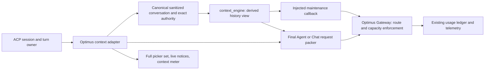

# Plan 12.2 Context Engine design specification

2026-10-01 repository filing of reviewed source revision 5 (review began 2026-09-30). Author: Codex, Senior Architect; reviewer: Claude. The operator authorized Claude’s Package A (Tasks 0, 2 and 3) and docs-first filing. Product code waits for the docs PR merge. All other implementation remains unapproved; filing is not full-plan execution or release acceptance.

Baseline: `83fafb9606fb81992508554aa302d3b62c603236`, the merge of [PR #213](https://github.com/vibhanshu-agarwal/optimus-cost-agent/pull/213). Its two parents are `e41b66d949291401feb30a33858b3e5f21a0ea78` and reviewed head `473b895730df6e5ebefcbac975e4a9a959994a44`. Codex verified all 18 cleared Git blobs and an empty tree difference between the PR head and merge. Both PR workflows report success. This is a pinned baseline, not a claim that the live `main` ref can never advance.

Authority: the [decision index](../../decisions/README.md) and frozen ADR-001–012 at the pinned merge; [ADR-013](../../decisions/ADR-013-plan12-effect-producer-repair.md), [ADR-014](../../decisions/ADR-014-all-session-request-guard-floor-clarification.md) and [ADR-015](../../decisions/ADR-015-cost-stop-removal-sequencing.md) record Q1–Q3 without changing predecessors. Their exact questions and operator responses are reproduced in repository form and cite [source S2](../../decisions/README.md#rules-for-every-record), `optimus-handoff\decisions-sources\2026-10-01-claude-session-context-engine-decisions-export.zip`, SHA-256 `8769D433CB869362305E91525273E8CA7A19EBC2807B1CA726F5DC9D4A81F5C2`. Raw S2 is archival provenance only. The later Package A and Docs PR first selections are reproduced in ADR-013. The [full implementation plan](../plans/2026-10-01-plan-12-2-context-engine-implementation.md) is allocated Plan 12.2; its sole [backlog](../plans/2026-07-23-consolidated-deferred-followups-backlog.md) owns current status and next gates. Remaining mechanisms stay proposed. No frozen record is edited.

## 1. Design brief and scope

Build an optional, extractable Context Engine that constructs bounded conversation views for Optimus Agent and Chat modes. It should preserve relevant ordinary history cheaply while keeping execution authority exact and host-controlled. Optimus must retain its core conversation floor when the engine is absent.

The operator's four checkpoints are binding:

1. Compaction is the default history strategy.
2. The strategy picker appears only when the engine is attached.
3. Sliding window tells the user that older ordinary content is dropped.
4. The core floor keeps full history, the 512 KiB cap and its 80% warning, subject to the recorded floor-display port, history-order fix and Haiku-removal exception.

This design covers the engine boundary, three views, source storage, capacity, host integration, picker synchronization, summarizer qualification and cost-accounting integration. The model registry is a supporting prerequisite with its own independently reviewable implementation package. Cost-stop removal depends on accounting and the unknown-cost successor (D6), under accepted Q3, without waiting for ADR-009's new mechanism. ADR-009's future loop mechanism remains separately unresolved (D8). Attached production activation also requires the missing effect-producer repair described below; offline construction does not.

It does not commission Auto classification, review-depth behavior, Jev evaluation, autonomous escalation, a savings-report surface, persistence/resume, user pins, runtime attach/detach, or another agent integration. Their existing owners and accepted requirements remain visible in sections 13–14; omission from this engine slice is not project completion or rejection.

## 2. ADR traceability

| Authority | Requirement carried into this design | Design location / treatment |
|---|---|---|
| ADR-001 Accepted | Separate package; forbidden imports; injected Gateway; sanitization; authoritative host records; derived revision-bound checkpoints; floor | Sections 3–5, 8, 11 |
| ADR-002 Accepted | Compaction default; distinct hybrid; newest-complete-turn sliding; exact outcome/effects/approvals; full-set picker; warning; per-turn capture | Sections 5–7, 10 |
| ADR-003 Accepted with open items | Attached source can exceed 524,288 bytes; total ceiling 262,144 including one output reserve; verified routes; remove Haiku | Sections 4, 8–9; Q2 compatibility clarification accepted in ADR-014; measurements/evidence remain open |
| ADR-004 Accepted with open items | Curated configurable list; explicit role eligibility; per-token ranking; origin inventory; Contributor warning and operator judgment; stated initial assignments | Section 9; schema/route/fallback details are proposed, not newly accepted |
| ADR-005 Accepted | Product alerts, no Optimus cost stops; test limits remain; actual stage/request costs; exactly-once settlement; unknown is not zero | Section 11; runtime unknown-cost successor (D6) remains open; Q3 sequencing accepted in ADR-015 |
| ADR-006 Accepted with open items | Ultra-cheap summarizer; explicit summary-quality check; no unqualified fallback | Section 6; proposed fixture requires recorded acceptance and paid-call authority |
| ADR-007 Proposed | Auto direction, host-side classification | Reserved integration boundary only; no classifier, confidence bands or routing class adopted |
| ADR-008 Proposed | Final review idea, depth and placement unresolved | Exact artifact binding is accommodated; no review mode, default or automatic call adopted |
| ADR-009 Proposed mechanism; requirement accepted | Bounded unproductive loops; no silent cost stop | Existing finite loop bounds retained under accepted Q3; future mechanism separate; no thresholds, recovery graph behavior or escalation default adopted |
| ADR-010 Deferred | No new Chinese-route restriction now | Record data-use facts; reserve constraint fields; do not enable a new retention restriction |
| ADR-011 Accepted | Preserve decisions, reasoning, provenance, publication/implementation boundaries | This trace table and conditional plan; frozen ADR bytes unchanged |
| ADR-012 Requirement accepted; mechanism proposed | User-facing net savings report is owed in Plan 12 | Supply attributable inputs; `P12-FU-2` owns report/baseline/surface; no report closure claimed |
| ADR-013 Accepted decision; technical mechanisms remain subject to proof | Q1: narrow effect/cancellation repair is Plan 12's first code step; sandbox retains gap; PR discloses hardening; archived-plan correction note | Section 4.1 and plan Task 2; separate Package A authority, code only after docs merge |
| ADR-014 Accepted decision with measurement items open | Q2: all-session guard clarifies source floor; every enabled route gets full-floor acceptance; failures return operator exception | Section 9.4 and plan Tasks 4/5/12 |
| ADR-015 Accepted decision with D6 open | Q3: cost-stop removal after accounting/D6, retaining existing finite limits without awaiting ADR-009 | Sections 11/14 and plan Task 11 |

## 3. Architecture and alternatives

**Recommend a separate in-process Python package, `context_engine`, with a narrow host adapter.** This implements ADR-001's chosen repository/package boundary. The engine sees immutable sanitized data and abstract maintenance calls. It has no provider credentials, workspace access, ACP transport, Redis store, approval store or ledger ownership.

An engine embedded in `optimus.agent` would simplify access to internal types but violate extractability. A service or separate repository would isolate deployment but introduce another failure/authorization boundary before a second consumer exists. Both are rejected for this slice by ADR-001, rather than re-opened as operator choices.



Proposed files, all relative to the future authorized implementation checkout:

| Package / files | Responsibility |
|---|---|
| `src/context_engine/contracts.py` | Immutable neutral input/output records and callback protocols |
| `src/context_engine/selection.py` | Complete-turn head/tail partitioning and allocation |
| `src/context_engine/summary.py` | Maintenance request construction and bounded summary validation |
| `src/context_engine/checkpoints.py` | Checkpoint identity and publication predicates |
| `src/context_engine/engine.py` | Strategy orchestration; no host side effects |
| `src/optimus/context/adapter.py` | Map canonical records, exact authority and lifecycle to engine contracts |
| `src/optimus/context/assembly.py` | Separate selection input from model history; render inert host-wrapped blocks |
| `src/optimus/context/maintenance.py` | Inject Gateway calls, cancellation, sanitization and accounting |
| `src/optimus/acp/session_config.py` | One full-set picker projection and serialized setter path |
| `src/optimus_model_policy/registry.py`, `validation.py`, `capacity.py` | Shared neutral registry snapshot and pure structural/capacity rules for host and Gateway |
| `src/optimus_model_policy/defaults.yaml` | Reviewed defaults packaged with the distribution |
| `src/optimus_gateway/model_policy.py` | Enforce trusted approved snapshot at the provider boundary |
| `src/optimus/usage/turn_settlement.py`, `cost_alerts.py` | Adapt existing ledger receipts to idempotent turn totals and notices |

`context_engine` must import nothing from `optimus`, `optimus_gateway`, `optimus_security` or either `evidence_handoff` package. Shared policy code also stays neutral: the Gateway must not acquire a dependency on the agent runtime merely to validate a registry. No generic plugin platform or network API is added.

Package discovery already uses `src/`; the implementation must include the new package in the wheel and coverage source list and verify a noneditable installation. YAML remains the frozen ADR-004 format. Propose PyYAML as an explicit locked runtime dependency, with a custom SafeLoader subclass that rejects duplicate mapping keys at every depth, all YAML anchors and aliases, `<<` merge keys, unknown/custom tags and non-string mapping keys. Reject parsed anchor/alias syntax, not matching characters inside ordinary scalar text. SafeLoader alone is insufficient. Loader and typed-schema tests precede activation. Optional TOML would require a new accepted record; no format switch is assumed.

## 4. Canonical data and source capacity

### 4.1 Authoritative data

Keep `ConversationTurn`'s five fields: user prompt, plan text, completion text, outcome and effect state. A summary never replaces, edits or deletes a canonical record. Keep the existing canonical storage serializer separate from the model-facing renderer. Main has no conversation-envelope hash today; HistoryRevision introduces the first such digest over explicit sanitized canonical bytes.

The host additionally exposes **exact approval facts** from actual approval/settlement events: turn ID, artifact hash, granted/denied/cancelled decision and any applicable scope. These are host facts, not interpretations of a user's prose or a model's statement that it was approved. A transient projection may retain them for this slice; no new durable conversation service is implied. Historical grants never authorize a new action.

**Accepted Q1 / first implementation step:** main's `_commit_turn` hard-codes `EffectState.NONE` (`acp/spec.py:1039`). The lifecycle computes WRITE/TEST effects only from registered terminals, but the three runner READ/WRITE/TEST executors discard `operation_control` (`agent/runner.py:822,849,875`); approved execution omits it at its READ/WRITE/TEST calls (`:706,723,727`). The operator chose to repair this inside Plan 12, not in a new separate runtime-hardening item. Plan Task 2 is the first product-code step, before the floor port and engine integration. It threads the exact control through relevant runner callers, registers host-issued directive IDs when known, takes a lease immediately before each producer, publishes actual terminal states and wires `_commit_turn` to the authoritative effect value. Cancellation after approval must prevent later operation starts; an already-started write/test is not promised to be interrupted. Register the known WRITE/TEST set before execution. Changing lifecycle.py is required: request_session_cancel and denied try_start currently suppress operations without recomputing effects; update those paths or provide a locked fresh effect read at commit. Preserve the existing transport-teardown recomputation. Ensure suppression/denial is reflected in a current consistent effect snapshot before commit, rather than reading a stale cached COMPLETE after a later TEST is suppressed. Preserve commit/final-delivery and transport-abandonment rules. Fixture projection alone is not producer evidence; attached activation waits for Task 2's reviewed production-path proof. Do not infer effects from mutation_count, invent effect enums or edit old canonical records. The correction to archived Plan 11.25 Task 6 Steps 3 and 8 is a separate note, not an edit to that plan. The repair reaches main through Plan 12's main-based PR or PRs after scope/review/delivery authority; no direct main edits are authorized. Fold into Plan 12 does not decide a single combined PR. The operator chooses PR boundaries when concrete reviewed work is ready; an early package-A PR is an architect/reviewer recommendation, not an accepted delivery decision. The sandbox retains the same gap until separately synchronized; the PR description must disclose the hardening fix and that sandbox status.

The pinned main has an in-memory session store and no `session/load` handler (`acp/spec.py:148–163,384–416,469`). A rollout that restarts the agent process creates fresh conversations; verify that restart/fresh-session boundary at release intake rather than adding a legacy-history migration to Q1. If durable sessions or replay reach the implementation base before the repair, the lane shipping persistence (`P11-FEAT-ZED-RESUME` or the applicable replay lane) must supply a reviewed provenance treatment before restoring old placeholder NONE records as authoritative effects. Keep canonical bytes and existing effect enums. This conditional obligation belongs to the persistence integration, not an unconditional repair prerequisite on current main.

A `HistoryRevision` contains an opaque session key, committed generation, last committed sequence and digest of the sanitized canonical snapshot. A frozen snapshot contains committed records only. The current sanitized prompt is supplied separately and is never compacted into an older-history checkpoint.

### 4.1.1 Architect/reviewer mechanisms, subject to execution-scope acceptance

Claude's version-4 review agrees with the following Codex choices, including advance registration of the known WRITE/TEST set. They implement Q1 and remain subject to acceptance of the execution scope; they are not additional operator-selected requirements:

- A TEST that returns normally counts as executed even if its exit status is non-zero. Its lifecycle terminal is `succeeded` for completed execution; its test verdict remains failing in existing result evidence. `EffectState.COMPLETE` means all registered effectful operations executed to known completion, not that tests passed or file changes were correct. A confirmed guard denial before any producer runs is `failed_no_effect`; an exception after possible WRITE/TEST start is `failed_effect_unknown` unless a typed boundary proves no effect. Do not infer that proof from exception message text. The existing unsafe-TEST text-matching check is a pre-producer parse refusal, not lifecycle effect classification; do not refactor it into this mapping or use it to erase other operation facts. READ/Gateway/persistence do not contribute effects.
- Use deterministic turn-local operation identities containing host turn/run identity, phase, invocation ordinal and directive ordinal/kind. Repeated reads of the same path and repeated commands remain distinct occurrences; implicit pre-WRITE reads get their own READ identity. Counters live in per-call state, not shared AgentRunner fields, and no model-generated ID or raw path/command is trusted as identity. Preserve no-control behavior for existing non-ACP callers.

Lease grant is the existing start linearization point. No unrelated await or producer work intervenes between that grant and its operation. A denied lease invokes no producer; cancelled later operations settle suppressed. Late results after teardown remain diagnostics under the existing frozen settlement policy. Tests must cover denied WRITE, completed WRITE plus suppressed TEST (PARTIAL), all-suppressed (NONE), completed operations (COMPLETE), unknown effects (INDETERMINATE), non-zero TEST exit and Chat NONE. This narrow repair covers the named runner executors, not every producer claimed by archived Plan 11.25: ranged `READ_MORE` uses another path in `planning_loop.py:1172–1181`. Keep it outside Q1: it is read-only and contributes no effect. Archived Step 8 excludes the planning iteration from registered lifecycle, whereas Steps 3/5 list Planning READ; record this as an ambiguity in the archived plan, not a second demonstrated overclaim or an orphan work item.

### 4.2 Storage limits

At session creation, attachment configuration fixes the source-storage class:

| Session class | Source limit | Storage warning |
|---|---|---|
| Engine absent | `CONVERSATION_MAX_BYTES = 524288` | `used_bytes * 5 >= 524288 * 4`; first crossing 419431 |
| Engine configured attached | Finite `SOURCE_MAX_BYTES`, measured before activation | `used_bytes * 5 >= SOURCE_MAX_BYTES * 4` |

An engine fault does not downgrade an attached session's storage class. Genuine source exhaustion may retain the existing `CAP_CLOSED` disposition; engine/view unavailability must not create it. Delivery-indeterminate behavior is not relaxed.

The attached implementation must account for peak copies, exact-state projections, checkpoints, serialization buffers, in-flight responses and concurrent sessions. Bound temporary work as well as retained source. Do not choose an arbitrary multi-megabyte cap or silently create disk spill. Measure a finite source limit, a per-turn final-record reservation and transient response bounds together. The absent-engine path retains its existing admission and commit behavior.

For attached sessions, a complete committed result must fit the reserved record capacity. If its bounded plan/completion cannot be retained, fail before approval or effects, settle the attempted calls, and retain the exact bounded failure/effect facts. Never apply a change and then discard its approval/outcome to make storage fit. Refusal because a new turn cannot reserve enough room is recoverable unless genuine canonical source exhaustion has occurred. Exact numeric reservation/buffer values remain a measurement output requiring review.

## 5. Engine contracts, views and publication

All proposed types below are immutable. Engine APIs use neutral scalar/tuple/dataclass types; no `ConversationTurn`, `GatewayUsage`, ACP or host enum crosses the import boundary.

| Type / API | Fields or signature |
|---|---|
| `OrdinaryTurn` | `seq: int`, `user_prompt: str`, `plan_text: str`, `completion_text: str` |
| `ProtectedTurnState` | `seq: int`, `outcome: str`, `effect_state: str`, exact tuple of host-issued approval facts |
| `HistorySnapshot` | `revision: HistoryRevision`, `turns: tuple[OrdinaryTurn, ...]`, `protected: tuple[ProtectedTurnState, ...]` |
| `StrategyParameters` | `anchor_input_tokens`, `compaction_tail_input_tokens`, `hybrid_tail_input_tokens`, `summary_output_tokens`, `max_maintenance_calls`: nonnegative integers with positive output/call limits where maintenance is enabled; prompt/format version and deterministic digest |
| `ViewLimits` | `history_input_tokens: int`, source/temporary byte bounds, maintenance input/output capacity; host-injected `estimate_history: Callable[[str], int]` and its verified estimator identity |
| `MaintenanceRequest` | complete sanitized `input_text: str`, `covered_turn_ids: tuple[int, ...]`, `max_output_tokens: int`, prompt/format version; the host adds approved route and stage identity |
| `MaintenanceResult` | bounded `summary_text: str | None`, `attempt_ids: tuple[str, ...]`, `status: str`, finish/truncation status; actual money remains in host receipts |
| `MaintenanceCallback` | synchronous `__call__(request: MaintenanceRequest) -> MaintenanceResult`; invoked off the ACP event loop; host owns attempt accounting/cancellation |
| `SummaryCheckpoint` | revision/digest; covered complete turn IDs; strategy/parameter/format identity; sanitized inert summary text |
| `PreparedView` | exact head/tail turn IDs, checkpoint candidate, all exact protected state, coverage/omission manifest, availability reason |
| `ContextEngine.prepare_view(...)` | `prepare_view(snapshot: HistorySnapshot, *, strategy: str, parameters: StrategyParameters, limits: ViewLimits, checkpoint: SummaryCheckpoint | None, maintenance: MaintenanceCallback, cancelled: Callable[[], bool]) -> PreparedView` |
| `publish_checkpoint(...)` | `publish_checkpoint(candidate: SummaryCheckpoint, *, current_revision: HistoryRevision, current_parameters_digest: str, cancelled: bool) -> bool` |

Host-issued IDs, coverage ranges and digests are computed outside the summarizer. The model cannot supply a valid publication key by printing one. Output is re-sanitized before prompt use. Reject unknown turn IDs, overlapping partitions, unbounded text, mismatched digests, future revisions and cancellation.

Per admitted turn, capture mode, selected strategy, strategy parameters, registry hash, model/route and committed history revision as one consistent snapshot. Setters affect later turns. Checkpoint publication uses a compare-and-publish check against the revision and parameter identity; a cancelled or stale candidate is discarded while its calls remain billable/accounted.

Checkpoint reuse is safe only with a validated relationship to the exact snapshot. Recommend validating an append-only covered prefix by every covered source digest, then re-keying the derived candidate to the current revision before compare-and-publish. Full revision equality is the simpler alternative, but it would cause avoidable repeat summarization after every append. Neither may treat session identity alone as freshness. Checkpoints from a different strategy/parameter version are not silently reused. The accepted implementation choice is confirmed in written-spec review; publication always requires current revision equality.

## 6. Strategy algorithms and summary gate

### 6.1 Shared invariants

Allocate instructions, current prompt, exact authority, required workspace/evidence and output reserve first. The history allocation is the remaining input capacity, never an entitlement to 100K or another fixed amount. Keep complete turns; do not cut a WRITE plan or a user correction mid-record to meet an allocation. Exact protected state is represented once for **every committed turn**, including turns whose ordinary text is omitted. If it cannot fit, safely refuse with a recoverable explanation.

The renderer labels ordinary history and summaries as untrusted data. It conveys chronology and later-turn precedence. This does not guarantee a model understands every correction; the host's approval and mutation enforcement is independent of that understanding. Historical plan text keeps its inert treatment, including exact anchor/tail plans.

### 6.2 Compaction (default)

Keep a bounded newest-complete-turn exact tail. Summarize older ordinary turns into bounded sections for task context, constraints and changes, decisions, work/evidence, unresolved matters and source chronology. Preserve all exact protected facts separately. Before a paid maintenance call, verify its complete packed input/output capacity and qualification. Chunk older source into complete-turn ranges when necessary.

Maintenance is incremental only when a prior summary's covered prefix is validated. Prefer original sanitized ordinary records for the range being summarized; do not repeatedly re-summarize a summary without accounting for its original source coverage. A qualification receipt must cover this incremental merge path as well as chunked input, including a late correction arriving after its old constraint has entered a prior summary. Limit the number of maintenance calls per turn by a finite reviewed policy and return unavailable if it cannot produce the required view. No unlimited compression loop is permitted.

### 6.3 Hybrid

Pin **only the first committed turn** as an exact head if the whole ordinary turn fits the anchor allocation. Otherwise include it in the summarized range; its protected facts stay exact. Keep a larger exact recent tail than compaction, with a bounded summary of the middle. Deduplicate the head if it is also in the tail. There is no semantic pin/correction detector or user-pin API.

Required discriminator fixture: on the same eligible history with turn 1 outside both tails and within the anchor allowance, hybrid includes turn 1 verbatim and compaction does not. Hybrid's declared exact-tail allocation exceeds compaction's. Allocations are proposed measured settings, not new operator-selected numbers.

### 6.4 Sliding window

Select the newest complete ordinary turns that fit; never skip a too-large newest turn to include older unrelated turns. A newest turn that cannot fit therefore leaves no older ordinary tail under this rule. Exact protected state and the current prompt remain required. There are **zero summarizer calls**, including on a strategy switch. Omitted ordinary history remains in canonical host storage.

### 6.5 Summary-format recommendation, still proposed

Recommend **host-owned structure around bounded plain-text summary sections**, rather than requiring provider-native JSON-schema output. This gives the host authoritative coverage/version metadata without prematurely disqualifying Qwen solely for missing structured-output support. The generated section bodies remain inert, do not feed file/skill selection, and are not parsed as approvals, executable plans or new host constraints.

A strict provider JSON schema is the alternative: simpler syntactic validation but, under the frozen catalog evidence, Qwen would be structurally barred and qualified Luna selected. Claude/operator review must accept the format and matching validator requirements. Neither candidate is eligible to summarize until its quality receipt exists. No paid equivalence/task test is added for Contributor or general coding roles.

### 6.6 Proposed summary-quality fixture and pass criterion

Fixture `calculator-constraints-v1` is a non-sensitive synthetic coding conversation. The committed fixture has an early request for a decimal currency calculator: use Decimal, keep the public `calculate` API, prohibit `eval` and network calls, support negative inputs, and initially use `ROUND_HALF_UP`. Later turns include irrelevant implementation discussion. A late ordinary user correction changes rounding to `ROUND_HALF_EVEN`, with `2.345 -> 2.34` and `2.355 -> 2.36`; it explicitly supersedes the initial rounding rule. Include one rejected mutation approval as host-issued protected state.

Place **both the early ordinary constraints and the late ordinary correction inside the summarized range**, outside the exact head/tail in the evaluation. Otherwise exact retention could hide a bad summarizer. Acceptance requires all four unchanged constraints and negative-input support; both current rounding examples; identification of HALF_EVEN as current and HALF_UP as superseded; and no claim that the denied change was applied or approved. The exact approval projection must equal its host source byte for byte, independently of summary text. Add an injection paragraph in an ordinary/tool-derived record; it must not become executable authority.

Evaluate the generated summary itself, not a later expensive model's ability to infer missing facts. Proposed pass: every required fact present, no active contradiction or invented effect/approval. A deterministic fact report plus Claude/Codex reading of the scenario and incremental variant establishes this limited gate; it is not a statistical model-quality guarantee. Empty, truncated or malformed output fails. Record candidate model ID, provider endpoint, reasoning settings, fixture/prompt/format digest, date, request IDs and result. Any change to those qualification keys invalidates automatic reliance on the receipt until the check is reviewed again.

Also require a two-step variant: step 1 summarizes the early constraints including HALF_UP; step 2 merges that prior summary with a new chunk containing the HALF_EVEN correction. Evaluate step 1 for retained constraints and the final merged summary for every required fact, supersession and inert authority. Original-source coverage remains host-issued. This exercises the incremental/chunked runtime path rather than qualifying only one-shot behavior.

Paid-call authority is separate: at most two initial summary requests per candidate route for this fixture (step 1 and step 2), with explicit input/output and dollar/call-count ceilings in the test harness. No rerun-until-pass. Establish input lengths and price/attempt bounds, then provide the operator the concrete estimate before requesting those paid calls. Qwen may be structurally ineligible if the accepted format needs a missing capability; do not call it merely to produce a predictable failure.

## 7. Host prompt assembly and Agent behavior

The attached host adapter exposes three distinct inputs:

| Input | Contents | Consumers |
|---|---|---|
| `current_prompt` | Exact current sanitized prompt | Active task and final request |
| `selection_text` | Current prompt, selected exact ordinary head/tail, all exact protected state | Workspace file selection and skill matching |
| `conversation_envelope` | Host-wrapped chosen history view including inert summary | Agent planner and Chat answer request |

No summary text participates in skill/file selection. No summary-only path is elevated into an exact path hint. A follow-up that refers only to omitted context can therefore lack a file-selection hint; the model asks for clarification or guarded reads using the existing planner protocol. The implementation must test this limitation and disclose it rather than promise full-history selection behavior after dropping ordinary history.

In attached Agent mode, keep `AgentRunRequest.task` as current prompt and add a separate immutable selection field. Update workspace assembly, `_match_skills`, all planner builders, and the exact stored-plan/request match. In attached Chat mode, also use the exact selection input, replacing its current full-envelope selection input. Internal PLAN/non-ACP callers retain existing behavior unless specifically scheduled.

The approved application must reuse the admitted request/view identity. Do not regenerate a summary, select a different route, or reread session strategy between planning and approval/application. Bind the candidate artifact to its existing plan hash and a context snapshot digest in the plan record; a mismatch requires fresh planning/approval. The digest binds host-rendered sanitized bytes and policy/revision identities, not a summarizer's claim of an ID. Historical approval facts remain descriptive, not authorization.

Absent-engine Agent task remains the full envelope plus current prompt; Chat keeps its current separate-envelope shape and current file-selection semantics. Compatibility is measured against the narrow floor/order baseline, with the Haiku-removal exception explicitly recorded. Do not refactor unrelated runner, approval, MCP or persistence flows.

## 8. Admission, fallback, ordering and meters

### 8.1 Turn flow

1. Validate the prompt, session and single-active-turn condition. Sanitize the current prompt.
2. Capture the turn configuration and committed revision. Check canonical source storage/reservation using that session's source class.
3. For an attached session, obtain a valid strategy view. Account for every attempted maintenance call, even if the view is discarded.
4. If the engine/view is unavailable, run the pure projected-floor check below. Do not invoke the engine-absent mutating admission routine for this probe.
5. Assemble workspace/evidence and the complete final model input. If added evidence reduces history space, re-pack using the same captured snapshot and finite maintenance allowance; never loop indefinitely to fit it.
6. Immediately before **each** model/provider attempt, check route, output reserve and complete request capacity. Send the required Contributor notice before any Contributor dispatch.
7. Settle calls and the final outcome on every exit. Commit canonical records only under the existing authoritative delivery rule. A checkpoint publication cannot substitute for a conversation commit.

### 8.2 Unavailable engine and recovery

Compute projected floor bytes from the **full committed canonical history plus the sanitized provisional current prompt record**, using the floor serializer; not from a compacted view, and not just the prior-history byte count.

| Situation | Behavior |
|---|---|
| No engine configured | Existing floor storage/admission path; full ordinary history |
| Attached and healthy | Selected view, attached source limit, capacity checks |
| Attached unavailable; projected floor <= 524288 | Full-history fallback, capacity check, notice that chosen strategy was not applied |
| Attached unavailable; projected floor > 524288 | Zero planning/answer calls; readable recoverable refusal; disposition stays OPEN |
| Same failure repeatedly | Same non-latching refusal; no source eviction or thread closure |
| Engine recovers | Next admissible turn proceeds when source and complete request fit |
| Exact required authority exceeds input capacity | Readable safety/capacity refusal, no summarization of authority |
| Genuine source cap or delivery indeterminate | Preserve applicable source/delivery disposition; engine recovery does not bypass it |

The fallback also applies when no qualified summarizer can build a required compaction/hybrid view. Sliding needs no summarizer. A valid existing checkpoint may serve a turn without a new summary, if its revision/coverage predicates hold.

### 8.3 Floor prerequisite and history order

Port only the sandbox's relevant presentation behavior: separated notices, readable capacity `end_turn`, and live-only `usage_update`. Main computes the 80% warning but discards it, and has no production usage-update caller; this port makes both visible for the first time and defines the new absent-engine presentation baseline. It preserves source admission computations, while adding observable delivery. Reconcile with Plan 12.1 Chat final-flush/commit behavior and current turn ownership. Do not transplant the sandbox's durable replay, session/load or other runtime work.

Fix F3's model-facing order: numeric turn sequence and the explicit `_RECORD_FIELD_ORDER`. The current `sort_keys=True` re-sorts numeric keys lexically and turn fields alphabetically. Preserve canonical record values and storage serialization; add a distinct model renderer with the newly defined revision digest kept separate. There is no existing conversation hash domain to preserve. Reordering identical keys and values preserves rendered byte length by construction; retain the regression test for byte length and unchanged floor admission/warning/cap computations. Model text may change field order even before turn 10; the compatibility exception covers both agreed order changes, not only 10+ turn histories.

### 8.4 Meter

For attached sessions, `used` is the largest complete estimated planning/answer **input actually dispatched** during the turn; `size` is that request's usable input capacity. Summarizer requests are excluded from the context ring but included in costs. For ties, use the smaller usable input capacity. Capture the request/route with the reading; capacity is prospective, the meter retrospective. A refusal with no planning/answer dispatch sends no fabricated new input reading. If a full-history fallback dispatch occurs, measure that complete input as well.

The newly delivered absent-engine meter uses `used_bytes // 4` against `524288 // 4` after the narrow port; main does not send this meter today. It is an historical floor estimate, not the new capacity estimator. Live notices distinguish canonical storage utilization from request utilization. The ring may decrease across turns; it must not be described as a cumulative token counter.

## 9. Curated registry and final Gateway guard

### 9.1 Proposed schema and validation

Ship one safely parsed YAML defaults file plus an optional validated operator override. Use explicit host defaults/override combination semantics: maps combine by declared keys; lists such as provider allow-sets and role assignments replace rather than append. This typed override combination is separate from YAML syntax; YAML anchors, aliases and `<<` merge keys are forbidden. Use the custom PyYAML SafeLoader described in section 3, rejecting duplicate keys, all anchors/aliases and `<<` keys before construction, then reject unknown schema fields, executable/custom tags, non-finite/negative prices and ambiguous IDs. Do not rely on plain `safe_load` to reject duplicates. Canonicalize the merged typed result, then hash it; formatting changes alone do not change the effective snapshot. Input file bytes and effective hash are separately recorded for provenance.

The snapshot includes schema/policy version, total ceiling, output reserves, measured strategy/source bounds, operator-set alert thresholds, model IDs, tiers, origins, explicit roles, route allow-sets and quantizations, fallback permission, verified capacities, price classes, data use, supported capabilities/reasoning, evidence references and summarizer receipts. Optional provider data constraints remain reserved, without enabling a new ADR-010 restriction.

Validate the structural requirements **for each role explicitly assigned**, not every role in the tier:

| Role | Mandatory facts |
|---|---|
| Easy/medium/complex/escalation implementer | Capability for the host's tool/planning contract; approved provider parameters; verified route capacity; data use; explicit assignment |
| Summarizer | Text output plus the accepted format's capabilities; valid summary receipt on this exact route/settings/format; approved capacity |
| Reviewer | Capabilities for the subsequently accepted reviewer artifact format; explicit reviewer assignment; capacity; no automatic implementer eligibility |
| Classifier | Accepted classifier-specific input/output contract; currently unresolved under ADR-007, not guessed from summarizer eligibility |

A native tool capability requirement and Optimus's textual directive grammar are distinct; the approved structural matrix must say which roles require which. Conservatively retain ADR-004's tool-support requirement for implementer assignments. No paid coding task/equivalence gate is introduced.

Each tier inventory lists China and non-China origin. Disabled inventory entries count for that inventory rule but grant no runtime eligibility. Rank eligible models by input/output price dominance; on an exact tie prefer China origin. Crossed prices require a declared role blend with basis; without one, that crossed ordering is unresolved, not silently decided by an estimated task score. No accepted entry crosses in the initial ordering.

### 9.2 Frozen initial assignments

These are operator assignments from ADR-004, not refreshed public-model recommendations. Prices/routes/capabilities must be refreshed by the **free** catalog drift check at implementation pickup; conflicting evidence is surfaced rather than rewriting the frozen decision.

| Role | IDs in stated order |
|---|---|
| Medium | `meta/muse-spark-1.3-contributor`; `deepseek/deepseek-v4.1-flash`; `google/gemini-3.8-flash`; `meta/muse-spark-1.3` |
| Complex / escalation | `google/gemini-3.8-flash`; `z-ai/glm-5.3` |
| Easy | `openai/gpt-6-luna` |
| Summarizer | `qwen/qwen3.7-flash`; `openai/gpt-6-luna`, each subject to structure and the summary receipt |
| Reviewer | `anthropic/claude-sonnet-5.5`; `moonshotai/kimi-k3` |

`z-ai/glm-5.3-flash` remains listed with no active role. Qwen has no coding assignment. Haiku is removed from shared defaults, aliases and selectable entries when the registry migration ships. Medium fixed-model default is Contributor under the accepted assignment; **Auto classification is not implemented or silently equated with medium**. ADR-004's Auto picker requirement remains a later gated integration with ADR-007.

Contributor identity is accepted on operator judgment, not independent weight evidence. No equivalence test is required. Its allowed reasoning settings exclude Standard-only `max`. Before every host request routed to Contributor, including planning, fallback and summarizer requests, show: **“Muse Spark Contributor may use supplied prompts, code, tool content and completions for model training.”** This is a disclosure, not a new consent dialog. Gateway dispatch requires host-issued disclosure authorization bound to this request identity, approved route and exact payload digest. A bounded transport retry of the identical payload on the same approved route is covered by that disclosure; it retains a distinct attempt identity for accounting. A new payload, fallback to Contributor or maintenance request needs its own disclosure. No per-turn notice relaxation is adopted; that optional Q4 change would need a new record. Disclosure and retry billing identities are separate.

### 9.3 Approved snapshot and routing

Bind the effective registry hash to a versioned successor of the Plan 9.96 launch approval schema. Host and Gateway validate the same trusted snapshot. A caller-supplied hash is not approval: the Gateway must compare it with the approved snapshot provided by trusted launch composition. A Gateway without a trusted approved snapshot refuses every model request with zero upstream calls; it never falls back to the current arbitrary `vendor/model` pass-through. Unknown IDs, unapproved aliases, mismatched routes and drift are refused before upstream dispatch. Do not add secrets to approval records or break record byte-size limits by embedding the registry.

Route provider allow-sets are enforced with `provider.only`; `order` is merely preference. Required output/capability parameters use `require_parameters`, with explicit fallback and quantization sets. These are documented OpenRouter controls; actual endpoint slugs and compatibility still require the free pickup check. [OpenRouter provider selection](https://openrouter.ai/docs/guides/routing/provider-selection).

Model fallback on provider error is **not** struggle escalation. The ordered assignments do not authorize indefinite retry, cross-role fallback, silent fixed-model substitution, or an unknown-cost retry. Exact fallback/error behavior remains an open registry disposition. Prefer host-visible attempts so warnings, capacity and receipts can precede/follow each dispatch; do not use an opaque unrestricted model fallback list.

### 9.4 Complete-request capacity

For every call, including each maintenance attempt and Agent/Chat call:

```text
effective_total = min(262144, verified_route_window)
usable_input = effective_total - output_reserve
complete_input_estimate <= usable_input
0 < output_reserve <= verified_route_max_output
```

The output reserve is counted once and enforced as the actual upstream generation cap using the route's verified parameter mapping. This introduces an output cap absent on main and can truncate a file-bearing WRITE plan. D3 must measure representative implementer plan-output sizes (including complete file contents) before selecting reserves. Propagate provider finish status through Gateway/host; length-limit termination is a distinct recoverable failure, never a complete parsed candidate. Reject partial/missing required completion status under the verified route contract before parsing, storing, presenting for approval or executing a plan; retain its usage receipt and permit only separately bounded recovery. A length-limited syntactically valid prefix must also be rejected. Chat may label incomplete text, but must not report it as a complete successful answer. Account for reasoning/output semantics for that route; do not assume hiding reasoning disables it. [OpenRouter output-token parameters](https://openrouter.ai/docs/api_reference/parameters).

The estimator takes the final packed request after all host transformations: instructions, history, exact state, current prompt, files, ranged reads, MCP/tool observations, model/message templates and framing. The Gateway recomputes on its final representation; host-declared token numbers alone are insufficient. An approved tokenizer or independently validated conservative route estimator is required. `bytes / 4` is not a safety proof; a byte upper bound also needs route/framing validation. Unknown/unverified routes are not admitted with an invented 128K default.

For a route allow-set, use the smallest verified window and max-output capacity among all possible endpoints, or enforce a narrower endpoint set. An eligible entry that cannot support the accepted ceiling fails structural validation. Capacity estimation does not calculate settled cost.

**Accepted D7 clarification (Q2 / ADR-014):** keep the inclusive 524288-byte source floor and full history, with a separate final-request guard for every session. Do not use a needlessly loose byte upper bound that cuts ordinary floor capacity. Acceptance requires representative English/code full-floor fixtures at exactly 524288 projected bytes, plus each path's maximum allowed workspace/tool/evidence material, framing and measured output reserve, to be admitted on every enabled absent-engine route. Test Unicode/adversarial inputs separately for estimator safety; bytes alone cannot guarantee a universal token count. If representative floor fixtures fail, narrow/validate the estimator without undercounting, or return the route/floor conflict to the operator as an exception before release. Do not exempt requests from capacity to manufacture a pass. The old $0.05 post-call stop is not proof: price, cache and output vary, and it does not enforce a pre-call token boundary. Capacity refusal after floor admission must explain the complete-request limit and remain OPEN without a provider charge; engine recovery or a smaller/new-thread request may help only when applicable. Record an accepted clarification as a new ADR-003 completion, never by editing its frozen bytes. The clarification is accepted; measured estimator, route and reserve evidence is still required before release.

## 10. ACP configuration, notices and concurrency

One `SessionConfigSnapshot` supplies all advertised options, initially mode and registry-enabled model choice; strategy is included only for configured attachment. The strategy select has wire option `id: "context_strategy"`; `session/set_config_option` identifies it through `configId: "context_strategy"`; category is `_context_strategy`. Values are `compaction`, `hybrid`, `sliding_window`, with compaction initial. This distinction follows the repository-pinned ACP schema.

Every response/update carries the full current `configOptions` set. Mode changes also send the existing `current_mode_update`; strategy/model-only changes do not falsely announce a mode change. All setters share one per-session lock and one resync state. A committed setter remains pending after partial send; a later setter republishes the entire current snapshot. Publication captures a config revision so an older send cannot clear a newer pending state. Invalid values change nothing.

Capture the turn settings before any await that could let a setter interleave; later updates affect the next prompt, including a switch during summary maintenance or approval waiting. Do not hold the config lock while making paid calls or waiting for user permission. Temporary health failure leaves an attached picker visible; actual runtime attachment changes are outside this slice.

Sliding option description: **“Keeps only the newest complete ordinary turns that fit. Older ordinary conversation content is dropped from model context.”** First admitted turn after a committed switch to sliding: **“Sliding window is active. Older ordinary conversation content may be omitted; execution outcomes and approval facts remain exact.”** Send once on that admitted turn, live-only, even if it subsequently falls back, with a separate fallback explanation. Switching away before a prompt cancels the pending sliding notice. Count actual delivery attempts/flushes under the existing transport contract, not merely a boolean set before send.

Use separated live text notices. Storage warning names its limit; fallback names the strategy that was not applied; capacity refusal names the limiting condition and whether retry/recovery is available. Recoverable capacity/view refusals end with readable `end_turn` and an internal non-success reason, not a content-policy refusal. Cancellation retains `cancelled`; policy/security denial retains its own semantics.

An engine-absent strategy setter remains an invalid unsupported option and cannot attach the engine. A free real-Zed check must prove persisted `default_config_options` carrying it does not break new threads. If it does, stop for a narrow protocol disposition; do not advertise a fake picker or silently mutate Zed settings.

## 11. Cost policy and exactly-once settlement

No product-path $0.05 stop, summarizer-dollar reserve, cost subtraction or equivalent hidden spend gate survives the accepted ADR-005 migration. Retain independently authorized test/golden/evaluation dollar and call-count caps. Retain output, capacity, cancellation, authorization and safety limits.

Inject maintenance through the existing Gateway and usage service. Give each attempt a stable host correlation identity: session, turn, stage (`summarization`, `planning`, `answer`, and reserved later stages), attempt ID, strategy, registry/route and history revision. Keep actual requested/resolved model/provider, token classes, cost, cache and price provenance where reported. `P11.26-CAND-2-TELEMETRY-CONTRACT` owns completion of that schema; this slice contributes its required fields without replacing that owner or introducing a parallel ledger.

Record receipts on arrival, independently of checkpoint acceptance and final text delivery. Idempotence is by actual attempt/Gateway request identity: an identical replay does not add another charge; a conflicting duplicate is an error. Turn aggregation is an idempotent projection over those receipts, not a second debit. Beware current approved execution returning stored planning cost again; do not add it once for planning and again for application. `AgentPlanRecord` lacks `cost_complete`; persist cost completeness and attempt references under a versioned stored-record migration, with legacy missing completeness treated as unverified rather than silently complete. Approved application carries incomplete planning cost unchanged. The existing duplicate `agent_run` planning-cost emission is assigned to `P11.26-CAND-2-TELEMETRY-CONTRACT`, not a new telemetry item; interface acceptance must prevent double debit across that boundary.

Proposed host accounting types: `StageReceipt` contains attempt/turn/stage IDs, optional Gateway request ID, requested/resolved model/provider, strategy/revision/registry identities, `reported_cost_usd: Decimal | None`, explicit cost completeness, token/cache fields and timestamp. `TurnCostSummary` contains turn ID, `known_subtotal_usd: Decimal`, unknown attempt IDs, receipt IDs and completeness. `CostScopeSummary` adds scope/session/date/timezone identity and ledger reconciliation state. `AlertPolicy` contains accepted scope-specific thresholds; `CostNotice` identifies scope/threshold/receipt and text. These wrap existing ledger records; unknown receipts are correlation/error facts, not fake settled `ProviderUsage` records with zero cost.

Known reported cost remains a known subtotal even when another attempt is unknown. Track unknown attempts explicitly, show totals as incomplete and do not report a definitive session/day total or savings percentage. The current conversation accumulator stops adding later known costs once incomplete; replace that behavior in the accounting migration rather than perpetuating the loss.

Settle on success, model failure, malformed response, unknown usage, capacity refusal after maintenance, no-qualified-summarizer fallback, cancellation before/during/after maintenance, stale publication, checkpoint rejection, user approval denial, exception and transport abandonment. Conversation commit and receipt settlement are distinct; a discarded summary can still cost money.

Alerts use operator-configured thresholds and actual provider receipts. Per-turn/session alerts can project available reconciled data; daily alerts require a timezone/day boundary and reconciled durable ledger under `P9.85-FU-3`. Do not label a process-local counter a daily total. Emit each threshold crossing once per scope/threshold identity; higher thresholds may still emit. Threshold amounts and delivery grouping remain open.

**Unknown-cost behavior stays unresolved.** Keep strict existing Gateway usage validation while drafting. Do not inherit the retired “suspend paid maintenance for the session” rule as new accepted policy, and do not replace it with unlimited automatic retries. Recommend recording the unknown attempt, warning that accounting is incomplete, and treating any retry as a separate bounded provider/recovery decision. Whether and when subsequent maintenance may proceed needs the ADR-005 successor disposition.

**Accepted Q3 sequencing (ADR-015):** remove the product $0.05 stop once accounting and the D6 unknown-cost/governed-policy successor are accepted, without waiting for ADR-009's new mechanism. Agent planning is already bounded by the configured planning-turn limit (default 3), a 30-minute wall-clock limit and repeated-failure limit 2; Chat is single-call and the goal loop is not an ACP product path. Retain and test those limits while removing every monetary predicate and the planner's remaining-dollar prompt. Do not use infinity or a large sentinel budget. Existing count/time stops can still terminate a turn until the separately accepted ADR-009 check-in/recovery mechanism replaces them; this is the explicit interim trade-off accepted in Q3. ADR-009 thresholds, escalation and permission UI are not selected here. Preparatory engine tests retain fixed call-count fixtures and independent authorized evaluation caps.

## 12. Verification and release claims

Each major claim gets evidence in the companion plan. Mandatory offline properties include boundary imports, packaged extraction, exact-state preservation, chronological rendering, distinct strategies, zero sliding summaries, injection isolation, pure non-latching fallback, capacity equality/one-reserve boundary, checkpoint staleness/cancellation, per-turn setting capture, full-set resync and exactly-once costs.

Live ACP evidence uses independently authored acpx against the real Optimus process. Real Zed proves picker persistence/visibility, separated warnings, readable refusal and meter behavior. Gateway capacity/output/route evidence must exercise the real Gateway path; stubs prove unit contracts only. Named Redis/credential tiers require their real dependencies. No private data, credentials, settings writes, paid calls or service start is authorized by this draft.

The successful PR #213 guardrails run is baseline evidence. The default pytest selection excludes marked live/E2E/Redis/Gateway/OS-keyring tiers in `pyproject.toml`; it is not evidence those tiers ran or that the unimplemented engine works. Future evidence must enumerate pass/fail/skip/unrun per tier and include per-command exits and hashes, not an overall wrapper exit alone.

Measure memory at the admitted source limit and representative session concurrency; capacity estimator bounds on supported input classes including Unicode/framing; view sizes and compaction retention; maintenance cost/latency as reported. No fixed ≥15% savings target, coding success gate or Contributor equivalence proof is invented.

## 13. Explicit exceptions and retained ownership

| Work outside this engine delivery | Existing custody / next gate |
|---|---|
| Auto mechanism, classifier choice/confidence, Jev/DSPy evaluation | Plan 12 lane, ADR-007; name its slice in the sole consolidated backlog before scheduling |
| Standard/Thorough review, placement/triviality/family preference | Plan 12 lane, ADR-008; new accepted record before behavioral implementation |
| Bounded loop recovery/escalation mechanism | Plan 12 lane, ADR-009; accepted requirement remains; `P12.1-FU-2` cancellation and `P11.25-FU-2` stop-reason owners retained |
| Cross-run/day spend alerts and governed policy succession | `P9.85-FU-3`; do not create a second spend-policy pool |
| Per-call attribution/schema completion | `P11.26-CAND-2-TELEMETRY-CONTRACT`; interface dependency, not transferred closure |
| Narrow runner effect-terminal repair and Plan 11.25 correction note | Accepted Q1: owned inside Plan 12 as its first code task, not a separate runtime item. Codex drafts/reviews; Claude implements only the separately authorized Package A scope after docs-first merge. Sandbox remains unfixed until separately synced; hardening must be disclosed in the PR |
| Savings table/baseline/surface/paid A/B | `P12-FU-2`; accepted Plan 12 requirement remains unscheduled |
| Durable session/load, replay, retention service | Existing `P11-FEAT-ZED-RESUME` and durable/evidence runtime lanes; sandbox code is reference only |
| Startup deadline diagnosis | `P12.1-FU-1`; do not absorb unrelated startup fixes |
| Semantic pins, summary-derived selection paths, multiple host agents | Plan 12 scope intake required before scheduling; no new implementation in this draft |
| Deferred data-retention controls | Plan 12 lane / ADR-010; reserve fields only |

These are custody references in a draft, not a second live backlog or a closure/status update. Registry and engine scheduling must first receive a named current backlog entry and linear slice allocation. Existing designated Plan 12 follow-ups remain owned; this document does not close them by implication.

## 14. Accepted dispositions and remaining design items

Q1–Q3 are accepted policy dispositions in ADR-013–015; the separately recorded Package A selection authorizes only Tasks 0, 2 and 3 after docs-first merge. D7's interpretation and Q3's sequencing are resolved; their evidence obligations and D6 unknown-cost policy remain open. Other rows retain their previously proposed status. Keep frozen predecessors unchanged.

| ID | Open point | Proposed next action / owner | Dependent activation |
|---|---|---|---|
| D1 | Compaction trigger and per-role/tier history targets | Measure sizes/cost/latency; compare capacity-driven trigger alone with ADR-003's proposed min(80%, role target); operator selects | Compaction scheduling/default parameters |
| D2 | `SOURCE_MAX_BYTES`, output reservations, transient/concurrency bounds | Claude measures local synthetic memory; Codex reviews basis; operator accepts deployment policy | Attached storage >512 KiB |
| D3 | Output reserves and estimator contracts | Free endpoint/tokenizer/framing verification plus measured complete WRITE-plan output sizes; propose route-specific values and truncation rejection; operator reviews policy snapshot | Any registry/capacity-enabled route |
| D4 | Summary format and exact quality fixture | Recommend host-wrapped text; Claude reviews section 6; new ADR completion and bounded paid authority | Qualified paid summarization |
| D5 | Registry schema/routes, price ceiling/Kimi open item, crossed-price blend and provider fallback | Validate free facts; preserve initial role assignments; propose exact snapshot without silently resolving frozen open items | Registry release / fallback |
| D6 | Unknown-cost successor, alert values/day boundaries, legacy budget documents | Governed successor under ADR-005 and `P9.85-FU-3`; no cost-stop retention under another name | Alerts-only migration/daily alerts |
| D7 | Accepted all-session guard/source-floor clarification | Draft ADR-014 records Q2; section 9.4 full-floor route tests and separate estimator safety evidence still required; failure returns an operator exception | Capacity migration evidence, not another decision on interpretation |
| D8 | Future loop/check-in mechanism and related cancel gaps | ADR-009 remains unresolved; accepted Q3 retains existing finite bounds while cost-stop removal depends on D6/accounting | New loop behavior only; no cost-stop-removal dependency |
| D9 | Auto, review depths and savings mechanism | Separate successor specs under ADR-007/008 and `P12-FU-2` | Those features only |
| D10 | Persisted Zed strategy default when engine absent | Free real-client check before choosing a remedy | Attached-only picker release |

The supplied implementation plan is conditional on these dispositions. Drafting it alongside this spec is directly requested by the operator; it does not bypass written-spec review, accept unresolved ADR mechanisms, or commission code.

## 15. Review request

Claude should check every accepted ADR against section 2, then review the four checkpoints, exact authority/selection boundary, finite source and request sizing, complete picker publication, maintenance qualification and all cost exits. Explicitly assess D7 and whether the scope/dependency packages preserve sole backlog custody. Return agree/proposed alternatives with section references. The separately recorded Package A selection releases only Tasks 0, 2 and 3; product code waits for docs-first merge. Broader implementing work requires the operator’s acceptance of the applicable remaining scope and dispositions.

Codex has made no repository changes, tests, paid calls, commits, pushes, cleanup or messages to another chat. The filing adaptation changes repository paths, allocation, source provenance and the recorded authority boundary; it does not expand Package A or accept remaining policy mechanisms.

## 16. Filing provenance

The reviewed source specification revision 5 has SHA-256 `7529F1BF1A05CFA202EE771267AD3F5FA3F856A9487AE98443A0F1DC9264527E`. This first repository edition retains its technical sections and incorporates only repository-relative links, Plan 12.2 allocation, S2 and the operator’s subsequent limited execution/filing selections. Local review drafts remain archival provenance; neither those paths nor raw S2 are project dependencies.
