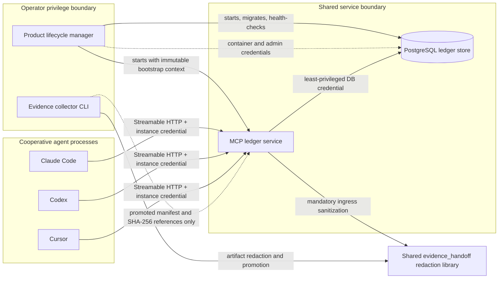
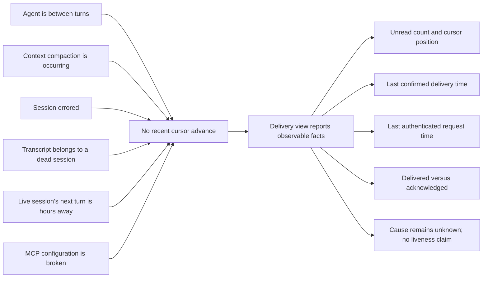
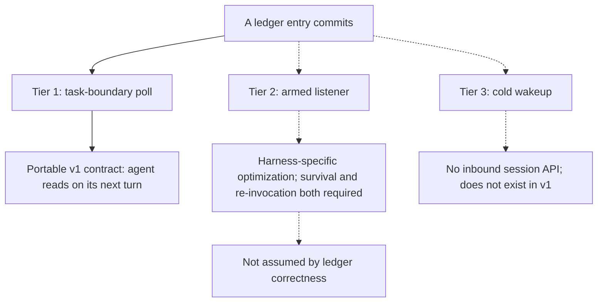

# EVIDENCE-HANDOFF-FEAT-A2A-LEDGER Design Specification

**Feature identity:** `EVIDENCE-HANDOFF-FEAT-A2A-LEDGER`. Scheduling identifiers are assigned only
when an implementation chunk is picked up.

**Baseline:** `origin/main` at `f7f78391f07554e675bb6ab36fdde0b5af7ac5d5`.

**Status authority:** Live state belongs only in the
[evidence and handoff open-work pool](../plans/evidence-handoff-open-work-pool.md). This document
owns architecture, scope, contracts, and verification requirements.

## Product intent

Build a local-first, independent handoff product through which cooperative coding agents can leave
durable questions, answers, evidence notices, review rulings, handoffs, and acknowledgements for
one another. The ledger removes operator transcription from ordinary cross-agent communication
while preserving the operator's exclusive authority over approval gates.

The product borrows Google A2A's `Task`, `Message`, `Part`, and `Artifact` vocabulary and data-model
shape. It does not implement or expose Google A2A transport. MCP Streamable HTTP is the served
access layer.

The ledger is a handoff protocol, not a transcript archive. Entries remain small and structured;
large evidence is represented by SHA-256 references to separately governed artifacts.

## Normative protocol baselines

- MCP transport and HTTP authorization behavior is pinned to the official
  [MCP 2025-11-25 core specification](https://modelcontextprotocol.io/specification/2025-11-25/basic),
  [Streamable HTTP transport](https://modelcontextprotocol.io/specification/2025-11-25/basic/transports),
  and [HTTP authorization](https://modelcontextprotocol.io/specification/2025-11-25/basic/authorization).
  The deprecated 2024-11-05 HTTP+SSE transport is not a v1 fallback.
- Borrowed data-model vocabulary is pinned to the official
  [A2A v1.0 definitions](https://a2a-protocol.org/latest/definitions/) for `Task`, `Message`,
  `Part`, and `Artifact`. A pickup preflight must digest-pin the exact schema artifacts consumed by
  its implementation plan; a moving `latest` page is discovery evidence, not a reproducible pin.

Later protocol revisions require a reviewed compatibility decision. Transport negotiation must
not silently weaken authentication, schema handling, session binding, or delivery semantics.

## What users should expect

- Lossless, append-only handoff: canonical entries are never updated or deleted, and every reader
  has a durable delivery cursor.
- One total order defined by a server-assigned, gapless, monotonically increasing sequence.
- No operator transcription of ordinary content between agents.
- Visible delivery facts per registered agent: cursor position, last cursor advance, unread count,
  and acknowledgement position.
- Redaction before any entry or entry body persists.
- Server-derived `authority` based on an authenticated principal's configured role.
- At-least-once delivery: an unconfirmed page may be returned again, and entry IDs make duplicates
  detectable.
- Integrity failures are loud, stop the ledger channel, and are never silently downgraded to
  operator relay.
- Graceful operator relay when the feature is disabled or unavailable.

## What users should not expect

- **Real-time delivery.** An agent reads entries on its next turn or explicit poll, not when another
  agent writes them.
- **Wakeup.** No v1 component exposes an inbound API to a running agent session or promises to
  re-invoke an agent.
- **Authorization through the channel.** No ledger entry can satisfy an approval gate. This is
  structural and independent of `authority`.
- **Resistance to a malicious same-user process.** Deliberate impersonation by a co-located process
  running under the same operating-system account is an explicit non-goal.
- **Verified agent identity.** `agent_id` is an asserted deployment identity mapped server-side
  from credential possession. It must never be described as verified identity or attestation.
- **A transcript archive.** Large bodies, screenshots, dumps, and reports remain outside the
  ledger and are referenced by SHA-256.
- **Agent-triggered evidence collection over MCP.** Agents may invoke the existing collector CLI
  through an authorized shell workflow, but collection is not a network-callable ledger tool.
- **SSE as a delivery guarantee.** SSE is optional within Streamable HTTP and never participates in
  ordering, durability, cursor advancement, or wakeup correctness.
- **Quiet integrity degradation.** Corruption is never treated as ordinary unavailability,
  transient retry, or automatic operator relay.

## Binding constraints and naming

- The portable package boundary remains `evidence_handoff` and the distribution stem remains
  `evidence-handoff`.
- Package, module, configuration, schema, artifact, service, container, and CLI names are
  descriptive, brand-free, and scheduling-number-free.
- `evidence_handoff` must not import `optimus`, `optimus_gateway`, their subpackages, project tools,
  ACP launch types, or Gateway service types.
- `evidence_handoff` may consume `optimus_security`; it must not fork the shared redaction engine.
- The portable product exposes no approval/mutation callback, approval-shaped result, or import
  path into host mutation state. Host consumers must treat every ledger value as untrusted input;
  no adapter may translate `authority`, `review-ruling`, `operator-relay`, or acknowledgement into
  approval.
- Feature documents use Feature IDs and contain no reserved implementation-plan number.
- Product live state remains only in the product pool. No roadmap document is introduced.
- The feature is controlled by an explicit configuration toggle that defaults to off. Disabled
  means no implicit service startup and graceful degradation to operator relay.

## Three surfaces, one product

The product has three deliberately separate executable surfaces and one shared library boundary.
The separation is load-bearing: broadening the ledger's network surface to process launch, log
reading, or window capture would invalidate the cooperative-agent threat model by giving a
misbehaving credential holder privileged acquisition capabilities.



### Product lifecycle manager

The operator-invoked lifecycle manager is the only product component with infrastructure
privileges. It starts, stops, status-checks, initializes, migrates, and health-checks PostgreSQL and
the MCP service. Its operations are idempotent and serialized by a product-owned lifecycle lock.
Agents and MCP request handlers never receive container rights or database-administrator
credentials.

The primary store is PostgreSQL in wslc, published only on `127.0.0.1`. The fallback store ladder
is PostgreSQL in Docker and then PostgreSQL native on Windows. MCP is the access layer in every
case; a remote/shared MCP deployment is a separate topology, not a store rung. SQLite is not a v1
fallback.

The lifecycle manager and all generated container/configuration names are independent of Optimus.
The existing Optimus local-infrastructure module is a reference pattern only and is neither edited
nor imported.

### Evidence collector CLI

The collector remains the existing explicit staged CLI. Agents may run it locally under an
approved workflow; the operator is not a per-stage collection approver. `ScreenshotApproval`
continues to gate promotion of the exact screenshot digest and remains independent of who invoked
collection.

Collection is not exposed as an MCP tool. If a future agent context cannot access a required local
capture capability, that need belongs to a separately authenticated evidence-control service and a
separate approved design.

### MCP ledger service

One long-running service exposes the ledger over MCP Streamable HTTP with optional SSE. It owns
transport authentication, principal mapping, role policy, redaction orchestration, canonical
ordering, append transactions, reads, delivery confirmation, and delivery observability. It holds
only a least-privileged application database credential and cannot manage the store process.

### Shared redaction library

Both executable sinks use `evidence_handoff.redaction` and the single
`optimus_security.sanitization` rule engine. The ledger adds a bounded in-memory structured-entry
route to the portable redaction package. That route validates a primitive typed entry, sanitizes it
with the populated runtime inventory, deterministically serializes it, performs the same final
exact/pattern/entropy/path scans, reparses it into a closed sanitized type, and returns content-free
rule counts. It does not create a competing rule registry and does not stage an unredacted ledger
entry on disk.

## Threat model and identity

### Protected assets and guarantees

- Entry content, artifact references, service/database credentials, per-instance access tokens,
  operator identity/path values, role mappings, sequence order, and delivery cursors.
- Only sanitized entry content reaches PostgreSQL.
- The server derives `agent_id`, `caller_role`, and `authority`; clients cannot supply them.
- Role policy prevents an implementer principal from writing `review-ruling`.
- The operator principal used for `operator-relay` is not present in agent configurations.
- No ledger output can satisfy an approval or mutation gate.

### Accepted residuals

All agents run as cooperative processes under one Windows user and share the host network
namespace. Per-instance credentials prevent accidental or misconfigured role confusion; they do
not resist deliberate token theft or replay by a malicious same-user process. Stronger resistance
would require distinct operating-system principals, AppContainers, VMs, or another reviewed
isolation boundary.

The reserved `attestation` field exists in the v1 physical and entry schema but is always `null`.
Any non-null v1 write is rejected. Future attestation can be additive only through a new entry
schema and can never substitute for authorization.

If rollback occurs before any external client witness has advanced beyond the restored head, the
restored prefix has the same instance ID, a valid chain, and matching counter state. It is
indistinguishable from a history in which the rolled-back entries were never committed. This is an
inherent detection limit, not a verified absence of loss. The mitigation is an external backup
manifest that records the ledger instance ID, head sequence and digest, counter state, and backup
identity at backup time outside the database snapshot. Restore procedures compare that manifest
before activation; periodic at-rest checks remain defense in depth. A manifest proves that the
restored snapshot matches the selected backup anchor, but it cannot witness entries committed after
that backup. Those later entries remain detectable only when a client witness or newer external
checkpoint recorded them.

### Principal and authority mapping

Each provisioned client instance receives a distinct short-lived, audience-bound credential. The
service validates issuer, audience, expiry, scope, and token status, maps the authenticated
principal to an asserted `agent_id` and configured `caller_role`, then derives `authority` from
role and entry kind.

| Authenticated condition | Server-derived authority or result |
|---|---|
| Agent writes ordinary permitted entry | `advisory` |
| Reviewer principal writes `review-ruling` | `review-ruling` |
| Non-reviewer writes `review-ruling` | Reject before redaction and sequence assignment |
| Separate operator principal relays content | `operator-relay` |
| Any client supplies `authority`, `caller_role`, `agent_id`, or non-null `attestation` | Reject as a closed-schema violation |

`operator-relay` records asserted provenance. It is not cryptographically proven operator identity
and does not authorize a mutation.

## Transport and session security

- Bind MCP and PostgreSQL only to `127.0.0.1`; never publish either on `0.0.0.0` by default.
- Validate every present `Origin` header against an exact configured allowlist. Reject an invalid
  origin with HTTP 403 before MCP parsing. Native clients may omit `Origin`; omission does not
  bypass authentication.
- Implement MCP HTTP authorization with audience-bound tokens. A session ID is never accepted as
  an authentication credential.
- Generate cryptographically random `MCP-Session-Id` values, bind each to the authenticated
  principal and negotiated protocol version, expire them, and reject principal/session mismatch,
  replay after expiry, or unknown sessions.
- Apply request size, rate, and concurrency bounds before entry parsing or redaction.
- Do not pass client tokens through to PostgreSQL or another service.
- SSE may carry protocol responses or optional notifications but is never a durable signal.

## Redaction runtime-input supply

The existing Optimus adapter cannot supply this service because it requires Optimus launch types.
A product-owned supplier receives resolved values and paths from the lifecycle/bootstrap boundary;
it never rediscovers ambient state.

The immutable startup context supplies:

- service-owned secrets already resolved by the lifecycle manager;
- operator identity values and canonical path aliases;
- private temporary, staging, and quarantine roots;
- forbidden persistence roots; and
- content-free provenance classes for supplied values.

Authentication middleware adds the exact current request credential to an ephemeral per-request
inventory before sanitization. Rotation creates a new immutable inventory snapshot. Values never
travel through argv, logs, exception text, persisted bootstrap manifests, or content-derived
fingerprints. The service does not reread environment files, query a keyring, inspect Optimus
configuration, or enumerate unrelated process state.

An empty inventory when configured credentials or identity values exist is a startup/readiness
failure. It is never treated as successful redaction.

## Canonical entry model

Every committed entry has one immutable envelope:

| Field | Contract |
|---|---|
| `sequence` | Server-assigned, gapless, strictly increasing total-order integer. |
| `ledger_instance_id` | Immutable identifier for the logical ledger instance that produced the entry. |
| `entry_id` | Server-generated globally unique entry identifier. |
| `schema_id` | Immutable entry-kind schema identifier including its major version. |
| `kind` | One of the six v1 entry kinds. |
| `context_id` | A2A-aligned logical interaction grouping. |
| `task_id` | Optional A2A-aligned handoff/task identity. |
| `in_reply_to` | Optional immutable reference to an earlier entry. |
| `recipient_agent_ids` | Required non-empty, duplicate-free set of registered recipients; immutable input to visibility and unread counts. |
| `message` | A2A-aligned sanitized `Message` with bounded `Part` values. |
| `artifacts` | Zero or more A2A-aligned metadata-only `Artifact` references. |
| `principal_id` | Server-observed credential principal; never accepted from the body. |
| `agent_id` | Server-mapped asserted deployment identity. |
| `caller_role` | Server-mapped configured role. |
| `authority` | Server-derived `advisory`, `review-ruling`, or `operator-relay`. |
| `attestation` | Always `null` in v1; non-null writes fail. |
| `created_at` | Server timestamp for display and audit only. |
| `idempotency_key` | Principal-scoped retry key. |
| `prev_content_sha256` | Digest of the immediately preceding committed entry, or the declared recovery anchor for a replacement instance. |
| `content_sha256` | Digest of the canonical sanitized envelope, including sequence, instance, and predecessor fields but excluding this digest. |

The request body contains only client-authorable fields. Server-owned fields are absent from the
client schema rather than accepted and overwritten.

### Ledger instance and hash-chain integrity

Store initialization creates one immutable `ledger_instance_id`. The lifecycle manager, service
configuration, credentials, durable delivery cursors, delivery tokens, client enrollment state,
and every entry bind to that identifier. A mismatch is an integrity failure, not a reason to adopt
whichever backend answered. Agent IDs and ledger instance IDs occupy separate namespaces.

`sequence` has a database `UNIQUE NOT NULL` constraint and a positive-value check. The singleton
counter row stores `ledger_instance_id`, `last_committed`, and `last_content_sha256`. An ordinary
new ledger initializes the counter to sequence zero with a null digest; its first entry therefore
has a null `prev_content_sha256`. A replacement initializes the counter from its independently
verified predecessor sequence and digest, and its first local entry continues at the next sequence
with that digest as its predecessor. Every later entry stores the exact `content_sha256` of
sequence `n - 1`. The current entry digest covers the canonical sanitized envelope including
`sequence`, `ledger_instance_id`, and `prev_content_sha256`. Duplicate sequence allocation therefore
fails in PostgreSQL, while insertion, deletion, reordering, counter drift, and divergent history
are detectable through counter/head and chain verification.

The transaction that already locks the counter obtains `last_content_sha256` without another
round-trip. Before assigning a sequence, it also verifies that the immutable instance metadata and
counter agree. If local rows exist, the maximum stored sequence must equal `last_committed`, and
that head row's digest must equal `last_content_sha256`; this also rejects unexpected rows above the
counter. If no local rows exist, the counter must equal the instance metadata's declared ordinary
genesis or recovery anchor. Any missing row or disagreement stops the append. On success, the
transaction assigns `last_committed + 1`, sets the predecessor digest, computes the new content
digest, inserts the entry, and advances the counter sequence and digest atomically.

Readiness performs a full declared-genesis-or-recovery-anchor-to-head sequence, instance, and chain
verification before the service accepts traffic. The first slice also exposes an explicit
operator-triggered full audit. Every normal read verifies the same unfiltered global sequence range
it already scans, from `reader_cursor + 1` through the scan watermark, anchored by the digest
recorded with the confirmed cursor, before recipient filtering; it adds no second range pass. It
verifies every global position, instance ID, predecessor link, content digest, and counter/head
boundary represented by that snapshot. A missing global position or broken link fails the entire
query, returns no entries or delivery token, and leaves the cursor unchanged.

Visible sequence gaps are expected under recipient filtering and are never treated as corruption.
Chain verification is service-side and operator-audit work: a reader cannot verify links across
entries it is not permitted to see, and the service does not disclose hidden-entry commitments,
existence, or count. Reader integrations receive integrity assurance transitively from the
verified service response and page digest.

The single serialized chain is a correctness requirement, not an interchangeable implementation
detail. v1 cannot shard sequence assignment, partition independent writer chains, or run a second
active ledger head without a new reviewed protocol and recovery lineage. Per append, the chain adds
one SHA-256 computation and one 32-byte predecessor digest; the existing counter lock supplies the
prior digest without a network round-trip. Counter/head agreement adds an indexed head lookup in
the same transaction. A full audit remains O(n). Later checkpoint digests may bound audit work from
a previously trusted anchor, but they cannot replace the canonical chain or bless an unverified
skip.

After delivery confirmation, the reader integration persists the accepted
`ledger_instance_id`, scan watermark, and chain-head digest outside the ledger database and
presents that witness on its next request. A witness ahead of the current database head or a digest
conflict at the same sequence detects rollback or divergence. Delivery tokens bind the prior and
proposed witnesses so confirmation cannot cross an instance or chain boundary.

### Frozen v1 recipient visibility

Every v1 append, including the first-slice `review-ruling`, must name at least one registered
recipient. The server rejects an empty list, duplicates, unknown or retired agent IDs, wildcards,
and role or context aliases before redaction and sequence assignment. v1 has no implicit sender
copy, broadcast audience, empty-list default, context-membership expansion, or role-derived
audience. A sender that also needs delivery through its own reader cursor names itself explicitly.

The recipient set is canonicalized and stored in the immutable envelope. An entry is visible in a
reader's delivery feed if and only if that reader's stable asserted `agent_id` is in the stored
`recipient_agent_ids`. Registration, role, context membership, principal status, and later schema
activation cannot reinterpret an existing entry's visibility. Agent IDs used by committed entries
are never reassigned.

Unread count is the number of committed entries after the reader's confirmed cursor whose stored
recipient set contains that reader. The cursor may therefore advance to a scan watermark past
non-visible positions without risking future omission: those existing entries can never become
visible to that reader. A future audience model may govern newly appended entries only. Historical
content needed by a newly eligible recipient must be appended as a new referenced entry; v1 never
mutates recipients, retroactively broadens visibility, or rewinds cursors to reinterpret history.

### A2A correspondence

| Ledger concept | A2A correspondence | Ledger-specific rule |
|---|---|---|
| Handoff unit | `Task` | Current state is a rebuildable projection over immutable entries, never an in-place Task update. |
| Communicative body | `Message` | Sender identity comes from the authenticated principal, not A2A's role token alone. |
| Content member | `Part` | Bounded text or structured data only; no large inline bytes. |
| Evidence/deliverable reference | `Artifact` | Metadata plus SHA-256 reference; artifact bytes remain outside the ledger. |
| Interaction grouping | `contextId` | Stored as `context_id` with explicit correspondence. |
| Work identity | `Task.id` | Stored as `task_id`; generated or validated by the service contract. |

This vocabulary alignment does not imply A2A discovery, Agent Cards, push notifications, webhooks,
or A2A transport support.

### Six v1 entry kinds

| Kind | Required semantics | Write policy |
|---|---|---|
| `question` | Requests bounded information or a decision; may open or reference a task. | Permitted agent or operator principal; `advisory` unless relayed. |
| `answer` | References and answers a prior question. | Permitted agent or operator principal. |
| `evidence-notice` | Announces promoted evidence through metadata and SHA-256 references. | Permitted principal; raw artifact bodies forbidden. |
| `review-ruling` | Records a reviewer's technical ruling and its referenced scope. | Reviewer principal only; authority derived as `review-ruling`. |
| `handoff` | Transfers task context, current state, and requested next action. | Permitted principal with explicit recipients. |
| `acknowledgement` | Records deliberate action or acceptance against a referenced entry. | Named recipient or operator principal; separate from delivery confirmation. |

There is no approval entry kind. An acknowledgement is not approval, and a review ruling is not
operator authorization. The global non-empty explicit-recipient rule applies to all six kinds.

## Write path and total ordering

```mermaid
sequenceDiagram
    participant Client as "MCP client"
    participant HTTP as "Origin and auth middleware"
    participant Policy as "Principal and role policy"
    participant Redaction as "Portable redaction ingress"
    participant Store as "PostgreSQL transaction"

    Client->>HTTP: "Append closed-schema draft"
    alt "Invalid Origin, token, audience, scope, or session"
        HTTP-->>Client: "Reject; no redaction, sequence, or row"
    else "Authenticated principal"
        HTTP->>Policy: "Principal plus client-authorable fields"
        alt "Server-owned field supplied or role forbidden"
            Policy-->>Client: "Reject; no sequence or row"
        else "Policy permits kind"
            Policy->>Redaction: "Typed draft plus populated runtime inventory"
            alt "Validation, sanitization, or final scan fails"
                Redaction-->>Client: "Stable failure code; no sequence or row"
            else "Sanitized canonical draft"
                Redaction->>Store: "Begin serialized append transaction"
                Store->>Store: "Lock counter; verify instance and head; chain, insert, advance"
                alt "Constraint, instance, counter, or chain check fails"
                    Store-->>Client: "Rollback; latch non-retryable integrity failure"
                else "Classified transient insert or commit failure"
                    Store-->>Client: "Rollback counter and row; retry-safe failure"
                else "Commit succeeds"
                    Store-->>Client: "Immutable entry ID, sequence, and digest"
                end
            end
        end
    end
```

The append transaction locks one product-owned counter row, verifies its instance, sequence, and
digest against immutable instance metadata and the current head, computes `last_committed + 1`,
inserts the sanitized chained entry, advances the counter, and commits both changes together.
Rollback restores both, so committed entries remain gapless. The database uniqueness constraint
is the final duplicate-sequence backstop. The database lock preserves correctness if a later
deployment runs more than one service process; an in-process mutex alone is insufficient.

Idempotency is principal-scoped. Reusing a key with the same sanitized request digest returns the
existing result; reusing it with different content fails as a conflict. Clients retry only
classified transient failures, with no more than three attempts.

**Total order is by server-assigned sequence. Timestamps are descriptive and are never used for
ordering, cursors, pagination, or conflict resolution.**

### Why timestamps and bare sequences are unsafe

```mermaid
sequenceDiagram
    participant A as "Transaction A"
    participant B as "Transaction B"
    participant DB as "PostgreSQL"
    participant Reader as "Reader"

    A->>DB: "BEGIN; timestamp 10:00:00.001; nextval 1"
    B->>DB: "BEGIN; timestamp 10:00:00.002; nextval 2"
    B->>DB: "COMMIT B first"
    Reader->>DB: "Read values after old cursor"
    DB-->>Reader: "B only"
    Reader->>Reader: "Advance timestamp or bare-sequence cursor past B"
    A->>DB: "COMMIT A later"
    Reader->>DB: "Read after advanced cursor"
    DB-->>Reader: "A is permanently invisible"
```

PostgreSQL `now()` represents transaction-start time, and `nextval` is allocated before commit.
Neither can define a lossless cursor when transactions commit out of order. Serialized,
transactional assignment after redaction removes the interleaving.

## Read path, delivery confirmation, and acknowledgement

```mermaid
sequenceDiagram
    participant Client as "Reader client"
    participant Ledger as "MCP ledger service"
    participant Store as "PostgreSQL"

    Client->>Ledger: "Read after durable cursor with supported schema set"
    Ledger->>Store: "Snapshot unfiltered global range and scan watermark"
    Store-->>Ledger: "Global rows, current head, and chain anchor"
    alt "Global gap, chain break, or instance mismatch"
        Ledger-->>Client: "Latch integrity failure; no page, token, or cursor change"
    else "Global range verifies before recipient filtering"
        Ledger->>Ledger: "Filter immutable recipients and check visible schemas"
    alt "Any visible entry schema is unsupported"
        Ledger-->>Client: "Fail entire query; no partial page and no cursor change"
    else "Whole page is supported"
        Ledger-->>Client: "Entries plus page digest and delivery token"
        Client->>Ledger: "Confirm complete page receipt"
        Ledger->>Store: "Atomically advance cursor to scan watermark"
        Store-->>Client: "Cursor position, last advanced time, unread count"
        opt "Reader deliberately acts on an entry"
            Client->>Ledger: "Append acknowledgement through normal write path"
            Ledger->>Store: "New ordered acknowledgement entry"
        end
    end
    end
```

The server cannot prove receipt merely by writing an HTTP response; bytes may remain buffered or a
connection may fail. `read_entries` therefore does not advance the cursor. It returns a short-lived
delivery token bound to the reader principal, ledger instance, previous cursor and chain anchor,
scan watermark and resulting chain anchor, visible entry IDs, and page digest. The reader
integration confirms only after receiving and validating the complete page.

If confirmation is lost, the same entries may be delivered again. If confirmation succeeds, the
cursor advances atomically to the scan watermark, including non-visible sequence positions already
examined for that reader. This gives at-least-once delivery without silent omission. Entry IDs and
content digests make replay detection deterministic.

The service scans and verifies global positions before applying the immutable recipient predicate.
The delivered page may therefore contain non-contiguous sequence values. That is normal visibility
filtering; only a missing position in the unfiltered global scan is an integrity failure.

Delivery confirmation is passive protocol bookkeeping: it proves only that the reader client
confirmed the page. An `acknowledgement` is a new deliberate ledger entry proving that the agent
reported action on referenced content. Neither proves human attention or authorizes mutation.

## Per-agent delivery observability

The service exposes an operator-readable, content-free delivery view for every registered reader:

- asserted `agent_id` and principal status;
- cursor sequence and timestamp of its last confirmed advance;
- count of currently visible unread entries;
- last successful authenticated request time;
- last acknowledgement sequence and timestamp;
- schema-capability freshness and any upgrade block; and
- global ledger integrity state, incident identifier, cause, detection time, affected instance and
  sequence boundary, and whether operator recovery is required.

The view reports facts, not guessed process liveness. It must not label an agent online, dead, or
healthy solely from cursor activity.



This distinguishes “a page was confirmed” from “no page was confirmed” and “content was
acknowledged” from “content was merely delivered.” It cannot distinguish all six underlying causes
without an independent harness/session health signal.

## Schema and migration versioning

Versioning exists before the first append and has two independent axes:

1. **Immutable entry schemas.** Every kind has an exact `schema_id` and major version. Historical
   bodies retain their original schema and meaning.
2. **Physical database revisions.** Product-owned migrations may add tables, columns, indexes,
   constraints, or rebuildable projections. They do not rewrite canonical entry bodies.

Writers emit only schemas that the service has explicitly activated. Readers declare their exact
supported schema set when registering or refreshing an authenticated client capability. The server
records that capability against the principal; it is cooperative, asserted compatibility data,
not attestation.

Unknown schema handling is **per query**. If any visible entry in the requested page has a schema
the reader did not declare, the server fails the entire query with a stable
`unsupported_entry_schema` result, returns no partial page, issues no delivery token, and leaves the
cursor unchanged. Silent skipping is forbidden.

Schema activation is coordinated:

1. Deploy reader support while writers remain on the current schema.
2. Each non-retired registered reader reports the new supported schema set.
3. The lifecycle manager's upgrade preflight lists missing or stale readers and refuses activation
   while any remain.
4. The operator may explicitly retire a genuinely obsolete reader principal; retirement is a
   content-free administrative audit event, not a ledger entry or implicit timeout.
5. Only after all active readers support the schema may the operator activate its writer.

The server advertises its transport/tool protocol version, active writer schemas, minimum reader
version, and pending compatibility blockers through a content-free capability surface. There is no
automatic downgrade, partial interpretation, or time-based forced activation.

Rebuildable projections may derive current Task status, unread counts, and delivery summaries.
They are versioned separately, can be discarded and rebuilt from canonical entries, and never
become the authority for entry content.

## Wakeup and trigger tiers

Wakeup is an explicit v1 non-goal. The product contract ends at durable availability and delivery
observability.



Point-in-time brainstorming probes demonstrated why Tier 2 is non-portable: Claude Code proved a
90-second detached process plus harness re-invocation; Codex proved a 90-second detached process
survived and exited cleanly but provided no harness completion event or spontaneous turn. Cursor
was not established by this design's evidence. These observations are not product dependencies or
capability promises.

An armed listener may be documented later as a harness-specific optimization only after its
duration ceiling, restart behavior, credential lifetime, missed-event recovery, and false-wakeup
behavior are proven. It never replaces durable polling.

## Integrity failure classification and alerting

The product keeps three operational outcomes distinct:

| Condition | Required behavior |
|---|---|
| Feature disabled | Quiet and expected; operator relay is the configured active route. |
| Store unavailable | Surface an unavailable, potentially transient condition; bounded retries are allowed and operator relay may be used meanwhile. |
| Integrity failure | Return `ledger_integrity_failed`; stop ledger delivery and appends, alert the human, and never silently activate relay. |

`ledger_integrity_failed` is a distinguished non-retryable class. Its stable causes are
`sequence_duplicate` for duplicate sequence, `sequence_gap` for a global sequence gap,
`chain_break` for a predecessor or content-digest break, `counter_head_mismatch` for counter/head
disagreement, `rollback_divergence` for rollback or divergence, and `ledger_instance_mismatch` for
a ledger-instance mismatch. It is explicitly excluded from database-unavailable and
classified-transient retry handling; replaying a request against a suspect history is not recovery.

Detection durably latches the service into integrity-failed state in lifecycle-manager-owned,
content-free product control state outside the ledger database and canonical append chain. That
state uses restrictive local permissions and atomic replacement, and the service mirrors the
incident into database control metadata where possible. Failure to persist the external latch is a
fail-closed readiness error: the current process remains stopped, and restart must repeat full
verification before serving. The latch survives an ordinary service restart. While latched, every
subsequent response that passes authentication carries the stable class, cause, incident
identifier, instance ID, and safe sequence boundary; pre-authentication failures disclose nothing.
Append, read, delivery-confirmation, cursor-advance, and acknowledgement operations remain stopped;
only content-free status, audit, quarantine, and recovery operations remain available. The service
never silently activates operator relay while this latch is set. Explicit manual relay may occur
only as a human decision made after the integrity warning, outside automatic degradation logic.
The latch takes precedence if PostgreSQL later becomes unavailable or the feature is subsequently
disabled: neither transition clears, suppresses, or reclassifies the incident, and lifecycle status
continues to expose it.

Reader integrations must treat the service-reported class as a user-visible warning, stop the
automated ledger handoff path, and preserve the incident identifier in safe diagnostics. They must
not swallow it into logs, retry it, label it ordinary unavailability, or continue through relay
without an explicit human decision. Wakeup remains out of scope, so the precise promise is that
each participating agent warns on its next ledger interaction. Agents do not independently detect
chain failures; they surface the service's result.

The operator-readable delivery view exposes the global latched integrity state independently of
any agent taking a turn. Its per-agent rows distinguish agents to which the service has returned
the current incident from those that have not yet made a subsequent authenticated request. This
does not prove that an integration rendered its required warning or that a human saw it. The view
reports only the service-observable fact and does not label an idle agent unhealthy.

## Chain-break recovery

Detection does not authorize history rewriting. The lifecycle manager first stops normal traffic,
captures the content-free incident metadata and external witnesses, and leaves the failed ledger
instance quarantined read-only. A full audit proceeds from the declared genesis or recovery anchor
until the first invalid position and identifies the last independently verified sequence and
digest. Client witnesses and backup manifests may prove a later expected anchor, but rows beyond a
chain break remain untrusted. Untrusted tail entries are never called final, repaired, or copied
into another canonical chain.

A successful full verification for same-instance latch clearing requires a repeated full audit of
the complete chain, counter/head agreement, instance bindings, and every available external
witness. Only then may an operator explicitly clear a proven false-positive latch on that instance.
Automatic clearing is forbidden. A genuine chain break, sequence gap, divergent history, or
unresolved rollback cannot be cleared in place.

For a genuine break, the operator creates a new `ledger_instance_id` and immutable recovery
metadata containing the incident ID, predecessor instance ID, and last independently verified
sequence and digest. Its counter starts at that verified sequence and digest with no local entry
rows; the first new entry receives the next sequence and uses the verified digest as the declared
recovery anchor covered by its own `content_sha256`. Sequence never restarts within a recovery
lineage. New client enrollment starts from the same anchor. The verified prefix remains in the
quarantined predecessor and is not copied. The operator provisions new instance-bound credentials
and client enrollment, verifies the recovery link, then explicitly activates the replacement. The
predecessor's integrity latch remains part of its permanent status; operational recovery means
switching to the linked replacement, never making the broken instance appear healthy.

## Default-off behavior and graceful degradation

The feature toggle defaults to disabled. When disabled:

- the lifecycle manager does not implicitly start PostgreSQL or the MCP service;
- clients do not retry indefinitely or silently start infrastructure;
- no ledger credentials are projected into agent configuration;
- agent workflows state that operator relay is the active handoff route; and
- absence of the service is reported as disabled, not as a transport incident.

Enabling is an explicit operator lifecycle action that validates configuration, redaction runtime
inputs, store readiness, migrations, principals, roles, origins, and schema compatibility before
accepting traffic.

## Failure semantics

- Invalid Origin, authentication, audience, scope, session, role, recipient, closed-schema field,
  or attestation: reject before redaction and sequence assignment.
- Missing or empty required runtime inventory: fail readiness or reject the write; never persist
  with an empty known-secret set.
- Validation, sanitization, final scan, deterministic serialization, or manifest failure: reject
  with a stable content-free code; allocate no sequence and write no row.
- Database transaction failure: roll back entry and counter together. Retry only classified
  transient failures and reuse the idempotency key.
- Duplicate sequence, global sequence gap, chain break, counter/head disagreement, rollback or
  divergence, or ledger-instance mismatch: return non-retryable `ledger_integrity_failed`, latch
  the incident, and stop normal ledger operations without automatic relay.
- Unknown entry schema: fail the whole read query and leave the cursor unchanged.
- Lost delivery confirmation: redeliver at least once; never infer delivery.
- Invalid, expired, replayed, or principal-mismatched delivery token: reject without cursor change.
- Cursor conflict from concurrent reader turns: one compare-and-swap advance succeeds; the other
  refreshes from the durable cursor.
- PostgreSQL unavailable: surface unavailable state and use operator relay; do not silently switch
  backends while a service is running.
- Logs and errors use stable codes and content-free summaries. Raw entry bodies, credentials,
  redaction inventory values, and untrusted exception text never enter logs.

## Audit and observability

Append-only structured audit records correlate service operations by request, session, principal,
entry, sequence, and delivery token identifiers without logging content or credentials. Record:

- authentication disposition and asserted principal/agent mapping;
- role and authority policy decision;
- entry kind, schema ID, sanitized content digest, and redaction rule counts;
- append sequence, idempotency disposition, latency, and transaction outcome;
- read range, scan watermark, page digest, delivery confirmation, cursor advance, and unread count;
- schema capability reports and upgrade blockers;
- integrity verification range and anchor, full-audit outcome, latched incident class and cause,
  integrity-error delivery to each agent, explicit operator disposition, and replacement-instance
  activation;
- lifecycle backend, migration, readiness, and recovery outcomes; and
- stable failure classification and final disposition.

Audit timestamps remain descriptive. Sequence is the only ledger ordering authority.

## Delivery chunks toward v1

Each chunk receives a separate implementation plan only when picked up. No scheduling number is
reserved here.

### Risk-bearing vertical slice

- Default-off configuration and operator-relay degradation.
- Product-owned lifecycle manager and PostgreSQL-in-wslc loopback startup.
- Migration framework, immutable envelope v1, transactional sequence counter, and schema
  capability/activation machinery.
- Continuous integrity verification: sequence uniqueness, ledger-instance binding, chained
  appends, counter/head agreement, readiness and on-demand full audits, and unfiltered global-range
  verification before recipient filtering.
- Integrity state and alerting: distinguished non-retryable causes, a restart-durable latch,
  content-free operator status, user-visible warnings from each agent on its next interaction, and
  no silent relay degradation.
- Required chain-break recovery: quarantine the failed instance read-only, identify the last
  verified anchor, preserve untrusted tail rows without laundering them, and activate a linked
  replacement instance explicitly.
- Streamable HTTP service with Origin, DNS-rebinding, authentication, session, and replay controls.
- Per-instance principal mapping with asserted `agent_id`, role policy, and server-derived
  `authority`.
- Product-owned redaction runtime-input supplier and in-memory structured ingress path.
- Frozen v1 recipient visibility: non-empty explicit recipients on every entry, immutable
  membership-based delivery, no implicit broadcast, and safe advancement past non-visible
  positions.
- `review-ruling` append/read only, proving reviewer succeeds, implementer is rejected,
  client-supplied authority is rejected, and no unredacted row exists after any failure.
- Delivery token, cursor confirmation, unread count, and per-agent delivery view.
- Real PostgreSQL, real service process, and real Claude Code/Codex/Cursor evidence.

### Ledger protocol completion

- Add `question`, `answer`, `evidence-notice`, `handoff`, and `acknowledgement` through the already
  proven version-activation gate.
- Freeze the remaining A2A correspondence, replies, task projections, artifact-reference shape,
  pagination, idempotency, concurrency, and acknowledgement semantics.
- Prove coordinated reader-first activation before any new writer schema is enabled.

### Evidence bridge

- Publish only promoted collector manifests, safe metadata, and SHA-256 artifact references as
  `evidence-notice`.
- Preserve the collector CLI and screenshot-approval boundary; expose no capture operation over
  MCP.
- Prove that raw evidence paths, bodies, screenshots, dumps, and unapproved artifacts cannot enter
  an entry or be followed by a reader.

### Operations and extraction

- PostgreSQL-in-Docker and native-Windows fallback deployment paths.
- Credential rotation plus periodic and at-rest integrity audits layered on continuous first-slice
  verification.
- Backup/restore manifests recorded outside the database snapshot; compare the backup manifest
  during restore before activation, and rehearse rollback, divergence, restart, and recovery.
- Upgrade and linked-instance recovery rehearsals without rewriting or copying untrusted history.
- Independent package/service/container naming, distribution metadata, install/uninstall, and
  extraction from the Optimus repository.
- Content-free operational observability and real release evidence across supported platforms.
- Final default-off, operator-relay, security, documentation-freshness, and package-boundary gates.

## Verification strategy

### Unit evidence

- Closed entry schemas reject unknown fields, client-owned server fields, non-null v1 attestation,
  unbounded content, inline large bytes, invalid recipients, and malformed SHA-256 references.
- Table-driven authority tests cover every role and entry kind; implementers cannot write review
  rulings and no entry satisfies approval.
- Redaction tests use populated exact-secret/PII inventories, split/encoded secrets, path aliases,
  entropy candidates, deterministic serialization, final scans, and fail-closed errors.
- Sequence tests cover the database uniqueness constraint, concurrent appends, rollback,
  idempotent retry, conflicting retry, counter/head drift, instance mismatch, predecessor and
  content-digest validation, and no committed gaps.
- Cursor tests cover page confirmation, lost confirmation, replay, compare-and-swap conflict,
  required explicit recipients, no implicit broadcast, immutable recipient filtering,
  legitimate visible gaps, global-range gaps, instance/chain witness conflicts, rollback ahead of
  the restored head, no-visible-entry watermarks, unread counts, and acknowledgement separation.
- Integrity-state tests distinguish disabled, unavailable, and corrupt outcomes; verify every cause
  latches across restart; reject retry, append, read, confirmation, cursor advance, acknowledgement,
  and automatic relay; and require content-free operator status plus next-interaction client alerts.
- Recovery tests quarantine the predecessor, reject in-place repair and automatic latch clearing,
  select only the last verified anchor, preserve untrusted tails, bind the replacement genesis to
  its recovery metadata, compare external backup manifests, and require explicit activation.
- Version tests cover per-query failure, no partial result, no cursor movement, reader-first
  activation, stale client blockers, explicit retirement, and projection rebuilds.
- Origin, token, audience, expiry, scope, session binding, replay, rate, and request-size tests fail
  before content reaches policy or persistence.
- Static import tests reject `optimus`, `optimus_gateway`, project tools, dynamic-import escape
  hatches, and Optimus local-infrastructure references from the portable product.
- Static and integration boundaries prove there is no approval/mutation callback, approval-shaped
  return value, host gate import, or adapter that promotes ledger authority into authorization.

### Real integration evidence

- A real TimeSeries-independent PostgreSQL instance exercises migrations, transactional sequence
  assignment, concurrent commits, rollback, cursor compare-and-swap, backup, and restore.
- A real independently authored MCP client drives the real Streamable HTTP service, including
  Origin handling, authentication, sessions, tool discovery, reads, writes, and delivery
  confirmation. A project-authored client alone is insufficient protocol evidence.
- Real redaction integration proves the exact presented credential and configured canaries are
  absent from PostgreSQL, audit logs, errors, and MCP responses after successful and failed writes.
- Real wslc startup proves loopback forwarding, readiness, persistence, restart, and cleanup. Each
  shipped fallback must be proven against its real named backend.
- Real Claude Code, Codex, and Cursor configurations use distinct credentials and prove shared
  cross-agent append/read behavior. Fakes may not stand in for a named agent or store at this tier.

### Release gates

- At least 80% aggregate Python production-code coverage and no regression in security-critical
  modules.
- Narrow feature tests, complete unit suite, Ruff, secret scanning, dependency-lock validation,
  import-boundary checks, and `git diff --check` pass.
- Windows evidence covers wslc, loopback, process/service lifecycle, path handling, and credential
  storage. Linux/WSL runs cover portable package, PostgreSQL protocol, and migration behavior where
  applicable.
- A raw canary scan covers PostgreSQL, service logs, audit output, temporary roots, error bodies,
  and promoted evidence references.
- Every completion claim names its real evidence artifact, dependency identity, command, result,
  digest, and reviewer ruling.
- Documentation freshness covers the product pool, this design, implementation artifacts,
  `README.md`, and every document claiming current product state.

## Explicit non-goals and exceptions

- No Google A2A transport, Agent Card, webhook, or push-notification implementation.
- No wakeup, cold resume, inbound agent-session API, or correctness dependency on SSE.
- No agent-triggered collection over MCP and no merger of collector privileges into the ledger
  service.
- No transcript archive, raw evidence body, large inline payload, or persistent vector index of
  source code.
- No SQLite v1 fallback and no coupling to Redis or general memory infrastructure.
- No malicious same-user resistance, cryptographic non-repudiation, or verified-agent claim.
- No approval record, approval entry kind, or path from ledger output to a mutation gate.
- No non-null attestation in v1 and no future attestation effect on authorization.
- No edit to Optimus local infrastructure and no `optimus.*` import from the product package.
- No implicit backend failover while running; fallback selection is an explicit lifecycle action.
- No implementation code or implementation plan is authorized by this design document alone.

## Design acceptance and next step

This design is ready for operator and independent architecture review when reviewers confirm:

- the three-surface privilege boundary and default-off behavior;
- the cooperative identity language and structural approval exclusion;
- redaction-input supply and in-memory ingress without a second rule engine;
- transactional sequence order and the rejection of timestamp/bare-sequence cursors;
- reader-confirmed at-least-once delivery and acknowledgement separation;
- per-query unknown-schema failure plus coordinated reader-first activation;
- factual delivery observability without a guessed liveness claim;
- the six entry kinds and explicit A2A data-model correspondence;
- the normalized PostgreSQL fallback ladder; and
- wakeup and network-callable collection as explicit non-goals.

After approval, author separate implementation plans for the named delivery chunks in order. Do
not reserve a scheduling number, implement code, or mark the feature promoted from this design PR.
